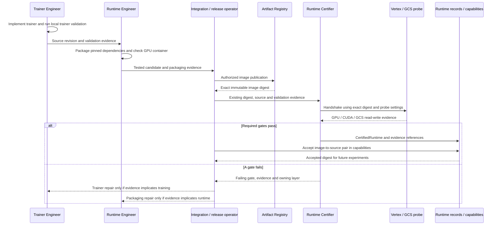
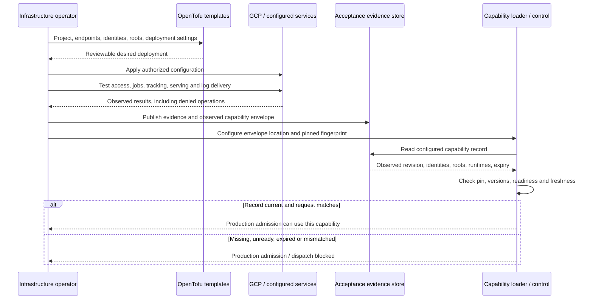
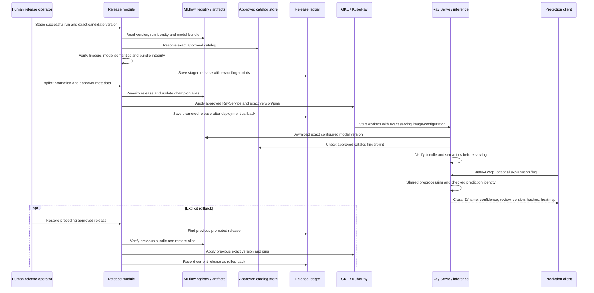
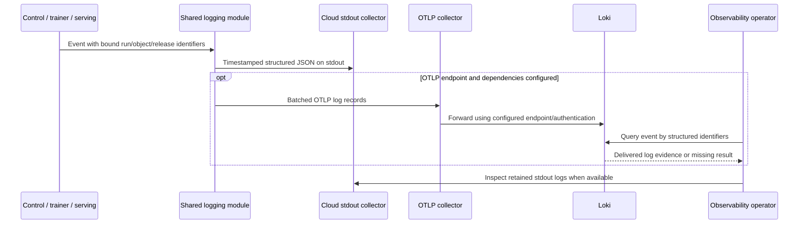

# Training platform: contracts and ownership

**Human-readable guide · 29 September 2026**

This platform trains one DINOv3 + MLP classifier per object type, using labeled defect crops. Datasets are published as versioned WebDatasets in GCS. Vertex runs training, MLflow records experiments and model versions, and approved models are packaged for Ray Serve on GKE.

This guide describes the implementation at [source revision `024c6af`](https://github.com/ahughes0227/training-platform/tree/024c6af5e9f4131b06297da5fbc7281fbd5dace7). Cloud diagrams show the configured production path; they do not assert that every service has been deployed or tested live. See [Evidence and limits](#evidence-and-limits).

## Contents

- [How to read a contract](#how-to-read-a-contract)
- [Ownership](#ownership)
- [Internal contracts](#internal-contracts)
- [External contracts](#external-contracts)
- [Swimlane diagrams](#swimlane-diagrams)
- [Where to find the records](#where-to-find-the-records)
- [Changing a contract safely](#changing-a-contract-safely)
- [Evidence and limits](#evidence-and-limits)
- [Implementation references](#implementation-references)

## How to read a contract

A **contract** is the agreement at a handoff: what the sender provides, what the receiver checks, what comes back, and what happens when something does not match.

- An **internal contract** connects parts of this program: for example, the dataset builder hands a verified dataset version to training.
- An **external contract** connects the program to a person, data source, cloud service, registry, or prediction client. A record can cross both boundaries: a training request is an internal agreement transported through GCS and Vertex.
- An **owner** is accountable for a decision or component. The owner can be a person or coding role; the software performs the runtime steps.
- A **fingerprint**, usually a SHA-256 checksum, identifies exact content. A **pin** tells the receiver which fingerprint it must accept. A checksum stored beside a file is weaker than a fingerprint independently pinned by an accepted record.
- **Class meaning** means the stable class ID, name, definition, aliases, and class order. For example, index 0 must mean the same defect during dataset creation, training, and prediction.

Every handoff checks three different things:

| Check | Plain-language question | Example |
| --- | --- | --- |
| Structure | Is the record complete and well formed? | An experiment needs a dataset version and runtime ID. |
| Identity and integrity | Is this the exact object, version, and content we agreed to use? | A changed shard fails its checksum. |
| Meaning and authority | Do these labels still mean the accepted classes, and was approval obtained from the configured authority? | A caller cannot authorize a draft catalog simply by placing it in a run request. |

These checks preserve an accepted interpretation. They cannot prove that a human labeled a real image correctly. Image or text similarity can support review; it cannot establish defect truth.

## Ownership

The dataset, training, and infrastructure modules have explicit inputs and outputs. Control coordinates their handoffs. Serving consumes approved outputs. Shared record definitions are maintained centrally so owners do not independently invent incompatible formats.

| Owner | Accountable for | Receives → produces | Diagram |
| --- | --- | --- | --- |
| Human object and label reviewer | Class definitions, exclusions, aliases, and label exceptions | Object details and ambiguous labels → accepted meanings and mappings | A |
| Catalog operator | Publishing approvals using credentials for the trusted catalog store | Reviewed catalog → immutable approved catalog | A |
| Setup assistant and CLI | Questions, structured drafts, project templates, and navigation | Notes and answers → typed configuration and run request | A, C |
| Dataset owner | Source adapters, validation, duplicate handling, split assignments, and publication | Object/catalog + dataset settings + source data → `DatasetVersion` and immutable artifacts | A |
| Trainer Engineer | DINOv3 + MLP logic, data reading inside the trainer, metrics, calibration, and heatmaps | Verified dataset + experiment → evaluated, portable model | B, C |
| Runtime Engineer | Container files, dependencies, entrypoint, and GPU container checks | Validated trainer source → tested container candidate | B |
| Runtime Certifier | Testing an existing exact image digest against Vertex and GCS | Existing image + probe settings → certification evidence and runtime record | B |
| Experiment Runner / control owner | Experiment settings, admission, submission, state, and results | Accepted dataset/runtime/infrastructure + request → durable run | C |
| Infrastructure operator | Endpoints, service identities, permissions, deployment settings, and live acceptance | Desired configuration + provider observations → accepted capabilities | D |
| Model release operator | Explicit promotion and rollback decisions | Successful candidate and evidence → approved release | E |
| Serving owner | Exact model loading and checked prediction responses | Approved release + image → class, confidence, review flag, optional heatmap | E |
| Telemetry / observability owner | Log format, delivery configuration, and operational correlation | Runtime events → searchable logs | F |
| Primary integration owner | Shared schemas, cross-owner changes, and integrated acceptance | Proposed changes and evidence → coordinated contract revision | All |

### Coding-role boundaries

The repository defines four coding-agent roles:

- **Trainer Engineer:** changes trainer code and its tests; cannot build/push images, certify a runtime, or submit paid jobs.
- **Runtime Engineer:** changes packaging and checks the GPU container; cannot change algorithms to conceal packaging failures, submit Vertex jobs, or certify. The local role guard also denies image pushes for this role.
- **Runtime Certifier:** validates an already built digest; cannot edit trainer/container code or rebuild the image. Failure evidence goes to the owning layer.
- **Experiment Runner:** configures and submits experiments using accepted runtimes; cannot build/push images, change trainer dependencies or algorithms, or certify.

The current `runtime certify` command orchestrates validation, build, GPU container check, push, and Vertex handshake together. It therefore spans several owners. It is a release/integration operation, not evidence that the Certifier role can perform the entire command within its stated boundary. Local role hooks are convenience checks; remote permission enforcement requires IAM configuration and live allow/deny testing.

## Internal contracts

### I1. Object and class catalog: what the classes mean

**Handoff:** Human reviewer and catalog operator → dataset, control, training, and serving.

**What:** `ObjectSpec` identifies an object type. `ClassCatalog` gives each class a stable ID, display name, definition, optional aliases, and optional positive/negative example locations. The ordered class list fixes the interpretation of classifier outputs.

**Why:** A spelling change, ambiguous alias, or reordered class list must not silently change a model's interpretation.

**Input:** Object name and slug, at least two distinct classes, definitions, and review metadata. The operator publishes the reviewed catalog to a separately configured store.

**Output:** An immutable catalog envelope and fingerprint. A version claim prevents publishing different content under the same catalog ID and version. Project YAML contains a readable copy; production consumers resolve approval from the trusted store.

**Receiver checks:** Matching object and ordered classes; unique stable IDs; no alias/name collision after normalization; explicit definitions and review metadata for reviewed catalogs; exact fingerprint lookup in the operator store for paid admission and serving.

**Rejected opposite:** An alias cannot mean two classes. Changing a submitted catalog to say `reviewed` does not publish a matching approval through the control API. Reusing a catalog version for different content is rejected.

**Limit:** Reviewer text and example locations are metadata. Permissions establish who can publish; the record alone does not authenticate the reviewer or verify the bytes and interpretation of example images. A stable ID must not be repurposed for a different defect meaning.

### I2. Dataset request and version: what data was accepted

**Handoff:** Dataset owner → control and trainer.

**What:** `DatasetSpec` describes sources, mappings, reviewed exceptions, split fractions/seed, shard size, and output location. `DatasetVersion` is the small locator record for the resulting immutable snapshot.

**Why:** Training must be reproducible from accepted labels, images, and split assignments rather than whatever happens to exist at a source location later.

**Input:** Matching object/catalog, CSV or BigQuery source descriptions, readable images, accepted label mappings, and split settings.

**Output:** Source snapshot, per-sample manifest, dataset manifest, dataset `SemanticManifest`, train/validation/test TAR shards and checksums, followed by a final `_COMMIT.json`. The version record carries locations, counts, content checksum, and semantic fingerprint.

**Receiver checks:** Commit marker, object/version identity, source and semantic bindings, accepted class order, assignment checksum, split-specific shard routes and sample counts, and every shard checksum. The semantic loader returns the manifest parsed from the bytes it verified.

**Rejected opposite:** Missing or changed shards, altered meanings, changed source evidence, and swapped train/test routes fail verification. An unfinished publication without its final commit is not a valid completed version.

**Duplicate boundary:** Exact byte hashes and perceptual image hashes identify duplicate candidates. The builder keeps recognized related images/groups together when splitting and checks conflicting labels. This is a bounded detector, not a guarantee that every real-world related crop is recognized; source group IDs and human review still matter.

**Storage boundary:** Publication uses create-only GCS writes. Existing identical versions can be verified and reused; changes produce a new version. This protects against overwrites through the publisher, not against every administrator or deletion permission.

### I3. Experiment and trainer request: what training must do

**Handoff:** Experiment Runner and control → trainer inside Vertex.

**What:** `ExperimentConfig` selects the object, dataset version, runtime, weight location/checksum, model settings, optimizer/loss, epochs, batch size, learning rate, augmentation, class weights, seed, and review policy. `VertexJobConfig` selects one machine, GPU type/count, service account, region, staging location, timeout, and estimated budget.

**Why:** An experiment is a complete, inspectable instruction. Changing its settings must not secretly select another dataset, vocabulary, or runtime.

**Input:** Experiment + verified `DatasetVersion` + ordered classes + certified runtime + semantic references + output/MLflow locations. Paid requests include both `catalog_sha256` and `dataset_semantic_sha256`.

**Output:** Evaluation report and portable model bundle. Model semantics bind the original experiment, dataset content and semantic identity, catalog, preprocessing, training policy, weights checksum, and runtime image/source lineage.

**Receiver checks:** Dataset/object/version match; exact class order; exact reference keys and fingerprints; certified runtime matches the requested runtime; weight checksum and model policy. Invalid labels are rejected rather than assigned to an arbitrary class.

**Training behavior:** Spatial DINOv3 patch features are pooled without class/register tokens and fed to the MLP. Selection uses validation MCC, then macro F1. Calibration uses validation; final evaluation uses test. Training and inference share the preprocessing definition. Configurable multiple GPUs are on one machine.

**Rejected opposite:** Reordered classes, unknown/out-of-range labels, changed normalization/policy, or stale semantic references cannot be accepted as the agreed experiment.

**Local exception:** Explicit local fixture requests can omit runtime provenance. That does not claim GPU/Vertex certification and does not provide the complete lineage required by production release staging.

### I4. Certified runtime: which executable environment is accepted

**Handoff:** Runtime engineering and certification → control and infrastructure acceptance.

**What:** `CertifiedRuntime` binds a runtime ID and source commit to an immutable container image digest, software versions, certification time, and validation results.

**Why:** Ordinary experiments should reuse a known executable environment. A movable image tag cannot establish which bytes ran.

**Input:** Validated source, pinned base image, candidate image, GPU container result, and Vertex/GCS probe evidence.

**Output:** Runtime record with trainer, container GPU, Vertex GPU, GCS read, and GCS write checks all passing.

**Receiver checks:** Certified flag, required successful checks and time, exact image digest, runtime ID, and matching image→source entry in accepted infrastructure capabilities.

**Rejected opposite:** An uncertified runtime or unacceptable image/source pair cannot pass production admission. The ordinary experiment submission path invokes no Docker build/push.

**Limit:** Booleans and timestamps in a client-supplied runtime record are not independent proof of certification. Production also checks the operator-pinned accepted image/source list; a fully authoritative runtime registry remains a live acceptance gap. A changed executable environment needs certification relevant to that exact new digest.

### I5. Run admission and state: who controls execution

**Handoff:** CLI/API → control/store → Cloud Workflows → Vertex → control/store.

**What:** `RunRecord` is the durable index of a training request and its progress. Stored payloads retain the full request, semantic references, runtime provenance, and infrastructure capability fingerprint.

**Why:** A lost terminal or agent session must not lose the run. An assistant must not spend tokens waiting for training.

**Input:** Complete request, idempotency key, trusted catalog root, accepted capabilities, and configured experiment tracker.

**Output:** Run ID, state, artifact/log locations, Vertex job reference, MLflow run reference, and bounded failure information. Submission returns after admission and orchestration start; it does not wait for training completion.

**Admission checks:** Estimated cost is within the configured cap; dataset integrity and semantics pass; catalog is approved; runtime is accepted; infrastructure identity/locations/freshness match. These checks precede creation of the run and tracker/workflow/Vertex effects. Delayed Vertex dispatch rechecks stored references and capabilities.

**Repeat behavior:** The same idempotency key and same admitted payload returns the existing record. Reusing the key for a different payload is rejected. Vertex dispatch attempts recovery of an existing job with the run's display name before creating one; this is not a proven exactly-once guarantee against every concurrent/crash scenario.

**States:** `pending`, optional `preparing`, `submitted`, `running`, then `succeeded`, `failed`, or `canceled`. Illegal transitions are rejected; terminal runs cannot be moved back to running. Repeated terminal callbacks can retry candidate registration.

**Rejected opposite:** A missing approval, integrity failure, stale capability, or estimate over the cap is not allowed to start the paid submission path. A failed training job does not automatically promote a model.

**Limits:** The estimate is `maximum hours × configured hourly price`. Price and cap currently come from request settings, not an authoritative billing policy. The workflow uses bounded polling but its timeout path records failure without explicitly canceling Vertex; the separately configured Vertex job timeout matters. Cross-service effects are not one transaction. A successful run can still carry an MLflow registration failure requiring recovery.

### I6. Portable model and release: what may become live

**Handoff:** Trainer/MLflow → release operator → serving.

**What:** The model bundle contains checkpoint, exported backbone/configuration, class mapping, inference settings, model semantics, and `integrity.json`. `ModelRelease` selects an exact MLflow model version and serving image digest and pins catalog, model-semantic, and bundle fingerprints.

**Why:** Serving must load the approved model and preserve its interpretation even if an MLflow alias moves or artifact files are edited.

**Input:** Successful run with MLflow identity, candidate version belonging to that run, complete matching lineage, verified model artifacts, serving image digest, and explicit promotion decision.

**Output:** Staged or promoted release record, approver/time metadata, registry alias change, release ledger events, and optionally applied RayService configuration. Rollback selects and verifies a preceding approved release.

**Receiver checks:** Candidate belongs to the selected run; object/dataset/runtime/catalog lineage agrees; external bundle pin and all member checksums pass; checkpoint semantics/classes/policy match. Bundle paths must remain contained; extra files, symlinks, and path traversal are rejected. Checkpoint loading uses the restricted weights-only loader.

**Rejected opposite:** An unapproved release, missing semantic pins, altered bundle, or wrong class meaning fails before promotion effects. Rewriting both a model file and its integrity list still fails against the independently pinned bundle fingerprint. Merely changing `champion` does not change an already configured worker's exact model version.

**Recovery:** Promotion/rollback restores the registry alias if deployment raises an error. Ledger, alias, and cluster changes are separate operations; interrupted operations need reconciliation, and successful manifest application is not proof that a healthy replacement served traffic.

**Limit:** A nonblank approver string is required by code. Authenticated approval identity and live deployment/rollback health checks need infrastructure enforcement and acceptance evidence.

### I7. Infrastructure capabilities: what the deployment was observed to support

**Handoff:** Infrastructure operator → production control.

**What:** `InfrastructureCapabilities` is an operator-pinned record of a deployment revision, project/region, service identity, storage roots, endpoints, supported semantic contract versions, accepted image/source pairs, evidence locations, and observation/expiry times.

**Why:** Desired deployment settings must not be treated as proof that the required services and permissions actually work.

**Input:** Deployment settings plus live acceptance observations collected by the operator.

**Output:** Capability envelope and separately configured checksum. The example remains `unready` until real observations are supplied.

**Receiver checks:** Matching envelope/pin; supported versions; ready, current observation; matching project, region, trainer service account, dataset/artifact roots, image/source pair, and MLflow URI. The production API requires the record and dispatch requires the stored fingerprint to remain accepted.

**Rejected opposite:** Unready, expired, future-dated, changed, or incompatible capabilities cannot authorize production dispatch.

**Limit:** The loader validates the operator's declaration. It does not independently probe every endpoint, inspect every referenced evidence file, or continuously refresh observations. The three versioned semantic interfaces currently accept version 1, not arbitrary mixed versions.

### I8. Prediction and telemetry: what consumers may rely on

**Handoff:** Verified model → serving client; runtime components → observability.

**What:** A prediction carries canonical class name and stable ID, catalog/model-semantic fingerprints, confidence, review flag, exact model name/version, and optional diagnostic heatmap. Structured logs carry time, severity, service name, message, bound identifiers, and applicable failure details.

**Why:** A consumer needs both a useful result and enough identity to trace how it was produced. Operators need to follow the same run across services.

**Receiver checks:** Serving confirms predicted ID/name and semantic identities against its loaded catalog before returning success. Log consumers preserve identifiers as searchable metadata.

**Rejected opposite:** A prediction claiming a class ID, name, or fingerprint inconsistent with the loaded model is rejected.

**Limits:** Confidence is a model estimate, not a guarantee. `review_required` reports a decision policy; the consuming system must implement the human review workflow. A heatmap is a diagnostic overlay, not a segmentation result or proof of cause. Log emission does not prove remote delivery.

## External contracts

### External boundary summary

| ID / external party | Program sends or accepts | Expected return / effect | Failure and authority boundary |
| --- | --- | --- | --- |
| E1 · Person and LiteLLM | Notes, source locations, questions/answers; schema for a setup draft | Typed draft, review items, template-generated project settings | The assistant suggests; human review and deterministic validators authorize later steps. |
| E2 · CSV, BigQuery, image sources | Configured columns/table/query and image reads | One image-label row per crop, optional sample/group IDs, readable image bytes | Missing/ambiguous labels or unreadable data stop publication; current source bytes are snapshotted. |
| E3 · GCS | Dataset/catalog/request publication and artifact reads/writes | Immutable dataset/catalog/request objects and run artifact locations | Create-only writes where implemented; IAM and exact content checks are separate obligations. |
| E4 · Artifact Registry and Vertex | Exact image digest; one-machine GPU specification; trainer request URI and timeout | CustomJob resource name, state, outputs, probe evidence | Authentication, quotas, image pull, GPU compatibility, and regional availability can fail independently. |
| E5 · MLflow | Run config/tags, metrics, model artifacts, candidate registration; exact model version reads | Run ID, candidate version, artifact source; controlled alias update | Candidate registration is separate from training success; promotion requires explicit release action. |
| E6 · Cloud Workflows and state database | Run ID/region/poll limit; durable request/state writes; authenticated callbacks | Runtime-owned polling and recorded terminal state | Database identity survives the CLI; workflow/Vertex/database operations are not atomic together. |
| E7 · GKE/KubeRay and prediction client | Approved RayService; base64 crop and optional explanation flag | Exact-version service; checked prediction response | Kubernetes application, worker startup, traffic health, authentication, and rollback need live tests. |
| E8 · OpenTelemetry/Loki | Optional OTLP log export and collector configuration | Searchable correlated logs | Structured stdout remains available when export is unset; remote ingestion is an independent gate. |
| E9 · Cloud/operator identities | Credentials, endpoint settings, protected catalog/capability locations | Authenticated service access and operational boundaries | Configuration declares access; only applied permissions plus live allow/deny evidence establish enforcement. |

### E1. Human setup and assistant interaction

`defect train guided` asks up to three rounds of clarifying questions, presents review items, generates object/configuration files, obtains catalog and exception review, builds a dataset, and submits a request when admission passes. `defect setup ask` can generate a draft independently.

The LiteLLM result must fit `SetupDraft`: object, sources, notes, questions, review items, and proposed experiment settings. Unsupported guided experiment fields are rejected. The prompt instructs the assistant not to invent sources/classes/credentials or start jobs; structural validation cannot guarantee every generated statement is true. Human review and subsequent source/catalog/admission checks remain necessary.

Training submission requires configured endpoints, runtime record, weights location/checksum, Vertex settings, and a spending estimate/cap. After submission, the assistant has no waiting or polling role. CLI status/list commands read durable records.

### E2. Source data shape

The default source columns are `image_uri` and `label`. Configuration can name different columns and optional sample/group ID columns. CSV locations can be local or GCS. BigQuery accepts the supported table/query adapter; queries can incur provider charges. Images can be local files or GCS objects, with relative locations resolved using the configured root/source context.

Each crop has one class. Group IDs should identify relationships, such as product or lot, that must stay in a single split. Exceptions require accepted mappings; a similarity suggestion alone is not an approved label. The snapshot records what was actually read. It does not prove the upstream business interpretation was correct or bind every example URI to independently reviewed image bytes.

### E3–E6. Cloud execution and persistence

Large images, shards, weights, and models live outside the source repository. Small records carry their locations and fingerprints. Dataset and catalog publication use create-only object writes; the immutable trainer request is written before job creation and a retry requires identical request content. Run artifact uploads have a different write path and must not be assumed to have the same create-only guarantee as datasets.

Vertex receives an immutable image URI and a GCS request URI. The worker command runs the trainer entrypoint. There is one worker-pool replica with configurable GPU count. Cloud Workflows receives only the run locator, region, and polling bound; the full request is in durable state.

MLflow stores run configuration, lineage tags, metrics, and artifact references and registers candidates. The run/release database and MLflow registry are distinct authorities: a run state records job progress; a model version records a candidate; a release records permission to deploy it. Local SQLite is available for local state; PostgreSQL/Cloud SQL is the production path.

### Control HTTP contract

These are the implemented paths relative to the configured control service URL:

| Method and path | Caller / purpose | Body → response |
| --- | --- | --- |
| `GET /healthz` | Service health probe | No body → `status: ok`; not a full dependency/capability test. |
| `POST /runs` | CLI submits an experiment | Experiment, job, dataset, runtime, classes, idempotency key → HTTP 202 with `run` and `created`. Admission errors use 422. |
| `GET /runs` | CLI lists runs | Optional `object_slug` query → run records. |
| `GET /runs/{run_id}` | CLI checks one run | No body → run record; unknown run uses 404. |
| `POST /runs/{run_id}/vertex-submit` | Workflow dispatches stored request | Empty body → `vertex_job_name`; invalid dispatch uses 409. |
| `POST /runs/{run_id}/events` | Workflow records progress/result | State and optional job/log/failure/metric fields → updated record; illegal transition uses 409. |

Cloud Run IAM is expected to protect these paths. Workflow requests use OIDC; the CLI client supports audience-bound Cloud Run identity tokens. The same application exposes submission and callback routes: endpoint-specific caller authorization is not independently implemented by these route handlers and must not be inferred from the path names.

### E7. Serving HTTP contract

The prediction service is configured for one exact model version; callers do not choose a model in each prediction request.

| Method and path | Input | Output / rejection |
| --- | --- | --- |
| `GET /health` | No body | Ready status, model name/version, catalog fingerprint, model-semantic fingerprint. |
| `POST /predict` | JSON with `image_base64` and optional `explain` boolean | Checked prediction; invalid image or identity result uses 400. Malformed request structure is rejected by request validation. |

The image must be valid base64 encoding of a readable image. Decoded input is limited to 8 MiB and converted to RGB. This byte limit is not a specified decoded-pixel or per-request compute budget.

```json
{
  "image_base64": "BASE64_ENCODED_CROP",
  "explain": true
}
```

Response fields are `class_name`, `class_id`, `catalog_sha256`, `semantic_sha256`, `confidence`, `review_required`, `model_name`, `model_version`, and optional `heatmap_png_base64`. Fingerprints are full lowercase 64-character SHA-256 values. The heatmap is returned only when requested and available.

### E8–E9. Configuration, telemetry, and permissions

Endpoints can remain unset during local exploration. Production requires operator-supplied settings and accepted observations.

| Setting | Meaning |
| --- | --- |
| `DEFECT_CONTROL_SERVICE_URL` | CLI's durable control endpoint. |
| `DEFECT_MLFLOW_TRACKING_URI` | Experiment tracking/model registry endpoint. |
| `DEFECT_CLASS_CATALOG_ROOT` | Protected approved-catalog store, local or GCS. |
| `DEFECT_INFRA_CAPABILITIES_FILE` and `DEFECT_INFRA_CAPABILITIES_SHA256` | Acceptance record location and independently pinned identity, both required together. |
| `DEFECT_OTLP_ENDPOINT` | Optional application log export destination. |
| `LOKI_OTLP_ENDPOINT` and `LOKI_AUTH_HEADER` | Collector's downstream Loki configuration. |

OpenTofu templates define separate catalog readers/writers, dataset publication/read access, image publishing, job submission, workflow invocation, model/artifact access, and serving identities. The catalog store is separate from dataset/artifact writer authority. Broader inherited IAM grants can weaken those intended restrictions; templates alone do not prove denial.

Logs always use structured JSON on stdout. OTLP export is optional and needs the telemetry dependencies. The collector forwards to Loki's OTLP HTTP endpoint. Run IDs should remain structured metadata rather than high-cardinality index labels. Export configuration and emitted logs do not establish that a remote operator can query the expected event.

## Swimlane diagrams

Each vertical lane is an accountable owner or service boundary. **Arrows name the data or command handed over; time flows downward.** The person owning code is distinct from the runtime executing it. Cloud lanes describe the production design and its acceptance obligations, including pending live checks.

### A. Dataset ownership: from intent to an accepted dataset

```mermaid
sequenceDiagram
    participant H as Human reviewer
    participant S as Setup assistant / CLI
    participant O as Catalog operator
    participant C as Approved catalog store
    participant D as Dataset module
    participant R as CSV / BigQuery / images
    participant G as Dataset storage
    H->>S: Object details, notes, source locations
    S->>H: Questions, draft definitions, review items
    H->>S: Answers and accepted class meanings
    S->>O: Catalog prepared for approval
    O->>C: Publish reviewed catalog and version claim
    C-->>S: Accepted catalog fingerprint
    S->>D: ObjectSpec, DatasetSpec, accepted catalog
    D->>R: Read configured rows and images
    R-->>D: Source evidence and image bytes
    D-->>S: Label exceptions and duplicate conflicts
    S->>H: Request exception disposition
    H->>S: Accepted mappings or correction
    S->>D: Reviewed mapping evidence
    D->>D: Check duplicates, assign splits, build shards
    alt Source and publication checks pass
        D->>G: Create source / sample / semantic manifests and shards
        D->>G: Write final commit marker
        D-->>S: DatasetVersion and artifact locations
        S-->>H: Dataset version and reviewable locations
    else Validation fails
        D-->>S: Exception evidence; no accepted version
        S-->>H: Correction needed
    end
```

**Contracts:** I1, I2; external sources/storage E1–E3. Definitions and exception decisions belong to people; publication and split logic belong to the dataset module. The operator and reviewer can be the same person, but approval-store write credentials remain a distinct authority.

### B. Trainer, runtime engineer, and certifier ownership



**Contracts:** I3, I4, I7; external registry/Vertex E4. This diagram separates accountability. The current combined certification command executes several of these steps under release/integration orchestration; independent stage-by-stage operational enforcement still needs acceptance. A handshake failure does not automatically mean the training algorithm is wrong.

### C. Experiment/control ownership: admission, execution, and training output

```mermaid
sequenceDiagram
    participant E as Experiment Runner / CLI
    participant C as Control module
    participant P as Catalog / dataset / capability readers
    participant S as Durable run store
    participant W as Cloud Workflows
    participant V as Vertex trainer
    participant G as GCS artifacts
    participant M as MLflow
    E->>C: Experiment, job, dataset, runtime, key
    C->>P: Verify bytes, meaning, approval, runtime and capabilities
    P-->>C: Accepted references or rejection
    C->>C: Compare configured estimate with run cap
    alt Admission fails
        C-->>E: Rejection before run / tracker / job effects
    else Admission passes
        C->>S: Persist RunRecord and exact payload
        S-->>C: New record or identical existing run
        opt New run
            C->>M: Start tracked run with lineage
            M-->>C: MLflow run ID
            C->>S: Store MLflow ID and submitted state
            C->>W: Start with run ID, region, polling bound
        end
        C-->>E: Run ID and locations; training need not finish
        W->>C: Dispatch stored run
        C->>P: Recheck stored pins and current capabilities
        P-->>C: Still accepted or dispatch denied
        C->>G: Publish immutable trainer request
        C->>V: Create or recover job using exact image digest
        V->>G: Read request, verified dataset and pinned weights
        V->>V: Train, select, calibrate, evaluate
        V->>G: Portable model, semantics, integrity, evaluation
        V->>M: Metrics and model artifacts
        loop Bounded runtime polling
            W->>V: Read provider job state
            V-->>W: Job state
        end
        W->>C: Terminal event and job reference
        C->>S: Persist terminal state / failure details
        C->>M: Finalize run; register successful candidate
        E->>C: Read status later
        C-->>E: Run state, artifacts, model/log references
    end
```

**Contracts:** I2–I5, I7; external storage/Vertex/MLflow/workflow E3–E6. The assistant is absent after setup. Workflows owns waiting; Vertex owns computation; the Trainer Engineer owns the training implementation. A dispatch recheck failure stops job creation. Registration can fail after training succeeds and is recorded separately. Ordinary submission contains no image build.

### D. Infrastructure ownership: desired settings versus observed acceptance



**Contracts:** I7; external identities/services E9. Live tests and publication are operator obligations, not autonomous probes performed by the loader. Producing an OpenTofu configuration alone does not produce an accepted capability. No current full live acceptance is implied by this diagram.

### E. Release and serving ownership: candidate, prediction, rollback



**Contracts:** I1, I6, I8; external MLflow/GKE/client E5, E7. Release proof is checked before alias/ledger/deployment effects. The diagram shows deployment application, not proven healthy traffic cutover. Alias compensation on an application error and reconciliation after interruption are separate recovery concerns.

### F. Telemetry ownership: events to searchable evidence



**Contracts:** I8; external observability E8. The application owns event identity/format. The observability operator owns collector configuration and proof of delivery. Neither an emitted event nor a configured URL proves Loki received it.

## Where to find the records

Locations below are within a platform checkout or configured remote roots. Large artifacts do not belong in the source repository.

| Readable item | Where it lives | What it explains |
| --- | --- | --- |
| Project introduction | `projects/<object>/README.md` | Object and next steps. |
| Object and vocabulary | `object.yaml`, `class-catalog.yaml` in that project | Class meanings and readable snapshot; approval is resolved from the trusted store. |
| Editable settings | Project `dataset.yaml`, `experiment.yaml`, `vertex.yaml` | Data, training and machine choices. |
| Dataset locator | Project `dataset-version.yaml` | Version, content/semantic fingerprints and remote files. |
| Runtime selection | Project `runtime.yaml`; certification record | Exact image/source and declared validation. |
| Submission draft | Project `run-request.yaml` | Inputs proposed for durable admission. |
| Approved catalogs | Catalog root `<object>/<catalog fingerprint>.json` and version claims | Immutable approved vocabulary identity. |
| Dataset evidence | Dataset root `source-snapshot.json`, `manifest.jsonl`, `manifest.json`, `semantics.json`, `shards/`, `_COMMIT.json` | Source, assignments, meaning and file integrity. |
| Run navigation | `defect run status RUN_ID`, `defect run list` | Durable state and available artifact/job/MLflow/log references. |
| Model and evaluation | Run `output_uri`: `model/` and `evaluation.json` | Portable model, policy, lineage, integrity, measured performance. |
| Release history | Configured SQL or GCS release ledger | Candidate, approval, promotion and rollback. |
| Deployment observations | Configured capability envelope plus evidence locations | What was accepted and when that observation expires. |

### One example of identity moving through the system

Suppose an object is `connector` and a class has stable ID `surface-scratch`.

1. A human defines that class and publishes catalog version 1. Its fingerprint identifies the entire ordered vocabulary.
2. The dataset version binds this catalog, accepted label mappings, source snapshot, and split assignments to its content checksum.
3. The admitted run stores the dataset-semantic and catalog fingerprints plus exact runtime image/source.
4. The trained model records that dataset, the original experiment and preprocessing, the weight checksum, and the same class identity.
5. A release pins the exact model version and artifact fingerprints.
6. Prediction returns `surface-scratch`, its canonical name, and the model/catalog fingerprints.

A later display-name change produces a new catalog fingerprint/version and requires an explicit new dataset/model/release path. Existing artifacts retain their old interpretation. Similarity vectors do not override this chain.

## Changing a contract safely

1. **Name the meaning change.** An added class, reordered outputs, new normalization rule, or changed split policy affects consumers even if JSON still parses.
2. **Coordinate through shared definitions.** Update the authoritative types, generated schemas, templates, producer, and every consumer together. Each owner reviews its boundary.
3. **Create new identities.** Increment catalog versions and publish new dataset/model artifacts. Keep historical versions and evidence. Do not rewrite old snapshots to imply new meaning.
4. **Check both directions.** Demonstrate the accepted handoff and rejection of the changed/stale/tampered opposite before operational effects.
5. **Revalidate executable changes.** Changed trainer/runtime software needs the relevant exact-digest GPU/Vertex acceptance. Configuration changes that an existing runtime supports do not inherently require a new image.
6. **Refresh deployment observations.** A changed accepted infrastructure revision or expired observation needs new evidence and capability pins. Delayed requests must not silently adopt replacement capabilities.
7. **Treat migration explicitly.** Legacy string-only vocabularies are marked `legacy`. Local exploration can use them; paid admission and production release need reviewed semantic proof. Missing proof is not silently fabricated.

The duplicate detector currently uses byte/perceptual hashes. DINOv3 uses feature vectors for classification. Neither is an automatic judge of label meaning. Embedding-based suggestions could be added with their own advisory input/output contract; the current implementation does not establish an embedding adjudicator or prove semantic correctness through vectorization.

## Evidence and limits

### Recorded positive and negative evidence

The repository records a **28 September 2026 local suite: 115 tests passed, no failures or skips**, with a source/configuration snapshot fingerprint. This guide inspected the current source and that evidence record; it did not rerun the suite or perform new cloud operations.

| Boundary | Positive evidence recorded | Negative evidence recorded: attempted opposite |
| --- | --- | --- |
| Catalog | Reviewed publication/lookup and alias/ID encoding | Colliding aliases, changed content under reused version, draft publication and path escape rejected. |
| Dataset | CSV/images → shard publication → verified semantic handoff | Semantic tamper, altered classes, swapped split routes and changed verified bytes rejected. |
| Training/model | Actual installed DINOv3 architecture with generated weights; training, evaluation, portable reload and heatmap | Invalid labels, reordered classes, policy/preprocessing mismatch and wrong request references rejected. |
| Artifact integrity | Reload after original weights were removed | Changed/extra files, rewritten integrity against external pin, symlinks and traversal rejected. |
| Control | Trusted catalog drives admitted classes and stored lineage | Missing/untrusted/draft catalogs and mismatched references produced no run/workflow/tracker/Vertex effects in instrumented local tests. |
| Infrastructure | Valid matching declared capability accepted | Expired/unready/future observations, wrong identities/roots/runtime and wrong pin rejected locally. |
| Serving/release | Actual local Ray workers and HTTP prediction; pinned release configuration | Wrong prediction identities and failed release proof rejected; instrumented tests observed no release effects on failed proof. |

Negative tests show prevention for specified cases. They do not establish that the opposite is impossible under every input, actor, race, crash, or cloud permission arrangement.

### Acceptance still required

- Current exact image GPU/container validation and Vertex handshake, followed by training with accepted pretrained DINOv3 weights.
- Authenticated live MLflow registration, release operations, GKE/KubeRay prediction and rollback, Loki delivery, and IAM allow/deny observations.
- Accepted live infrastructure capability record and protected approval-store permissions.
- Authenticated human approval identity, authoritative runtime certification source, and authoritative pricing/budget enforcement.
- Human review of real defect reference images and labels, source evidence quality, and model quality thresholds.

Historical GPU/GCS evidence belongs to an older image/source and does not certify the current semantic implementation. Local generated-weight acceptance demonstrates integration, not pretrained defect-detection quality. The complete production system remains unaccepted until the required live gates pass.

## Implementation references

Links are pinned to the inspected revision. Python definitions are authoritative; generated JSON schemas describe record structure, while consumer code enforces additional meaning, integrity, authority, and freshness checks.

| Area | Source |
| --- | --- |
| Core record definitions | [contracts.py](https://github.com/ahughes0227/training-platform/blob/024c6af5e9f4131b06297da5fbc7281fbd5dace7/src/defect_platform/contracts.py) |
| Class meaning, preprocessing and lineage | [semantics.py](https://github.com/ahughes0227/training-platform/blob/024c6af5e9f4131b06297da5fbc7281fbd5dace7/src/defect_platform/semantics.py) |
| Catalog approval store | [catalog_store.py](https://github.com/ahughes0227/training-platform/blob/024c6af5e9f4131b06297da5fbc7281fbd5dace7/src/defect_platform/catalog_store.py) |
| Dataset production and verification | [dataset module](https://github.com/ahughes0227/training-platform/tree/024c6af5e9f4131b06297da5fbc7281fbd5dace7/src/defect_platform/dataset) |
| Trainer, inference and artifact integrity | [trainer module](https://github.com/ahughes0227/training-platform/tree/024c6af5e9f4131b06297da5fbc7281fbd5dace7/src/defect_platform/trainer) |
| Admission, dispatch, state and HTTP paths | [control module](https://github.com/ahughes0227/training-platform/tree/024c6af5e9f4131b06297da5fbc7281fbd5dace7/src/defect_platform/control) |
| Runtime release orchestration | [runtime_release.py](https://github.com/ahughes0227/training-platform/blob/024c6af5e9f4131b06297da5fbc7281fbd5dace7/src/defect_platform/runtime_release.py) |
| Capability record and checks | [infrastructure_contract.py](https://github.com/ahughes0227/training-platform/blob/024c6af5e9f4131b06297da5fbc7281fbd5dace7/src/defect_platform/infrastructure_contract.py) |
| Release, deployment and prediction | [serve module](https://github.com/ahughes0227/training-platform/tree/024c6af5e9f4131b06297da5fbc7281fbd5dace7/src/defect_platform/serve) |
| Logging and Loki collector template | [telemetry.py](https://github.com/ahughes0227/training-platform/blob/024c6af5e9f4131b06297da5fbc7281fbd5dace7/src/defect_platform/telemetry.py), [collector template](https://github.com/ahughes0227/training-platform/blob/024c6af5e9f4131b06297da5fbc7281fbd5dace7/infra/otel-collector.example.yaml) |
| Deployment and workflow configuration | [infra](https://github.com/ahughes0227/training-platform/tree/024c6af5e9f4131b06297da5fbc7281fbd5dace7/infra) |
| Role definitions and local checks | [coding roles](https://github.com/ahughes0227/training-platform/tree/024c6af5e9f4131b06297da5fbc7281fbd5dace7/.github/agents), [role_guard.py](https://github.com/ahughes0227/training-platform/blob/024c6af5e9f4131b06297da5fbc7281fbd5dace7/scripts/role_guard.py) |
| Generated schemas and templates | [schemas](https://github.com/ahughes0227/training-platform/tree/024c6af5e9f4131b06297da5fbc7281fbd5dace7/schemas), [templates](https://github.com/ahughes0227/training-platform/tree/024c6af5e9f4131b06297da5fbc7281fbd5dace7/templates) |
| Evidence scope and individual observation | [SEMANTIC_TEST_STATUS.md](https://github.com/ahughes0227/training-platform/blob/024c6af5e9f4131b06297da5fbc7281fbd5dace7/docs/SEMANTIC_TEST_STATUS.md), [local-acceptance.json](https://github.com/ahughes0227/training-platform/blob/024c6af5e9f4131b06297da5fbc7281fbd5dace7/docs/evidence/2026-09-28-semantic-contracts/local-acceptance.json) |
