# Architecture

## System flow

```mermaid
flowchart LR
  A[Object details, notes, CSV or BigQuery labels] --> B[Guided CLI and LiteLLM setup]
  B --> C[Dataset review and immutable WebDataset build]
  C --> D[GCS dataset version]
  B --> E[Durable run record and budget check]
  D --> E
  E --> F[Cloud Workflows]
  F --> G[Vertex CustomJob with certified image digest]
  G --> H[GCS evaluation and checkpoint]
  G --> I[MLflow run and candidate model]
  H --> I
  I --> J[Human promotion]
  J --> K[Ray Serve on GKE with KubeRay]
  K --> L[Class, confidence, review flag, diagnostic heatmap]
```

The agent participates in setup and label-mapping suggestions only. Cloud Workflows and the control plane own job waiting, retries, state transitions, and terminal results, so no model session consumes tokens while training runs.

## Component and authority boundaries

```mermaid
flowchart TB
  CLI[CLI] --> API[Cloud Run control API]
  API --> DB[(Cloud SQL run and release state)]
  API --> WF[Workflows]
  WF --> API
  WF --> V[Vertex CustomJobs]
  V --> DS[(GCS dataset versions)]
  V --> ART[(GCS run artifacts)]
  V --> M[MLflow on Cloud Run]
  M --> SQL[(Cloud SQL MLflow registry)]
  M --> ART
  API --> REG[Certified runtime records]
  REG --> AR[Artifact Registry image digest]
  V --> AR
  OP[Human approver] --> PROM[Promotion command]
  PROM --> M
  PROM --> R[RayService on GKE]
  R --> M
  R --> OBS[OTLP collector and Loki]
  V --> OBS
  API --> OBS
```

- `DatasetVersion` binds the accepted label map, source snapshot, split, content hashes, and shard checksums. A commit marker is written last; a repeated build with identical input reuses the version.
- `CertifiedRuntime` binds trainer, container GPU, Vertex GPU, and GCS probes to an exact Artifact Registry digest. Normal experiment submission reads this record and cannot invoke a build or push.
- `RunRecord` is the durable job authority. The same idempotency key returns the same run. State changes are tied to the Vertex job name and retained log links.
- MLflow controls experiment metrics and model versions. A release ledger records explicit approver identity, selected model version, serving digest, and rollback history. A KubeRay RayService deploys only an approved release.
- Structured logs include identifiers as metadata. OTLP transport makes them compatible with Loki; Cloud Logging is retained when no OTLP endpoint is configured.

## Model behavior

DINOv3 ViT-S/16 produces spatial patch features; their pooled representation feeds a configurable MLP classifier. Inputs are single defect crops with exactly one class. Selection uses validation MCC then macro F1. A held-out test report includes both, per-class confusion, and confidence/review measurements. Heatmaps are gradient-based diagnostic overlays, not a defect segmentation mask or proof of cause. Low-confidence cases are routed for human review, and disposition is left to the consuming system.

## Explicit module contracts

Datasets, training and infrastructure exchange typed inputs/outputs with semantic identities. [Module contracts](MODULE_CONTRACTS.md) documents their schemas, authority, rejection conditions and migration. The catalog store is separate from dataset/artifact writer authority. Serving loads an exact MLflow version and pinned semantic/catalog/bundle fingerprints; moving an alias does not change a configured worker’s model.
