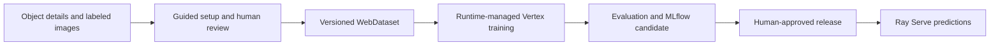

# Program features

This guide describes the Defect Training Platform: a configurable program for building, training, tracking, and serving a separate defect classifier for each inspected object type. It explains the implemented behavior and the configuration it needs.

**Scope reviewed:** September 29, 2026, against the source at commit `024c6af`. This is a feature inventory based on source inspection. The verification results below are existing recorded evidence; no training job or deployment was started for this document.

## What the program does

You provide an object description, defined defect classes, labeled image locations, and training settings. The platform turns those inputs into a versioned WebDataset, trains a DINOv3 feature extractor with an MLP classification head, records the experiment in MLflow, and supports an explicitly approved release to Ray Serve.

Each image must already be a crop containing a detected defect, with one class label. The program classifies that crop. Finding defects in full inspection images, drawing segmentation masks, and deciding whether a product should pass, fail, or be scrapped are outside its current scope.

| Feature area | What you get |
| --- | --- |
| Guided setup | A command-line conversation that produces validated, editable configuration |
| Class definitions | Reviewed meanings, stable class IDs, aliases, and versioned catalogs |
| Dataset preparation | Label review, duplicate checks, grouped splits, optional Cleanlab quality gates, and immutable WebDataset files |
| Training | Configurable DINOv3 + MLP training with validation-based checkpoint selection |
| Run management | Durable run IDs, asynchronous cloud submission, status, and artifact links |
| Experiment tracking | MLflow configuration, lineage, evaluation artifacts, and candidate model versions |
| Release management | Explicit staging, promotion, approval records, and rollback |
| Prediction | Class, confidence, review flag, model identity, and optional diagnostic heatmap |
| Operations | Runtime certification, deployment templates, structured logs, and optional OTLP export |

## 1. Guided setup and readable project folders

The primary interface is the `defect` command-line tool. `defect train guided` accepts object details, notes, and a CSV or BigQuery source location. A configured LiteLLM model proposes a structured setup and asks for missing information in up to three rounds, with at most five questions presented per round. Unresolved questions or review items block further progress.

The guided path creates or checks the object folder, asks for class definitions and explicit approval, reviews unresolved labels, builds the dataset, collects a certified runtime and Vertex settings, pins DINOv3 weights, writes the experiment, and submits it through the control service. It returns a run ID after submission. Setup and dataset building happen before that handoff; the command is not an instant background task for the entire preparation process.

For smaller steps, `defect setup ask` saves a validated draft without starting a job, and `defect object init` creates an object folder interactively. Free-form notes help draft configuration; the program still requires structured labeled data. It does not automatically extract trustworthy training labels from arbitrary documents.

The agent proposes configuration. The control service and cloud workflow execute and monitor training, so an agent session does not have to remain active while the GPU job runs.

Source: [CLI](../src/defect_platform/cli.py), [setup assistance](../src/defect_platform/control/setup.py), and [object templates](../templates/object/).

## 2. Reviewed, versioned defect class definitions

Each object has an ordered class catalog with at least two unique classes. A class has a stable ID, display label, definition, aliases, and optional positive and negative example references. The order also defines the model's numerical class indices.

The catalog normalizes aliases and rejects ambiguous collisions. Draft and legacy catalogs can support local exploration; paid submission requires a reviewed catalog resolved from the separately configured operator catalog store. `defect object review-catalog` displays definitions and requires an explicit `--approve` and reviewer identifier before publication.

Catalog publication is create-only. A checksum identifies its exact content, and a version claim prevents the same catalog ID/version from being reused with changed content. A catalog change requires a new version and dataset rebuild; historical datasets and models keep their original meanings.

Definitions, reviewer names, timestamps, and example locations are recorded evidence. The program does not authenticate a person from the reviewer string or independently establish that an example image is correctly labeled. Store permissions and human review remain necessary.

Source: [semantic contracts](../src/defect_platform/semantics.py), [catalog store](../src/defect_platform/catalog_store.py), and [module contracts](MODULE_CONTRACTS.md).

## 3. Data ingestion, label review, and leakage checks

The dataset reader accepts one or more CSV manifests or fully qualified BigQuery tables. You can configure the image and label columns, optional sample and product/lot group IDs, and an image root for relative paths. CSV files may be local or in GCS. Image bytes must be available locally or through GCS; HTTP image downloading is rejected by the builder.

`defect dataset preview` reports row counts, mapped counts, per-class counts, and review exceptions. Label lookup normalizes spelling and uses approved catalog aliases or explicit mappings. Unknown labels can receive spelling suggestions, but those suggestions do not become accepted mappings automatically. Interactive review records the accepted mapping changes, reviewer, timestamp, and original exceptions.

Dataset preparation checks conflicting labels and sample identities, image availability and decoding, exact duplicates by content hash, and near duplicates using perceptual fingerprints. Duplicate images carrying different labels block the build. Duplicate links and supplied group IDs keep related crops together when assigning train, validation, and test sets.

When configured, Cleanlab consumes an external out-of-sample probability artifact.
The builder validates exact sample keys and class order, records ranked label issues
in `cleanlab/report.json`, and blocks publication when the configured issue fraction
is exceeded.

Splitting is deterministic for a given input and seed and approximately balances class and total counts. The default proportions are 70% training, 15% validation, and 15% test. Keeping whole groups together can prevent exact proportions. Near-duplicate detection is a heuristic; missing product/lot identifiers and undetected relationships can still permit leakage.

Source: [source readers](../src/defect_platform/dataset/sources.py), [label review](../src/defect_platform/dataset/labels.py), [duplicate detection](../src/defect_platform/dataset/duplicates.py), and [splitting](../src/defect_platform/dataset/splits.py).

## 4. Immutable WebDataset versions and integrity checks

`defect dataset build` packages images, labels, and sample metadata into split-specific TAR shards. The maximum samples per shard is configurable; its default is 1,000. A content-derived version ID binds image content, labels, class catalog, split policy, mappings, and source provenance.

Each version includes sample and source manifests, checksums, duplicate findings, split assignments, and a semantic manifest describing the class meaning. Publication supports local storage and GCS. GCS writes are create-only, and a final `_COMMIT.json` marker identifies a completed publication. Identical accepted inputs can reuse the existing version instead of overwriting it.

Consumers verify manifests and artifact content, including the exact shard routes and counts for each split. Corruption, changed semantics, or a train/test route swap is rejected. Checksums establish identity and consistency; they cannot establish the truth of the source labels.

Source: [dataset builder](../src/defect_platform/dataset/builder.py) and [dataset verification](../src/defect_platform/dataset/verification.py).

## 5. Configurable DINOv3 + MLP training

The model pools DINOv3 spatial patch features and feeds them through an MLP classifier. Pooling excludes the class token and register tokens. The default backbone is DINOv3 ViT-S/16. The backbone is frozen by default; selected final transformer layers can be unfrozen for fine-tuning.

Weights must come from a pinned local or GCS artifact with a SHA-256 checksum. The loader disables a mutable model-hub fallback. Training reads the versioned WebDataset shards, uses shared preprocessing for training and inference, and applies horizontal flipping only on the training path.

| Setting | Purpose | Default |
| --- | --- | --- |
| `model.backbone` | Backbone identity | `facebook/dinov3-vits16-pretrain-lvd1689m` |
| `model.weights_uri`, `model.weights_sha256` | Exact starting weights | Required |
| `model.image_size` | Square input size | 256 |
| `model.hidden_dim` | MLP hidden width | 256 |
| `model.dropout` | MLP dropout | 0.2 |
| `model.unfreeze_last_n` | Final backbone layers to train | 0 |
| `model.preprocessing` | Explicit shared resize/normalization contract | RGB, bilinear resize, ImageNet mean/std |
| `epochs` | Training passes | 10 |
| `batch_size` | Images per batch | 32 |
| `learning_rate` | Optimizer step size | 0.001 |
| `optimizer` | Optimization method | `adamw`; also supports `sgd` |
| `loss` | Classification objective | `cross_entropy`; also supports `focal` |
| `focal_gamma` | Focal-loss focusing strength | 2.0 |
| `horizontal_flip_probability` | Training augmentation probability | 0.5 |
| `class_weights` | Optional positive weights for every class | Empty; unweighted |
| `seed` | Random seed | 42 |
| `max_review_error_rate` | Validation error target used to choose a review cutoff | Unset |

The local trainer can run on CPU or GPU. Multiple visible GPUs use PyTorch `DataParallel` on one machine; there is no implemented multi-node distributed training flow. A seed records the randomization choice without guaranteeing identical results across all hardware and library versions.

Source: [configuration types](../src/defect_platform/contracts.py), [model](../src/defect_platform/trainer/model.py), [training](../src/defect_platform/trainer/training.py), and [preprocessing](../src/defect_platform/trainer/preprocessing.py).

## 6. Evaluation, confidence, and portable model outputs

The best epoch is selected by validation Matthews correlation coefficient (MCC), with macro F1 as the second comparison. The selected checkpoint is evaluated on validation and held-out test data. Reports include MCC, macro F1, accuracy, per-class precision/recall/F1/support, a confusion matrix, and epoch loss/validation history.

When configured, the trainer derives a confidence cutoff from validation data and records the validation review fraction and accepted-case error rate. Inference flags predictions below the stored cutoff for human review. Without calibration, the exported cutoff defaults to zero. Confidence and the validation error target do not establish a guaranteed error rate on new production data.

The exported model contains the checkpoint, backbone configuration and weights, ordered class map, inference settings, original experiment settings, semantic manifest, and bundle integrity information. Inference can reload it after the original weight location is removed. Release loading verifies external checksum pins, contained artifact paths, and checkpoint consistency, and uses PyTorch's weights-only loading mode.

Source: [metrics](../src/defect_platform/trainer/metrics.py), [model export](../src/defect_platform/trainer/training.py), [inference](../src/defect_platform/trainer/inference.py), and [integrity helpers](../src/defect_platform/trainer/weights.py).

## 7. Durable cloud runs and admission controls

`defect train start` and `defect run submit` submit validated requests to the control API. The controller records the request and run ID before starting execution. A stored idempotency key and request fingerprint let repeated matching requests resolve to the same run and reject conflicting reuse.

Before admission, the controller checks object/dataset/runtime identities, verified dataset semantics, trusted reviewed classes and ordering, the certified immutable trainer digest, and infrastructure capabilities. Delayed workflow dispatch checks semantic and infrastructure references again.

The production control service requires an operator-published capability record and its pinned checksum. That record specifies observed project, region, service account, artifact roots, endpoints, supported contract versions, accepted runtime source/digest pairs, evidence locations, and an expiry. Stale, unready, mismatched, or future observations are rejected. Reading the record does not itself probe endpoint availability or validate every referenced observation.

The cost admission check compares `max_run_hours × estimated_hourly_usd` with `max_run_cost_usd`. This uses the configured hourly estimate; it is not a complete billing cap or an aggregate spending reservation. The job has a configured execution timeout. Storage, other services, inaccurate prices, and uncertain external operations still require operator accounting.

Cloud Workflows submits a Vertex AI CustomJob, polls it independently of the user session, and reports terminal results through the control API. Run records support pending, preparing, submitted, running, succeeded, failed, and canceled states, with failure codes and useful locations. PostgreSQL supports deployed state; SQLite supports local work.

The current CLI has status and list commands, but no run-cancel command. A workflow polling timeout records failure; that step does not cancel the actual Vertex job. Stored idempotency and existing-job checks do not prove exactly-once paid dispatch across concurrent requests or a lost cloud creation response. These recovery limits remain acceptance work.

Source: [controller](../src/defect_platform/control/controller.py), [run store](../src/defect_platform/control/store.py), [control API](../src/defect_platform/control/api.py), [workflow](../infra/workflow.yaml), and [infrastructure capabilities](../src/defect_platform/infrastructure_contract.py).

## 8. MLflow experiment and model tracking

The control service creates an MLflow experiment run and records the run configuration, dataset version/content checksum, runtime identity, image digest, and semantic references. The trainer resumes that run to log evaluation metrics and the portable model artifacts.

Successful runs register candidate versions under an object-specific model name such as `defect-widget`. Registration reuses a version already associated with the run. MLflow finalization or registration errors remain visible in the run record. A successful training job does not automatically promote its model to serving.

The integration supports a configurable tracking URI and Google IAM token handling for protected MLflow services. The repository includes an MLflow service image and infrastructure templates; the live cloud tracking path remains unverified.

Source: [MLflow controller adapter](../src/defect_platform/control/controller.py), [trainer logging](../src/defect_platform/trainer/training.py), and [authentication helper](../src/defect_platform/mlflow_auth.py).

## 9. Approved releases, serving, and rollback

`defect release stage` binds a successful run to an exact MLflow model version and an immutable serving image digest. It checks the candidate's run ownership, dataset/runtime lineage, catalog, model semantics, and bundle identity before writing the release.

`defect release promote` requires an approver identifier, re-verifies the release, records approval, updates the MLflow `champion` alias, and normally applies a KubeRay RayService manifest. `--no-deploy` supports a deliberate registry-only change. `defect release rollback` restores the preceding approved version. Release records use local SQL storage or append-only GCS revisions, according to configuration.

Serving workers load the exact model version and fingerprints configured in the release. Moving a registry alias does not silently change a running worker's pinned model. Requests cannot choose an arbitrary model URI. Promotion and rollback attempt to restore the registry alias if deployment raises an error; applying a manifest does not by itself establish successful GKE rollout or live readiness.

The Ray Serve HTTP interface has `GET /health` and `POST /predict`. Prediction accepts a base64 image and an optional `explain` flag, with an 8 MiB decoded-image limit. Its response contains:

- The class name and stable class ID.
- Confidence and whether human review is required.
- The model name and exact version.
- Catalog and model-semantic checksums.
- An optional base64 PNG heatmap overlay.

The heatmap is a gradient diagnostic for the predicted class. It is not a segmentation mask or proof of the defect's cause. The default infrastructure exposes an internal GKE service; callers and ingress must be configured for the intended environment.

Source: [release commands](../src/defect_platform/serve/commands.py), [release lifecycle](../src/defect_platform/serve/releases.py), [Ray deployment](../src/defect_platform/serve/deploy.py), and [prediction API](../src/defect_platform/serve/api.py).

## 10. Runtime validation, deployment templates, and telemetry

Trainer runtime release is a separate operation from experiments. The `defect runtime certify` implementation checks committed source, validates the trainer, builds from a pinned base image, validates the container on a GPU, pushes and resolves its digest, and runs a Vertex GPU/GCS handshake. It writes a certification record only after the ordered gates pass. The engineering roles separate trainer changes, image packaging, certification, and experiment execution.

Ordinary experiments reuse an existing certified digest. Changing data, epochs, learning rate, supported augmentations, or GPU count does not inherently rebuild the image. Changed code or dependencies require new image validation; an old image's evidence does not certify later source.

OpenTofu templates describe GCS datasets/artifacts/catalogs, Artifact Registry, Cloud SQL, Cloud Run control and MLflow, Workflows, a Cloud Tasks queue, GKE/KubeRay, and separate service identities and permissions. Dockerfiles and bounded cloud smoke configurations support packaging checks. Templates describe deployment inputs; they do not establish that these resources are deployed or accepted.

Components emit JSON logs to stdout with available object, dataset, run, job, model, stage, and failure context. An optional OpenTelemetry exporter sends logs to a configured OTLP collector for Loki-compatible delivery. High-cardinality run IDs remain structured metadata. Without an OTLP endpoint, stdout logging remains available; Loki is not automatically provisioned or verified.

Source: [runtime release](../src/defect_platform/runtime_release.py), [infrastructure](../infra/), [telemetry](../src/defect_platform/telemetry.py), and [operations](OPERATIONS.md).

## 11. Configuration and artifact locations

The repository holds code, templates, small configuration files, and artifact references. Large datasets and models stay in configured storage. Run locator files are refreshed by CLI submission/status reads; they are snapshots rather than a live status feed.

| Location | Contents |
| --- | --- |
| `projects/<object>/object.yaml` | Object description and class catalog |
| `projects/<object>/class-catalog.yaml` | Readable catalog snapshot; approved authority lives in the configured catalog store |
| `projects/<object>/dataset.yaml` | Sources, accepted mappings, splits, output location, and shard size |
| `projects/<object>/dataset-version.yaml` | Exact published dataset reference |
| `projects/<object>/experiment.yaml` | Weights, model choices, and training settings |
| `projects/<object>/runtime.yaml` | Certified trainer runtime record |
| `projects/<object>/vertex.yaml` | Project/region, machine/GPU, service account, staging, and cost settings |
| `projects/<object>/run-request.yaml` | Generated guided submission request |
| `projects/<object>/runs/<run-id>.yaml` | Last observed state, lineage, failures, and remote artifact locations |
| `certifications/` | Reusable runtime certification records |
| Dataset version root | TAR shards, source/sample manifests, semantics, and commit marker |
| Run `output_uri` | Evaluation report and model bundle |
| MLflow | Experiment runs, metrics, model artifacts, and registered versions |
| Configured release ledger | Staging, approval, promotion, and rollback history |

Environment variables configure service endpoints and credentials-related behavior. Key inputs include `DEFECT_CONTROL_SERVICE_URL`, `DEFECT_STATE_DATABASE_URL`, `DEFECT_WORKFLOWS_NAME`, `DEFECT_MLFLOW_TRACKING_URI`, `DEFECT_LITELLM_MODEL`, `DEFECT_CLASS_CATALOG_ROOT`, `DEFECT_INFRA_CAPABILITIES_FILE` with `DEFECT_INFRA_CAPABILITIES_SHA256`, and optional `DEFECT_OTLP_ENDPOINT` and `DEFECT_RELEASE_GCS_URI`. Guided setup can prompt for weights and default runtime/Vertex records, or receive them through its additional environment settings.

Strict shared types reject unknown configuration fields and validate supported values. Generated [JSON schemas](../schemas/) make file structure inspectable. Service URLs, identities, prices, weight artifacts, reviewed catalogs, and infrastructure observations must be supplied; the example files contain unset values and placeholders.

Source: [project layout](../projects/README.md), [environment example](../.env.example), [templates](../templates/), and [configuration types](../src/defect_platform/contracts.py).

## 12. Command reference

Run these from the repository with its dependencies installed. Arguments in uppercase are values you supply; submission, certification, and deployment commands require configured services and their operational permissions.

| Command | Purpose |
| --- | --- |
| `defect object init` | Create an object project interactively |
| `defect object review-catalog OBJECT.yaml --reviewer ID --approve` | Publish explicitly reviewed definitions to the configured operator store |
| `defect setup ask "DETAILS" --output setup-draft.yaml` | Generate a setup draft and questions |
| `defect train guided "DETAILS AND DATA LOCATION"` | Run guided preparation and submit training |
| `defect dataset preview DATASET.yaml --object OBJECT.yaml` | Inspect mappings, counts, and exceptions |
| `defect dataset build DATASET.yaml --object OBJECT.yaml` | Build an accepted immutable dataset |
| `defect train start projects/OBJECT/` | Submit a configured project |
| `defect run submit REQUEST.yaml --idempotency-key KEY` | Submit a combined request with an explicit retry key |
| `defect run status RUN_ID --json` | Inspect current state and locations |
| `defect run list --object OBJECT` | Find runs for an object |
| `defect runtime certify CONFIG.yaml --output certifications/RUNTIME.yaml` | Execute the explicit runtime release gates |
| `defect runtime show certifications/RUNTIME.yaml` | Inspect a runtime record |
| `defect release stage RUN_ID --model-version VERSION --serving-image-digest IMAGE@sha256:DIGEST` | Record a candidate release |
| `defect release show RELEASE_ID` | Inspect lineage and approval |
| `defect release promote RELEASE_ID --approver ID` | Approve and normally deploy a candidate |
| `defect release rollback OBJECT --approver ID` | Restore the preceding approved release |

## Current verification and remaining work

The [recorded semantic acceptance](SEMANTIC_TEST_STATUS.md) reports **115 local tests passed, with zero failures or skips**, for its September 28 source snapshot. It includes actual dataset building, the installed DINOv3 architecture with generated weights, portable model reload, and real local Ray HTTP inference. This document does not report a new test run or pretrained-model quality result.

The earlier [GPU evidence](evidence/2026-09-27-gpu-container/README.md) records an A100 synthetic training/CUDA and GCS handshake for a historical image digest. That digest predates the updated DINOv3 and semantic code. The current source still needs a newly validated and certified image.

Full live acceptance remains incomplete: pretrained DINOv3 defect training, live dataset publication/BigQuery ingestion, deployed control/database/workflow recovery, cloud MLflow registration, GKE serving/promotion/rollback, Loki delivery, and actual permission denial checks remain open. Authenticated operator approval, trusted runtime authority, complete pricing, migration acceptance, and real defect reference-set quality also need evidence. Local tests and checksum pins do not establish those results.

Use [Start here](START_HERE.md) for the user workflow, [module contracts](MODULE_CONTRACTS.md) for handoffs, [operations](OPERATIONS.md) for deployment procedures, and [requirements](REQUIREMENTS.md), [testing status](TEST_STATUS.md), and [acceptance](ACCEPTANCE.md) for the full completion criteria and evidence.
