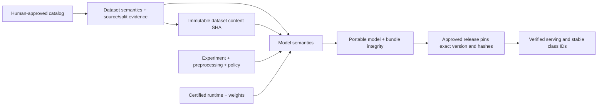

# Dataset, training, and infrastructure contracts

The Python types are authoritative; [generated JSON schemas](../schemas/) describe their structure. Consumers also enforce content hashes, identity, review authority, freshness, and class meaning. Schema validation alone cannot prove those properties.

| Module | Accepted input | Published output | Consumer rejection |
| --- | --- | --- | --- |
| Dataset | ObjectSpec with catalog; DatasetSpec; source rows/images; accepted exception review | DatasetVersion; immutable WebDataset shards; source snapshot; assignments; dataset SemanticManifest; final commit | Missing/corrupt bytes, different object/version, conflicting aliases, catalog/order mismatch, exchanged split routes |
| Training | Verified DatasetVersion + dataset SemanticManifest; ExperimentConfig; certified runtime/request references | Portable model, full original experiment, model SemanticManifest, integrity manifest, validation/test evaluation | Unknown/out-of-range labels, wrong catalog/order/policy, different dataset references, incomplete semantic handoff |
| Infrastructure | Deployment configuration; credentials; provider acceptance observations | Operator-pinned InfrastructureCapabilities + evidence locations; observed revision/endpoints/roots/expiry | Desired config presented as an observation, missing acceptance record, stale/unready revision, wrong identity/location/runtime |
| Control | Dataset/training inputs; trusted catalog root; accepted capabilities; idempotency key | Durable RunRecord; stored semantic references; bounded workflow/Vertex request | Client vocabulary differs; unreviewed/untrusted catalog; integrity/admission/capability failure before run or paid job effects |
| Serving | Human-approved ModelRelease; exact MLflow version; model/catalog/bundle fingerprints; trusted catalog root | Class ID and name, confidence, review flag, model version and semantic/catalog fingerprints, optional diagnostic heatmap | Altered artifact, changed class meaning/order, missing approval, unpinned version or wrong prediction identity |

## Authority and meaning

An image vector or text embedding can find similar examples and suggest an alias. It cannot decide the meaning of a defect class. A human defines each class, its exclusions, and reference examples. A stable class ID survives label spelling changes, but any catalog change creates a new fingerprint and catalog version. Dataset rebuilds inherit that new identity; existing versions retain their original meaning.

The review command writes approved catalogs to a separate configured store. Reader credentials cannot publish approvals. Review text and timestamps are audit fields; operating-system permissions or cloud IAM protect the store. A person editing a request to say “reviewed” cannot create a matching entry in that store through the control API.

Catalog objects are stored as `<object>/<catalog SHA>.json`; immutable version claims prevent reuse of a catalog ID/version with changed content. Hashes bind declared semantics, not the factual truth of labels or the reviewer’s identity. Reference image locations are recorded; their human interpretation remains an acceptance task.

## Fingerprint flow

Dataset semantic hashes omit their own enclosing content hash to avoid recursion. The enclosing dataset binds the semantic file; the model binds both dataset content and its parent semantic fingerprint. The externally pinned checksum of the model integrity file prevents an altered checkpoint plus a rewritten integrity file from passing release checks.

## Infrastructure observations

The capability envelope is an output of live acceptance, separate from OpenTofu’s desired settings. Its schema contains project, region, service account, artifact roots, endpoints, runtime digest/source commit, observation/expiry times, contract versions, and evidence locations. Production control requires the configured envelope and matching fingerprint at admission and again at delayed dispatch.

The loader validates the operator-pinned record and its declared observation. It does not independently fetch or verify every evidence location, authenticate a reviewer string, prove endpoint reachability, or refresh stale observations. Those checks remain required live acceptance gates. The example remains `unready` and unconfigured until evidence is supplied.

## Migration

1. Keep old datasets, checkpoints, releases, and historical test evidence.
2. String-only object classes derive an explicitly `legacy` catalog for local exploration.
3. Edit `class_catalog` in `object.yaml`, including definitions, aliases, stable IDs and examples. Publish with `defect object review-catalog object.yaml --reviewer YOUR_ID --approve` using operator credentials.
4. Build a new dataset and pin its catalog SHA in the experiment. Old artifacts lacking semantic proof are rejected by production admission/release; nothing is silently relabeled or promoted.
5. Changed software needs a new runtime image and relevant GPU/Vertex certification. Normal experiments reuse accepted digests and do not build containers.
6. Record live deployment observations and configure the capability envelope. Updated local tests do not certify the old cloud image.

## Evidence scope

See [semantic implementation evidence](SEMANTIC_TEST_STATUS.md). The local acceptance includes actual DINOv3 architecture with generated weights and real Ray HTTP processes. It cannot establish pretrained accuracy, real defect ground truth, live GPU compatibility of this revision, cloud IAM denial, or GCP MLflow/GKE/Loki delivery.
