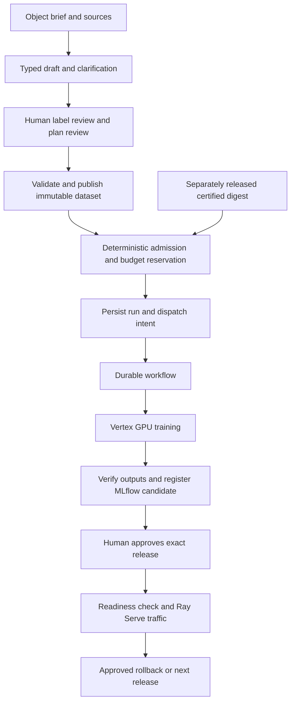

# Defect Training Platform — Full System Requirements

**Version:** 1.0

**Date:** September 28, 2026

**Status:** Requirements baseline for implementation and acceptance; full platform acceptance is incomplete.

**Implementation reviewed:** `dbc04a3c4ff260f966f7fc886efa8fc77d3a4b15`

**Audience:** Project owner, dataset reviewers, coding agents, platform operators, and acceptance reviewers.

## How to use this document

This document contains **150 individually identified requirements**. Each includes the requirement, **what** it means, **why** it exists, **how** it is enforced, required **positive evidence**, required **negative evidence**, and the evidence currently available.

Read the lifecycle and assurance sections first. Use the section index to find a feature, then its `TP-NNN` identifier to track implementation and evidence. A requirement is a target obligation, not a claim that the current code already satisfies it.

The canonical structured register is [requirements.json](requirements/requirements.json). The surrounding specification is authored in [context.md](requirements/context.md). This document is generated from both, with the evidence catalog. [baseline.json](requirements/baseline.json) records the local test observation used here. Run `python scripts/requirements_document.py --check` to validate document consistency; use `--write` to regenerate after an intentional specification change.

**“Positive evidence” describes successful required behavior. “Negative evidence” describes an attempted opposite or prohibited behavior being prevented.** Known defects and missing evidence are recorded separately. Procedures labeled `P-TP-NNN` and `N-TP-NNN` are acceptance obligations; they are not reports of tests already executed.

## 1. Purpose and authority

### 1.1 Intended system

A person supplies an object definition, class information, notes, images or image locations, and CSV or BigQuery labels. A LiteLLM-backed assistant asks a bounded number of clarifying questions and proposes configuration. The person reviews unresolved label decisions and the concrete training plan. Deterministic services validate the plan, publish a versioned WebDataset, admit a budgeted experiment, and execute it on a Vertex CustomJob.

Each object type has its own DINOv3 + MLP classifier. The system selects a checkpoint primarily by validation MCC and secondarily by macro F1, evaluates it, derives review thresholds, and registers an MLflow candidate. An authenticated human approves a concrete release before Ray Serve on GKE/KubeRay serves it. The system retains the prior approved release for rollback.

The agent helps establish intent and repair software within its role. **The runtime owns job submission, waiting, retries, cancellation, reconciliation, and result acceptance.** An active assistant session is not required while training runs.

### 1.2 Product boundary

| Included | Boundary |
| --- | --- |
| Supervised single-label classification | Input is an already identified defect crop |
| Separate object models | Dataset, model, and release identity bind to an object type |
| DINOv3 feature extraction and configurable MLP | Supplied pinned weights; controlled last-layer fine-tuning |
| CSV and BigQuery labels; local/GCS images | Approved, validated source locations |
| Versioned WebDatasets in GCS | Accepted evidence, splits, and shard integrity are immutable |
| One-machine GPU training | Configurable supported GPU count; no multi-machine requirement |
| MLflow run/registry control | Candidate creation is separate from production promotion |
| Ray Serve with GKE/KubeRay | Configured serving profile and explicit release approval |
| Structured logs and configurable Loki/OTLP integration | Delivered telemetry must be verified at its configured sink |
| CLI-first, template-driven operation | Non-programmers can navigate objects, runs, and artifacts |

Product disposition, autonomous release decisions, general object detection, segmentation, and unapproved model families are outside the accepted purpose. Heatmaps are diagnostics, not proof of defect localization or causal explanation. A later scope change must explicitly update this baseline and its acceptance criteria.

### 1.3 Requirement authority

This baseline derives from the user's platform request, accepted implementation plan, supplied eighteen architecture/agent prompts, and later insistence on actual GPU and live-infrastructure testing. Engineering obligations such as authenticated approval, crash reconciliation, artifact containment, and denial proof elaborate those requirements into testable controls.

Deployment-specific numeric targets remain decisions to configure and accept; this document does not invent approved latency, throughput, RPO/RTO, retention, quality, or production budget values. New cloud spending and resource destruction still require applicable authorization. The existing **USD 5 total test authorization** is not authorization for an unrestricted full deployment.

Changes to canonical requirement meaning require project-owner review. Generated views, test results, agent proposals, and code comments do not silently change scope. Historical evidence stays tied to its original source, image, environment, and procedure.

### 1.4 Current evidence boundary

A fresh local suite run for this document produced **55 passing tests, no skips, and two dependency deprecation warnings**. Actual DINOv3 architecture integration uses generated local weights. It verifies selected-layer gradients, patch pooling, fixture training, portable reload, evaluation, and heatmaps; it does not prove pretrained defect quality.

The prior live A100/GCS container probe passed for:

```text
source: cbf9dd19ba09df5a1c4236f620e83d20f73d7a94
image: us-central1-docker.pkg.dev/prefab-winter-256318/defect-gpu-smoke-20260927/trainer@sha256:54b8a0ffd2a8bb0cb444c6f61069f33c7fca4ce98ce88abd734eba0855c17c27
Vertex job: 5919343314829574144
```

That image predates the trainer compatibility fix in `749b3e5`. The live probe ran a generic CUDA MLP/checkpoint check, not pretrained DINOv3 training. Its successful result cannot certify changed source or close the deployed platform lifecycle. No complete live prevention campaign or full `CertifiedRuntime` acceptance is claimed.

See [testing status](TEST_STATUS.md), [chronological acceptance](ACCEPTANCE.md), and [retained GPU evidence](evidence/2026-09-27-gpu-container/README.md). Earlier dated entries describe observations at that time; later entries supersede readiness conclusions without rewriting history.

## 2. Actors, boundaries, and ownership

### 2.1 Operational actors

| Actor | Permitted responsibility | Authority boundary |
| --- | --- | --- |
| Project owner | Accept scope, environments, budgets, and operational profiles | Explicit human authority; cannot be impersonated by assistant text |
| Dataset reviewer | Resolve label exceptions against exact evidence | Does not issue runtime certification or production release |
| Setup assistant | Ask questions and propose typed configuration | No paid execution, certification, approval, or policy authority |
| Dataset publisher | Validate and publish accepted versions | Create-only accepted data; cannot change source decisions |
| Runtime release controller | Coordinate gated role-specific stages | Cannot collapse every stage into one unconstrained agent identity |
| Certification service | Validate existing exact digest and issue bound evidence | Cannot edit or rebuild the validated software |
| Admission/control service | Validate, reserve budget, persist intent, dispatch | Trusted facts resolved server-side |
| Workflow/job identities | Observe/execute within approved job and data scope | No arbitrary IAM changes or production promotion |
| MLflow candidate writer | Record runs and eligible candidate versions | No protected production-alias authority |
| Human approval/release service | Verify approval, deploy, reconcile, rollback | Artifact identity and approval are immutable and scoped |
| Serving identity | Read approved bundle and answer authorized inference | No dataset publication, trainer submission, or registry promotion |
| Acceptance reviewer | Evaluate requirement-level evidence | No claim of completion from a green subset |

### 2.2 Coding-agent roles

| Role | Owned work | Forbidden effects |
| --- | --- | --- |
| Trainer Engineer | Trainer algorithms, local trainer tests | Image build/push, cloud submission, certification |
| Runtime Engineer | Docker/dependencies/runtime packaging and GPU checks | Trainer algorithm edits, experiment submission, certification |
| Runtime Certifier | Existing-digest validation and evidence issuance | Source edits, image build/replacement, unrestricted training |
| Experiment Runner | Allowed experiment/job configuration, certified submission, inspection | Trainer/dependency edits, image build/push, certification |
| Primary integration owner | Shared contracts, deployment integration, reviewed handoffs | Does not bypass human budget/release authority |

A publisher capability, if required for candidate images, belongs to a narrowly scoped release-stage identity. This resolves the distinction between a runtime engineer proposing/building packaging and a protected service publishing it. Role policy must be consistent across instructions, harness checks, filesystem capabilities, and cloud permissions.

### 2.3 Threat and assurance model

Prevention claims cover mistakes and adversarial actions by untrusted source content, assistant outputs, API clients, ordinary role identities, and retries/crashes/concurrent requests at the declared boundaries. They assume trusted policy administrators, cloud identity providers, and configured cryptographic primitives behave as specified.

A cloud project Owner or host administrator who can replace policy is outside an ordinary-role denial claim. That exclusion must be stated in the evidence; it cannot be hidden to claim universal impossibility. Compromised administrator response, policy changes, and recovery remain operational concerns.

A prompt, written rule, or regex hook alone does not establish that a prohibited effect cannot occur. Authority must be constrained beneath that layer: authenticated services, scoped capabilities, protected storage, immutable records, and cloud IAM. If an alternative path such as an SDK or indirect subprocess can bypass the boundary, negative acceptance is still open.

## 3. Lifecycle and invariants



Runtime release is a separate path: **local trainer validation → pinned candidate build → GPU validation of that candidate → publication/digest resolution → exact-digest Vertex handshake → authenticated certification**. A candidate can be validated before publication by local content identity; after publication its resolved digest must match that same candidate. Where GPU validation is performed only after registry publication, publication is staging, not certification, and the subsequent gates must validate the resolved exact digest. The Certifier operates on an already built digest.

Ordinary experiments only resolve a usable certification; they never enter the build path. A hardware change can reuse an image but must remain inside proven compatibility scope.

### 3.1 State semantics

| Record | Required states/meaning | Important restriction |
| --- | --- | --- |
| Setup | Draft, needs clarification/review, accepted, superseded | Acceptance binds the displayed revision |
| Dataset | Preparing, committed/accepted, failed/quarantined | Only complete verified versions are consumable |
| Runtime | Candidate, validation pending/failed, certified, revoked | Certification binds exact identity and supported scope |
| Run | Pending/preparing, submitted, observed running, finalizing, succeeded/failed/canceled | Submission is not running; process success is not artifact acceptance |
| Reconciliation | Known, uncertain external outcome, stopping, resolved | May be orthogonal to run state; never hide unknown liveness |
| Release | Staged, approved, deploying, ready/promoted, failed/reconciling, rolled back | Completed release needs verified traffic and identity |

Existing `RunState` and `ModelRelease` enums are smaller than this target lifecycle. Implementations may represent finalization/reconciliation with separate typed records, but must preserve these semantics. State transitions use authenticated sources, stable event IDs, and revision checks. A terminal event cannot rewrite immutable job/artifact identity.

### 3.2 Safety invariants

1. **Paid job created ⇒** accepted plan ∧ source/dataset verification ∧ usable authoritative certification ∧ authorized identity ∧ trusted budget reservation.
2. **Accepted dataset ⇒** resolved accepted labels ∧ complete manifest/source evidence ∧ verified shards ∧ leakage-safe split assignment ∧ protected commit.
3. **Certified runtime ⇒** exact source/image binding ∧ all required successful gates ∧ authenticated certifier ∧ supported hardware scope.
4. **Ordinary experiment ⇒** zero software-build, image-publish, dependency-install, or certification effects.
5. **Successful run ⇒** observed terminal job success ∧ verified coherent outputs ∧ explicit finalization/registration status.
6. **Promoted release ⇒** authenticated human approval of exact identity ∧ eligibility evidence ∧ matching ready deployment ∧ consistent alias/traffic/ledger.
7. **Canceled/stopped claim ⇒** observed external terminal state; a local timeout alone is insufficient.
8. **Retry ⇒** same effective intent, bounded attempts/cost, no unauthorized duplicate effect.
9. **Complete system claim ⇒** all applicable requirements and accepted local/live positive and negative gates are satisfied.

These are acceptance invariants, not assertions about the present implementation.

## 4. Typed records and artifact organization

### 4.1 Required data contracts

Every record needs schema version, stable identity, object/environment scope where applicable, revision or content fingerprint, and validated references. The table distinguishes current named contracts from fields needed for complete authority/evidence binding.

| Record | Required content and purpose |
| --- | --- |
| `ObjectSpec` | Stable safe slug, readable name/description, unique ordered classes, crop/task policy |
| `LabelSource` | Kind, approved location, column mapping, image root, source revision/query selection, access evidence |
| `LabelReviewEvidence` | Authenticated reviewer, exact preview/source fingerprint, decisions, timestamp, mapping revision |
| `DatasetSpec` | Accepted sources/mapping, duplicate/group policy, splits/seed, output/shard policy, validation limits |
| `DatasetVersion` | Immutable identity, manifest/source/shard URIs and checksums, class/split counts, final commit reference |
| `ExperimentConfig` | Object/dataset/runtime references, pinned weights/model/head, optimization, preprocessing, seed, calibration policy |
| `VertexJobConfig` | Project/region/identity/network, machine/GPU/count/disk, duration/retry limits, trusted price-profile and budget reference |
| `CertifiedRuntime` | Exact source/image/software identities, hardware scope, gate reports/checksums, certifier identity/time, usability/revocation |
| `RunRecord` and dispatch/events | Durable ID, request fingerprint, state/revision, workflow/job/MLflow links, cost reservation, outputs, failures, reconciliation |
| `ModelRelease` and approval | Exact model/run/dataset/runtime/serving digest, eligibility, authenticated scoped approval, prior release, deploy/traffic outcome |
| `PlatformConfig`/deployment profile | Endpoints, secret/identity references, policy limits, environment resources, operational/acceptance targets |

Current definitions are in [contracts.py](../src/defect_platform/contracts.py). Fields already present do not make missing authenticity or immutable-storage guarantees implicit.

### 4.2 Template-controlled navigation

The following is the required navigation shape, not a claim that every generated file currently exists:

```text
projects/<object>/
  README.md                  object purpose and next actions
  object.yaml                object/classes
  dataset.yaml               source and accepted dataset policy
  experiment.yaml            training policy and artifact references
  vertex.yaml                job and cost profile references
  reviews/                   source-bound review indexes
  datasets/<version>/        readable index to immutable GCS artifacts
  runs/<run-id>/             summary and links generated from run state
  models/<version>/          evaluation, registry, and release index
  releases/<release-id>/     exact approval/deployment/rollback index

certifications/              readable pointers to authoritative records
templates/                   versioned object/run/review/release shapes
docs/                        requirements, operations, acceptance evidence
```

Large images, shards, weights, checkpoints, and bulk diagnostics belong in configured private GCS stores. These readable folders contain safe summaries and references. Private project summaries must not automatically become public Git files. Generated views can be rebuilt from authoritative records; hand edits cannot alter accepted truth.

## 5. Evidence and prevention proof

### 5.1 Evidence classes

| Class | What it establishes | What it does not establish |
| --- | --- | --- |
| Source inspection | A control or path appears in reviewed code/configuration | It executes correctly or cannot be bypassed |
| Local positive observation | Required behavior happened in the recorded local case | Live permissions, cloud integration, or realistic model quality |
| Local negative observation | A specified prohibited attempt was denied locally with checked effects | All bypass paths or cloud IAM |
| Simulated integration | Adapter/controller behavior under the simulated responses | Actual external authorization, capacity, durability, or billing |
| Live positive observation | A specified action happened on the recorded deployed infrastructure | Changed versions or untested prohibited behavior |
| Live negative observation | A real principal was denied and prohibited state remained unchanged | Different roles, alternate capabilities, administrators, or later policy changes |
| Invariant/control argument | Why all enumerated entry paths are mediated by enforcement | Universal mathematical proof unless formal verification is actually supplied |

Evidence scope and age are part of the result. A mocked denial is a simulated result, even when the test passes. An earlier GPU probe remains evidence for its original digest only.

### 5.2 Standard positive procedure

For each `P-TP-NNN`: identify the allowed actor and exact setup; exercise the real required path; verify expected output and durable state; capture lineage and artifacts; repeat at required local/live scope. Include the allowed counterpart in negative campaigns so a globally broken or inaccessible environment cannot appear to prove policy enforcement.

### 5.3 Standard negative procedure

For each `N-TP-NNN`:

1. State the opposite/prohibited effect and who is attempting it.
2. Enumerate the reachable entry points, credentials/capabilities, and enforcing boundary.
3. Capture before-state: relevant jobs, object generations/hashes, records/revisions, aliases, traffic, files, and audit context.
4. Attempt the forbidden effect directly and through relevant alternate paths; include stale data, races, interruption, replay, and dependency errors.
5. Observe an explicit denial, fail-closed result, or quarantined uncertain outcome.
6. Independently inspect after-state and audit evidence. Verify **zero forbidden effects** and no hidden stronger credentials.
7. Exercise the permitted counterpart and reconcile any uncertainty. If observation is incomplete, record **pending**, not passed.

An exception alone does not prove prevention: a paid job may have been created before the exception. An empty log query alone does not prove nothing happened. A test that only mocks the denial does not prove the real permission boundary.

“Cannot happen” means the prohibited effect is unreachable through the enumerated actor capabilities under the declared trust assumptions, backed by control inspection and adversarial observations. Finite tests cannot establish an unrestricted universal claim. A bypass invalidates the claim until fixed and reverified.

### 5.4 Required evidence report

Reports are separate from this requirements register. A planned procedure is not an observed report.

```yaml
evidence_id: N-TP-071-case-001
requirement_id: TP-071
direction: negative
procedure_version: "1"
status: pending                 # passed | failed | pending | inconclusive
scope: live                    # inspection | local | simulated | live
observed_at: null
source_commit: null
image_digest: null
configuration_fingerprint: null
environment: null
actor_principal: null
enforcement_boundary: "admission service plus restricted build capabilities"
prohibited_effect: "ordinary experiment builds or publishes a runtime"
entry_paths_tested: []
trust_assumptions: []
preconditions: []
steps: []
expected_result: "denied; no build, push, install, or certification effects"
observed_result: null
before_state_uri: null
after_state_uri: null
audit_or_trace_uri: null
artifact_checksums: {}
side_effects: null
limitations: []
reviewer: null
```

Evidence is valid only when identifiers, scope, preconditions, actual observations, integrity, and independent side-effect checks support the claim. A passed report may cover only part of a requirement. Store sensitive raw evidence privately; publish safe indexes.

### 5.5 Available evidence catalog

<a id="e-scope"></a>

### E-SCOPE — Accepted scope and repository orientation

- **Scope:** `source_inspection`.
- **Sources:** [README.md](../README.md), [docs/ARCHITECTURE.md](../docs/ARCHITECTURE.md), [AGENTS.md](../AGENTS.md).
- **Selected tests:** No named test claim.
- **Observed support:** The repository describes per-object crop classification, runtime/experiment separation, and four coding roles.
- **Limits:** Written intent establishes scope, not enforcement.

<a id="e-contract"></a>

### E-CONTRACT — Typed contracts

- **Scope:** `source_inspection_and_selected_local_checks`.
- **Sources:** [src/defect_platform/contracts.py](../src/defect_platform/contracts.py), [templates/object/](../templates/object/).
- **Selected tests:** No named test claim.
- **Observed support:** Strict Pydantic records define the core entities, forbid extra fields, and validate several value relationships.
- **Limits:** Current records do not establish authenticated certification, approval, schema migration, or every-ingress enforcement.

<a id="e-setup"></a>

### E-SETUP — Guided setup and CLI

- **Scope:** `local_with_mocked_services`.
- **Sources:** [src/defect_platform/control/setup.py](../src/defect_platform/control/setup.py), [src/defect_platform/cli.py](../src/defect_platform/cli.py), [tests/test_guided_cli.py](../tests/test_guided_cli.py), [tests/test_control_client.py](../tests/test_control_client.py).
- **Selected tests:** `test_guided_setup_builds_project_and_submits_to_durable_control_api`, `test_remote_cli_uses_one_authenticated_durable_api_for_submit_and_status`
- **Observed support:** Guided fixture setup and a simulated remote control API are exercised in the local suite.
- **Limits:** No live LiteLLM setup or deployed guided-to-runtime acceptance; prompt rules are not capability isolation.

<a id="e-template"></a>

### E-TEMPLATE — Project and infrastructure templates

- **Scope:** `source_inspection_and_prior_parse_checks`.
- **Sources:** [templates/object/](../templates/object/), [templates/runtime-release.yaml](../templates/runtime-release.yaml), [docs/START_HERE.md](../docs/START_HERE.md), [infra/](../infra/).
- **Selected tests:** No named test claim.
- **Observed support:** Object templates, deployment examples, and readable navigation are present; ten YAML files were previously parsed.
- **Limits:** Parsing does not validate OpenTofu providers, template containment, deployment readiness, or usable endpoints.

<a id="e-data"></a>

### E-DATA — Dataset behavior

- **Scope:** `observed_local_with_mocked_cloud_adapters`.
- **Sources:** [src/defect_platform/dataset/](../src/defect_platform/dataset/), [tests/test_dataset.py](../tests/test_dataset.py).
- **Selected tests:** `test_csv_adapter_reports_missing_columns_and_cells`, `test_bigquery_adapter_quotes_columns_and_maps_rows`, `test_label_preview_normalizes_mapping_and_reports_unresolved_suggestions`, `test_preview_detects_conflicting_same_image_and_sample_ids`, `test_duplicate_detector_finds_exact_and_near_images`, `test_group_aware_splits_are_deterministic_and_keep_groups_together`, `test_builder_creates_webdataset_provenance_checksums_and_idempotent_version`, `test_review_evidence_is_pinned_to_dataset_version`, `test_builder_refuses_unresolved_labels_and_conflicting_exact_duplicates`, `test_builder_refuses_overwrite_of_existing_version`, `test_verify_dataset_version_fails_closed_on_missing_or_corrupt_artifact`
- **Observed support:** Local tests exercise label exceptions, duplicates, splits, provenance, idempotency, overwrite rejection, and selected artifact tampering.
- **Limits:** BigQuery/GCS adapter doubles do not prove live publication, retention, role denials, source snapshots, or concurrent recovery.

<a id="e-train"></a>

### E-TRAIN — Trainer and actual DINOv3 integration

- **Scope:** `observed_local`.
- **Sources:** [src/defect_platform/trainer/](../src/defect_platform/trainer/), [tests/test_dinov3_integration.py](../tests/test_dinov3_integration.py), [tests/test_trainer_end_to_end.py](../tests/test_trainer_end_to_end.py), [tests/test_trainer_runtime.py](../tests/test_trainer_runtime.py).
- **Selected tests:** `test_real_dinov3_pooling_and_selected_layer_gradients`, `test_real_dinov3_refuses_unfreeze_past_depth`, `test_real_dinov3_webdataset_training_portable_reload_and_heatmap`, `test_selection_metrics_prefer_mcc_then_macro_f1`, `test_abstention_threshold_is_calibrated_from_validation`, `test_weight_artifact_checksum_is_stable_and_enforced`, `test_model_factory_refuses_unpinned_remote_fallback`
- **Observed support:** Actual DINOv3 architecture with generated local weights passes frozen/selected-layer gradients, patch pooling, training, portable reload, evaluation, and heatmap checks. The layer-layout fix is committed as 749b3e5.
- **Limits:** Generated random weights do not establish pretrained defect quality, GPU/multi-GPU training, or production calibration. The older end-to-end fixture substitutes a tiny model.

<a id="e-runtime"></a>

### E-RUNTIME — Runtime release gates

- **Scope:** `local_with_mocked_build_and_cloud_operations`.
- **Sources:** [src/defect_platform/runtime_release.py](../src/defect_platform/runtime_release.py), [src/defect_platform/trainer/runtime.py](../src/defect_platform/trainer/runtime.py), [src/defect_platform/trainer/runtime_probe.py](../src/defect_platform/trainer/runtime_probe.py), [infra/docker/trainer.Dockerfile](../infra/docker/trainer.Dockerfile), [tests/test_runtime_release.py](../tests/test_runtime_release.py), [tests/test_trainer_runtime.py](../tests/test_trainer_runtime.py).
- **Selected tests:** `test_certification_gate_order_and_exact_digest`, `test_failure_stops_before_image_push_or_vertex`, `test_certification_stops_at_failed_stage`, `test_handshake_requires_requested_gpu_count_and_gcs_roundtrip`
- **Observed support:** Local tests check ordered stages, failed-gate stopping, exact digest use, and handshake result requirements.
- **Limits:** Mocked gates cannot issue a trustworthy live certification. The monolithic certify wrapper currently builds, conflicting with restricted Certifier authority.

<a id="e-control"></a>

### E-CONTROL — Control-plane state and admission

- **Scope:** `observed_local_with_mocked_external_services`.
- **Sources:** [src/defect_platform/control/](../src/defect_platform/control/), [tests/test_control.py](../tests/test_control.py), [tests/test_control_client.py](../tests/test_control_client.py).
- **Selected tests:** `test_submit_persists_before_start_and_idempotent_retry_starts_once`, `test_preflight_blocks_over_budget_before_creating_run`, `test_normal_experiment_reuses_certified_digest_and_failure_has_owner`, `test_idempotency_key_rejects_changed_config`, `test_vertex_submission_returns_server_resource_and_recovers_retry`, `test_control_http_submission_and_workflow_callbacks`
- **Observed support:** Local tests cover persistence before start, selected idempotency, budget rejection, digest reuse, simulated job recovery, and API callbacks.
- **Limits:** Client runtime overrides/rates remain trust gaps; CAS, crash/concurrency safety, per-operation authorization, and no-build effect interception are not proved.

<a id="e-workflow"></a>

### E-WORKFLOW — Durable workflow design

- **Scope:** `source_inspection`.
- **Sources:** [infra/workflow.yaml](../infra/workflow.yaml).
- **Selected tests:** No named test claim.
- **Observed support:** The workflow dispatches and polls Vertex independently of an LLM session.
- **Limits:** No deployed workflow acceptance. Current timeout/poll-error paths mark failure without canceling/reconciling the job; running is recorded before observed running.

<a id="e-mlflow"></a>

### E-MLFLOW — MLflow tracking and registration

- **Scope:** `observed_local_registry_and_mocked_authentication`.
- **Sources:** [src/defect_platform/mlflow_auth.py](../src/defect_platform/mlflow_auth.py), [src/defect_platform/control/controller.py](../src/defect_platform/control/controller.py), [src/defect_platform/trainer/runner.py](../src/defect_platform/trainer/runner.py), [tests/test_mlflow_registration.py](../tests/test_mlflow_registration.py), [tests/test_trainer_runtime.py](../tests/test_trainer_runtime.py).
- **Selected tests:** `test_raw_bundle_registers_once_with_matching_run_id`, `test_mlflow_logging_authenticates_and_resumes_controller_run`
- **Observed support:** A real local SQLite-backed MLflow registry test checks candidate reuse; authentication/resume paths use simulated service behavior.
- **Limits:** No configured cloud MLflow service acceptance, protected-alias denial, or live lineage/registration recovery.

<a id="e-release"></a>

### E-RELEASE — Promotion and rollback

- **Scope:** `observed_local_with_mocked_deployment_and_GCS`.
- **Sources:** [src/defect_platform/serve/releases.py](../src/defect_platform/serve/releases.py), [src/defect_platform/serve/ledger.py](../src/defect_platform/serve/ledger.py), [tests/test_release_lifecycle.py](../tests/test_release_lifecycle.py), [tests/test_serve.py](../tests/test_serve.py).
- **Selected tests:** `test_promotion_requires_approver_and_moves_champion`, `test_release_ledger_promotion_rollback_and_deploy_failure`, `test_rollback_restores_alias_if_deploy_fails`, `test_gcs_release_history_and_rollback_without_cloud_sql`
- **Observed support:** Local checks cover missing approval text, ledger history, promotion/rollback, and selected alias compensation on deployment failure.
- **Limits:** Approver strings are not authenticated human consent; readiness, traffic, concurrent releases, crash recovery, and live rollback are unverified.

<a id="e-serve"></a>

### E-SERVE — Ray Serve packaging and inference

- **Scope:** `local_function_tests_and_prior_fixture_HTTP_observation`.
- **Sources:** [src/defect_platform/serve/](../src/defect_platform/serve/), [tests/test_serve.py](../tests/test_serve.py), [docs/ACCEPTANCE.md](../docs/ACCEPTANCE.md).
- **Selected tests:** `test_serving_decodes_image_and_returns_result`, `test_rayservice_requires_approval_and_exact_digest`
- **Observed support:** Typed local inference/decode checks pass; acceptance notes record an earlier local Ray HTTP fixture predictor.
- **Limits:** A fixture predictor does not prove a trained DINOv3 model on GKE. Startup resolves champion instead of immutable approved version; live serving/auth/load gates remain open.

<a id="e-telemetry"></a>

### E-TELEMETRY — Structured telemetry

- **Scope:** `source_inspection_and_prior_live_probe_logging`.
- **Sources:** [src/defect_platform/telemetry.py](../src/defect_platform/telemetry.py), [infra/otel-collector.example.yaml](../infra/otel-collector.example.yaml), [docs/evidence/2026-09-27-gpu-container/README.md](../docs/evidence/2026-09-27-gpu-container/README.md).
- **Selected tests:** No named test claim.
- **Observed support:** JSON context logging and optional OTLP log export exist; the GPU probe emitted correlated stages in Cloud Logging.
- **Limits:** No complete tracing/metrics, secret-redaction, buffering, or live Loki-delivery acceptance.

<a id="e-failure"></a>

### E-FAILURE — Failure ownership

- **Scope:** `observed_local_and_source_inspection`.
- **Sources:** [src/defect_platform/trainer/runtime.py](../src/defect_platform/trainer/runtime.py), [src/defect_platform/control/controller.py](../src/defect_platform/control/controller.py), [tests/test_trainer_runtime.py](../tests/test_trainer_runtime.py).
- **Selected tests:** `test_failure_classifier_names_owner_and_retryability`
- **Observed support:** Selected runtime failures are assigned an owner/retryability; the DINOv3 layer bug was corrected in trainer code.
- **Limits:** Complete taxonomy and enforcement of authorized recovery actions need additional proof.

<a id="e-role"></a>

### E-ROLE — Agent roles and hooks

- **Scope:** `local_hook_checks_and_source_inspection`.
- **Sources:** [AGENTS.md](../AGENTS.md), [.github/agents/](../.github/agents/), [scripts/role_guard.py](../scripts/role_guard.py), [tests/test_role_guard.py](../tests/test_role_guard.py).
- **Selected tests:** `test_trainer_cannot_build_image`, `test_experiment_can_inspect_but_not_edit_dockerfile`, `test_runtime_can_edit_dockerfile_but_cannot_submit_vertex`
- **Observed support:** Four custom roles and three direct role-guard tests exist.
- **Limits:** Actual harness invocation is unverified; regex checks do not prevent SDK/interpreter/indirect effects or provide filesystem/cloud isolation.

<a id="e-infra"></a>

### E-INFRA — Deployment and IAM templates

- **Scope:** `source_inspection`.
- **Sources:** [infra/main.tf](../infra/main.tf), [infra/variables.tf](../infra/variables.tf), [infra/outputs.tf](../infra/outputs.tf), [infra/versions.tf](../infra/versions.tf), [infra/terraform.tfvars.example](../infra/terraform.tfvars.example).
- **Selected tests:** No named test claim.
- **Observed support:** Templates describe GCS, service identities, Cloud Run/SQL, Workflows, GKE/KubeRay, and configured integration endpoints.
- **Limits:** Provider validation, complete deployment, scoped capability enforcement, restore drills, and live IAM denial checks are pending.

<a id="e-public"></a>

### E-PUBLIC — Public-source hygiene

- **Scope:** `prior_publication_inspection`.
- **Sources:** [.gitignore](../.gitignore), [README.md](../README.md).
- **Selected tests:** No named test claim.
- **Observed support:** The prior publication pass reported a scan of 107 history blobs with no common secret patterns and no tracked large dataset/weight files.
- **Limits:** A pattern scan is not a universal secrecy guarantee; no persistent raw scan report or runtime/image secret-canary campaign is claimed.

<a id="e-gcp"></a>

### E-GCP — Observed live A100 container/GCS probe

- **Scope:** `prior_live_observed_exact_old_digest`.
- **Sources:** [docs/evidence/2026-09-27-gpu-container/README.md](../docs/evidence/2026-09-27-gpu-container/README.md), [docs/evidence/2026-09-27-gpu-container/result.json](../docs/evidence/2026-09-27-gpu-container/result.json), [docs/evidence/2026-09-27-gpu-container/validation.json](../docs/evidence/2026-09-27-gpu-container/validation.json), [docs/evidence/2026-09-27-gpu-container/job-summary.json](../docs/evidence/2026-09-27-gpu-container/job-summary.json), [docs/ACCEPTANCE.md](../docs/ACCEPTANCE.md).
- **Selected tests:** No named test claim.
- **Observed support:** Vertex job 5919343314829574144 succeeded on one A100, ran a generic CUDA MLP/checkpoint probe, and verified GCS read/write for the recorded old digest. Two T4 attempts were canceled and confirmed terminal.
- **Limits:** Source cbf9dd1 predates the DINOv3 fix; no pretrained DINOv3, current image, full CertifiedRuntime, deployed platform, or measured final bill is established. These are retained observations, not a fresh cloud retest.

<a id="e-acceptance"></a>

### E-ACCEPTANCE — Current local suite and acceptance boundaries

- **Scope:** `observed_local_and_acceptance_record_review`.
- **Sources:** [docs/TEST_STATUS.md](../docs/TEST_STATUS.md), [docs/ACCEPTANCE.md](../docs/ACCEPTANCE.md), [docs/requirements/baseline.json](../docs/requirements/baseline.json).
- **Selected tests:** No named test claim.
- **Observed support:** The unchanged implementation at dbc04a3 was rerun for this document: 55 passed, no skips, two dependency deprecation warnings, 5.62 seconds.
- **Limits:** A green local suite is a partial result. Complete deployed flow and live prevention acceptance remain incomplete.


## 6. Requirements register

Each entry's **How** names the required enforcing mechanism and responsible component. **Current evidence** identifies present support and remaining proof. Every requirement's full acceptance remains open unless separately closed by a reviewed report; this baseline does not calculate a misleading completion percentage.

| Section | IDs | Count |
| --- | --- | --- |
| [Mission, scope, and authority](#requirements-mission) | TP-001–TP-006 | 6 |
| [Guided setup and human review](#requirements-setup) | TP-007–TP-015 | 9 |
| [Configuration, templates, and project navigation](#requirements-configuration) | TP-016–TP-024 | 9 |
| [Source acquisition and label authority](#requirements-sources) | TP-025–TP-036 | 12 |
| [Immutable WebDataset versions and leakage prevention](#requirements-datasets) | TP-037–TP-048 | 12 |
| [DINOv3 training, evaluation, and inference artifacts](#requirements-training) | TP-049–TP-064 | 16 |
| [Runtime packaging and exact-digest certification](#requirements-runtime) | TP-065–TP-077 | 13 |
| [Admission, budgets, and durable execution](#requirements-execution) | TP-078–TP-094 | 17 |
| [MLflow experiment and model governance](#requirements-mlflow) | TP-095–TP-102 | 8 |
| [Human-approved releases and Ray Serve](#requirements-serving) | TP-103–TP-116 | 14 |
| [Telemetry, diagnostics, and failure ownership](#requirements-observability) | TP-117–TP-125 | 9 |
| [Coding-agent roles and enforced authority](#requirements-security) | TP-126–TP-139 | 14 |
| [Deployment, recovery, and full acceptance](#requirements-operations) | TP-140–TP-150 | 11 |

<a id="requirements-mission"></a>

### Mission, scope, and authority

<a id="tp-001"></a>

#### TP-001 — One supervised classification purpose

- **Requirement:** The system shall train and serve supervised DINOv3 plus MLP defect classifiers for already identified, single-label defect crops.
- **What:** A crop receives one canonical defect class; product disposition remains a consuming-system decision.
- **Why:** Keep the platform focused on the user's single training objective.
- **How:** Declare the input/output contract and expose only supported training and prediction operations.
- **Enforcement owner:** Project owner and primary integration owner.
- **Positive evidence — `P-TP-001` (required):** Train one labeled crop dataset and obtain class, confidence, review flag, and optional diagnostic heatmap.
- **Negative evidence — `N-TP-001` (required):** Forbidden: an accepted request silently becomes detection, segmentation, multilabel training, or product disposition. Submit each unsupported task; validation must reject it before dataset publication or a paid job.
- **Current evidence:** E-SCOPE and E-TRAIN support the chosen path. Negative task-mode rejection is not comprehensively tested. References: [E-SCOPE](#e-scope), [E-TRAIN](#e-train)
- **Required scope:** `inspection`, `local`, `live_as_applicable`. **Full verification:** pending.

<a id="tp-002"></a>

#### TP-002 — Separate object models

- **Requirement:** The system shall isolate datasets, experiments, model names, and approved releases by object type.
- **What:** Each object has its own canonical class list and classifier lineage.
- **Why:** Avoid mixing incompatible defects or deploying one object's classifier for another.
- **How:** Carry object identity through typed records, artifact prefixes, registry names, and serving deployment checks.
- **Enforcement owner:** Project owner and primary integration owner.
- **Positive evidence — `P-TP-002` (required):** Run two object projects with different class lists and verify their artifacts and predictions remain distinct.
- **Negative evidence — `N-TP-002` (required):** Forbidden: a dataset, checkpoint, model version, or release from object A is accepted for object B. Attempt each cross-object substitution; all must be rejected without changing B's run or live release.
- **Current evidence:** E-DATA and E-CONTROL include object checks; complete cross-object and live serving evidence remains open. References: [E-DATA](#e-data), [E-CONTROL](#e-control)
- **Required scope:** `inspection`, `local`, `live_as_applicable`. **Full verification:** pending.

<a id="tp-003"></a>

#### TP-003 — Deterministic execution authority

- **Requirement:** The system shall give the runtime control plane exclusive authority over admission, job submission, waiting, retries, state, and result collection.
- **What:** The agent supplies setup suggestions; it does not become a long-running execution controller.
- **Why:** Training must continue without agent token consumption or an active conversation.
- **How:** Use durable run storage and GCP Workflows with narrow authenticated adapters; provide the agent no operational submit or polling capability.
- **Enforcement owner:** Project owner and primary integration owner.
- **Positive evidence — `P-TP-003` (required):** Submit a reviewed draft, close the agent session, and verify runtime-owned execution reaches its recorded terminal outcome.
- **Negative evidence — `N-TP-003` (required):** Forbidden: an agent directly launches, polls, cancels, or advances a paid run outside the control plane. Attempt via every enabled agent tool and credential; deny operations and prove no unauthorized cloud event occurred.
- **Current evidence:** E-CONTROL tests adapter behavior; E-WORKFLOW is inspected configuration only. Live agent absence and capability-denial proof is pending. References: [E-CONTROL](#e-control), [E-WORKFLOW](#e-workflow)
- **Required scope:** `inspection`, `local`, `live_as_applicable`. **Full verification:** pending.

<a id="tp-004"></a>

#### TP-004 — Suggestions require validated facts

- **Requirement:** The system shall treat model-generated setup and label suggestions as proposals until deterministic validation and required human review accept them.
- **What:** Agent text never establishes source existence, certification, label truth, permission, or budget authority.
- **Why:** Prevent plausible generated content from becoming unverified execution input.
- **How:** Separate draft and accepted records; validate schemas and source evidence; retain explicit review decisions.
- **Enforcement owner:** Project owner and primary integration owner.
- **Positive evidence — `P-TP-004` (required):** Show a suggested mapping, accept it through review, and record the accepted mapping and reviewer with the dataset.
- **Negative evidence — `N-TP-004` (required):** Forbidden: a fabricated URI, certification, approval, or label becomes accepted solely because the agent asserts it. Inject such suggestions and instructions; admission must fail or require unresolved human review.
- **Current evidence:** E-SETUP and E-DATA provide partial local evidence. Suggestion provenance and all authority-bypass cases are pending. References: [E-SETUP](#e-setup), [E-DATA](#e-data)
- **Required scope:** `inspection`, `local`, `live_as_applicable`. **Full verification:** pending.

<a id="tp-005"></a>

#### TP-005 — Human release authority

- **Requirement:** The system shall require an explicit authenticated human approval before promoting or rolling back a served model.
- **What:** Training completion can create a candidate, while live release changes require a separate authorized decision.
- **Why:** Protect consumers from automatically deploying an unevaluated or unintended model.
- **How:** Use protected release commands, verified approver identity, an immutable approval record, and deployment permissions separate from training.
- **Enforcement owner:** Project owner and primary integration owner.
- **Positive evidence — `P-TP-005` (required):** Approve one staged candidate and verify the recorded approver, selected version, and active serving response.
- **Negative evidence — `N-TP-005` (required):** Forbidden: training success, an LLM statement, an empty or spoofed name, or an unauthorized caller changes the live model. Attempt each route and verify alias, ledger, and serving revision remain unchanged.
- **Current evidence:** E-RELEASE tests missing approver and staging checks locally. Authenticated identity binding and live IAM denial remain open. References: [E-RELEASE](#e-release)
- **Required scope:** `inspection`, `local`, `live_as_applicable`. **Full verification:** pending.

<a id="tp-006"></a>

#### TP-006 — Truthful acceptance

- **Requirement:** The system shall distinguish implementation, local test success, live infrastructure success, and full system acceptance.
- **What:** A passing synthetic GPU check cannot establish pretrained DINOv3 or deployed-service acceptance.
- **Why:** Keep readiness claims tied to actual observations.
- **How:** Record claim scope, source and image identity, evidence tier, timestamps, and unmet gates in the acceptance register.
- **Enforcement owner:** Project owner and primary integration owner.
- **Positive evidence — `P-TP-006` (required):** For the existing A100 result, show only its GPU/GCS scope and the remaining DINOv3, registry, serving, and telemetry gates.
- **Negative evidence — `N-TP-006` (required):** Forbidden: absent evidence, a mock, or a passing check for another image produces a full acceptance claim. Try promoting each evidence record's scope; the acceptance validator or reviewer must reject the unsupported claim.
- **Current evidence:** E-ACCEPTANCE documents the distinction. Automated claim-scope enforcement is not implemented. References: [E-ACCEPTANCE](#e-acceptance)
- **Required scope:** `inspection`, `local`, `live_as_applicable`. **Full verification:** pending.

<a id="requirements-setup"></a>

### Guided setup and human review

<a id="tp-007"></a>

#### TP-007 — Accept an object brief

- **Requirement:** The setup interface shall accept object details, notes, unstructured text, image locations, and label-source locations.
- **What:** Provide a guided CLI entry point for a new object project.
- **Why:** Reduce the need to write program code.
- **How:** Parse input into a typed draft; retain the supplied brief as evidence.
- **Enforcement owner:** Setup/CLI service and dataset reviewer.
- **Positive evidence — `P-TP-007` (required):** Enter a brief containing all supported input types; inspect the resulting draft and preserved source text.
- **Negative evidence — `N-TP-007` (required):** Supply malformed locations or missing facts; they remain unresolved and cannot become a runnable configuration.
- **Current evidence:** E-SETUP: CLI and typed draft exist; complete input-preservation coverage is pending. References: [E-SETUP](#e-setup)
- **Required scope:** `local`, `live_integration`. **Full verification:** pending.

<a id="tp-008"></a>

#### TP-008 — Bound clarification

- **Requirement:** The assistant shall ask concise questions only for missing or conflicting facts, within a configurable question-round limit.
- **What:** A few questions produce a reviewable configuration.
- **Why:** Keep setup understandable and predictable.
- **How:** Track unresolved fields and asked questions; end the configured rounds with a draft or explicit unresolved items.
- **Enforcement owner:** Setup/CLI service and dataset reviewer.
- **Positive evidence — `P-TP-008` (required):** Exercise a complete brief and an incomplete brief; verify only necessary questions and the configured round bound.
- **Negative evidence — `N-TP-008` (required):** Repeated or adversarial responses cannot cause an unbounded question loop or bypass unresolved required fields.
- **Current evidence:** E-SETUP: current CLI uses up to three rounds; configurable bounds and loop prevention need evidence. References: [E-SETUP](#e-setup)
- **Required scope:** `local`, `live_integration`. **Full verification:** pending.

<a id="tp-009"></a>

#### TP-009 — Use configurable LiteLLM

- **Requirement:** The assistant shall use a configured LiteLLM provider, model, and credentials without embedding endpoints or secrets in source.
- **What:** Setup intelligence is replaceable through configuration.
- **Why:** Support endpoints that are not yet available.
- **How:** Validate provider settings and use secret references; separate assistant failure from operational state.
- **Enforcement owner:** Setup/CLI service and dataset reviewer.
- **Positive evidence — `P-TP-009` (required):** Use a test provider to obtain a valid draft; replace the endpoint without source edits.
- **Negative evidence — `N-TP-009` (required):** Missing credentials, invalid JSON, timeouts, or unavailable providers cannot start a job or invent a completed draft.
- **Current evidence:** E-SETUP: typed parsing and missing-model errors exist; timeout and secret-handling proof is pending. References: [E-SETUP](#e-setup)
- **Required scope:** `local`, `live_integration`. **Full verification:** pending.

<a id="tp-010"></a>

#### TP-010 — Review the proposed configuration

- **Requirement:** The system shall show the object, classes, sources, dataset policy, runtime, hardware, estimate, and unresolved items before accepting a runnable plan.
- **What:** Expose what will run in plain language.
- **Why:** Let a human correct consequential interpretation errors.
- **How:** Render a template from validated records; bind acceptance to a configuration fingerprint.
- **Enforcement owner:** Setup/CLI service and dataset reviewer.
- **Positive evidence — `P-TP-010` (required):** Inspect the review and accept it; the stored fingerprint equals the displayed configuration.
- **Negative evidence — `N-TP-010` (required):** Change a reviewed field before submission; stale acceptance cannot authorize the changed plan.
- **Current evidence:** E-SETUP/E-CONTROL: draft and submission fingerprints exist; review-to-admission binding is pending. References: [E-SETUP](#e-setup), [E-CONTROL](#e-control)
- **Required scope:** `local`, `live_integration`. **Full verification:** pending.

<a id="tp-011"></a>

#### TP-011 — Review label exceptions

- **Requirement:** The system shall require human decisions for unresolved, ambiguous, or conflicting labels before publishing a dataset.
- **What:** Suggestions assist review; accepted labels are explicit.
- **Why:** Avoid silently training on guessed labels.
- **How:** Present raw label, context, suggested mapping, and reason; persist reviewer and decisions.
- **Enforcement owner:** Setup/CLI service and dataset reviewer.
- **Positive evidence — `P-TP-011` (required):** Resolve an exception and verify the accepted mapping and reviewer in provenance.
- **Negative evidence — `N-TP-011` (required):** Unanswered, conflicting, or assistant-only decisions cannot produce an accepted dataset version.
- **Current evidence:** E-DATA: unresolved labels block builds; review evidence is pinned locally; authenticated review remains pending. References: [E-DATA](#e-data)
- **Observed negative support (local_suite):** [test_builder_refuses_unresolved_labels_and_conflicting_exact_duplicates](../tests/test_dataset.py) — Unresolved labels cause local builder rejection. **Limit:** Rejection is asserted; a complete independent no-publication state audit is not asserted.
- **Required scope:** `local`, `live_integration`. **Full verification:** pending.

<a id="tp-012"></a>

#### TP-012 — Preserve actionable review

- **Requirement:** The system shall provide a review artifact that a non-programmer can inspect and return with decisions.
- **What:** Provide readable exception rows and decision instructions.
- **Why:** Make the review usable outside a chat session.
- **How:** Generate stable item IDs, allowed decisions, instructions, and a validated import format.
- **Enforcement owner:** Setup/CLI service and dataset reviewer.
- **Positive evidence — `P-TP-012` (required):** Export, edit, and import a review; every decision resolves the intended item.
- **Negative evidence — `N-TP-012` (required):** Duplicate decisions, unknown IDs, or altered source bindings cannot silently resolve another item.
- **Current evidence:** E-DATA: preview reports exist; full round-trip review and tamper checks are not established. References: [E-DATA](#e-data)
- **Required scope:** `local`, `live_integration`. **Full verification:** pending.

<a id="tp-013"></a>

#### TP-013 — Recover setup interruptions

- **Requirement:** The system shall save drafts and accepted review decisions so setup can resume without losing completed work.
- **What:** Resume after terminal or provider interruption.
- **Why:** Prevent repetition and inconsistent decisions.
- **How:** Persist revisioned drafts and validate source fingerprints on resume.
- **Enforcement owner:** Setup/CLI service and dataset reviewer.
- **Positive evidence — `P-TP-013` (required):** Interrupt setup after review; resume with the same decisions and unresolved items.
- **Negative evidence — `N-TP-013` (required):** A stale draft cannot overwrite a newer accepted revision or apply decisions to changed evidence.
- **Current evidence:** E-SETUP: durable draft revision and resume guarantees are pending. References: [E-SETUP](#e-setup)
- **Required scope:** `local`, `live_integration`. **Full verification:** pending.

<a id="tp-014"></a>

#### TP-014 — Automatically admit an eligible plan

- **Requirement:** The system shall automatically start runtime execution after setup acceptance only when all admission gates pass.
- **What:** A valid reviewed plan progresses without additional agent waiting.
- **Why:** Deliver the requested simple interface.
- **How:** Invoke deterministic admission using validated sources, accepted labels, usable certification, and trusted budget policy.
- **Enforcement owner:** Setup/CLI service and dataset reviewer.
- **Positive evidence — `P-TP-014` (required):** Accept an eligible fixture plan; receive a run ID and observe runtime dispatch.
- **Negative evidence — `N-TP-014` (required):** A single failed or unknown gate prevents paid submission; no separate hidden path bypasses admission.
- **Current evidence:** E-CONTROL: several admission gates are tested locally; complete guided-to-runtime flow is pending. References: [E-CONTROL](#e-control)
- **Required scope:** `local`, `live_integration`. **Full verification:** pending.

<a id="tp-015"></a>

#### TP-015 — Explain progress and required action

- **Requirement:** The interface shall display current status, next action, evidence locations, and failures in plain language.
- **What:** Users can find and understand their run.
- **Why:** Avoid requiring cloud-console or code knowledge for routine navigation.
- **How:** Generate summaries from authoritative records with CLI list, status, and location commands.
- **Enforcement owner:** Setup/CLI service and dataset reviewer.
- **Positive evidence — `P-TP-015` (required):** Find a run by object and ID; follow dataset, model, logs, and failure links.
- **Negative evidence — `N-TP-015` (required):** Missing evidence or unknown state cannot be displayed as success, approval, or a verified artifact.
- **Current evidence:** E-SETUP/E-CONTROL: navigation commands exist; complete truthful-display tests are pending. References: [E-SETUP](#e-setup), [E-CONTROL](#e-control)
- **Required scope:** `local`, `live_integration`. **Full verification:** pending.

<a id="requirements-configuration"></a>

### Configuration, templates, and project navigation

<a id="tp-016"></a>

#### TP-016 — Strict typed records

- **Requirement:** The platform shall validate typed object, source, dataset, experiment, Vertex job, certified runtime, run, and release records.
- **What:** Use explicit contracts across every subsystem.
- **Why:** Prevent shape drift and ambiguous defaults.
- **How:** Version schemas; reject unknown fields and invalid values at each ingress.
- **Enforcement owner:** Primary integration owner and configuration/template generator.
- **Positive evidence — `P-TP-016` (required):** Round-trip every record and validate documented examples.
- **Negative evidence — `N-TP-016` (required):** Unknown fields, invalid enums, duplicate classes, or invalid split fractions cannot enter accepted records.
- **Current evidence:** E-CONTRACT: strict Pydantic records exist; schema migration and every-ingress coverage are pending. References: [E-CONTRACT](#e-contract)
- **Required scope:** `inspection`, `local`, `live_resource_binding`. **Full verification:** pending.

<a id="tp-017"></a>

#### TP-017 — Separate configuration concerns

- **Requirement:** The platform shall separate runtime software, experiment settings, hardware/job settings, and environment endpoints.
- **What:** Change an experiment without changing its runtime image.
- **Why:** Keep reproducibility and ownership clear.
- **How:** Use independent validated files and fingerprints; document permitted changes per role.
- **Enforcement owner:** Primary integration owner and configuration/template generator.
- **Positive evidence — `P-TP-017` (required):** Change epochs or GPU count; retain the exact image digest while updating the correct record.
- **Negative evidence — `N-TP-017` (required):** An experiment cannot silently change dependencies, source code, or certification scope.
- **Current evidence:** E-CONTRACT/E-RUNTIME: distinct records and files exist; exhaustive boundary tests are pending. References: [E-CONTRACT](#e-contract), [E-RUNTIME](#e-runtime)
- **Required scope:** `inspection`, `local`, `live_resource_binding`. **Full verification:** pending.

<a id="tp-018"></a>

#### TP-018 — Configurable integrations

- **Requirement:** The platform shall configure GCP, GCS, BigQuery, Vertex, MLflow, LiteLLM, telemetry, and serving endpoints without source edits.
- **What:** Supply actual endpoints when they become available.
- **Why:** Avoid coupling the repository to one environment.
- **How:** Use deployment profiles, validated placeholders, and capability-specific readiness checks.
- **Enforcement owner:** Primary integration owner and configuration/template generator.
- **Positive evidence — `P-TP-018` (required):** Configure two isolated environments using the same code.
- **Negative evidence — `N-TP-018` (required):** Unset or placeholder endpoints cannot be used as operational destinations or cause silent fallback to another account.
- **Current evidence:** E-INFRA/E-SETUP: examples exist; full readiness enforcement is pending. References: [E-INFRA](#e-infra), [E-SETUP](#e-setup)
- **Required scope:** `inspection`, `local`, `live_resource_binding`. **Full verification:** pending.

<a id="tp-019"></a>

#### TP-019 — Generate consistent project folders

- **Requirement:** The system shall create readable object projects from versioned templates.
- **What:** A predictable folder layout contains configuration, reviews, and artifact indexes.
- **Why:** Make projects navigable by non-programmers.
- **How:** Record template version; validate generated folder and file shapes.
- **Enforcement owner:** Primary integration owner and configuration/template generator.
- **Positive evidence — `P-TP-019` (required):** Generate two objects; verify the documented structure and usable links.
- **Negative evidence — `N-TP-019` (required):** Unsafe object names, path traversal, or template changes cannot write outside the project root or overwrite another project.
- **Current evidence:** E-TEMPLATE: templates and slug validation exist; containment and collision evidence is pending. References: [E-TEMPLATE](#e-template)
- **Required scope:** `inspection`, `local`, `live_resource_binding`. **Full verification:** pending.

<a id="tp-020"></a>

#### TP-020 — Generate consistent run folders

- **Requirement:** The system shall generate a run summary and artifact index from the authoritative run record.
- **What:** Each run has one obvious navigation entry.
- **Why:** Keep cloud artifacts discoverable without duplicating them locally.
- **How:** Use run templates with IDs, configuration fingerprints, state, metrics, and locations.
- **Enforcement owner:** Primary integration owner and configuration/template generator.
- **Positive evidence — `P-TP-020` (required):** Create and complete a run; its index resolves every expected artifact.
- **Negative evidence — `N-TP-020` (required):** A generated summary cannot invent locations or replace authoritative state with manually edited claims.
- **Current evidence:** E-TEMPLATE/E-CONTROL: run records and summaries exist; complete regenerated-view proof is pending. References: [E-TEMPLATE](#e-template), [E-CONTROL](#e-control)
- **Required scope:** `inspection`, `local`, `live_resource_binding`. **Full verification:** pending.

<a id="tp-021"></a>

#### TP-021 — Store large artifacts in GCS

- **Requirement:** The platform shall store datasets, weights, checkpoints, and large diagnostics in configured GCS locations and expose references locally.
- **What:** Keep the repository focused on source and readable indexes.
- **Why:** Avoid bloated repositories and accidental data publication.
- **How:** Classify artifacts; upload with integrity metadata; generate URI references.
- **Enforcement owner:** Primary integration owner and configuration/template generator.
- **Positive evidence — `P-TP-021` (required):** Inspect a completed run and resolve its GCS artifacts.
- **Negative evidence — `N-TP-021` (required):** Large data, model weights, credentials, or private images cannot enter a public commit through generated project files.
- **Current evidence:** E-DATA/E-PUBLIC: source-only publication was inspected; automated artifact-classification enforcement is pending. References: [E-DATA](#e-data), [E-PUBLIC](#e-public)
- **Required scope:** `inspection`, `local`, `live_resource_binding`. **Full verification:** pending.

<a id="tp-022"></a>

#### TP-022 — Snapshot effective configuration

- **Requirement:** Each dataset, run, and release shall retain its effective configuration, schema/template versions, and source/runtime identifiers.
- **What:** Reconstruct exactly what was requested.
- **Why:** Make later edits unable to rewrite history.
- **How:** Write immutable snapshots before execution and include their checksums in lineage.
- **Enforcement owner:** Primary integration owner and configuration/template generator.
- **Positive evidence — `P-TP-022` (required):** Reproduce configuration from a historical run after editing current defaults.
- **Negative evidence — `N-TP-022` (required):** Editing defaults or templates cannot alter a historical accepted snapshot.
- **Current evidence:** E-DATA/E-CONTROL: dataset provenance and run payloads exist; complete immutable snapshot enforcement is pending. References: [E-DATA](#e-data), [E-CONTROL](#e-control)
- **Required scope:** `inspection`, `local`, `live_resource_binding`. **Full verification:** pending.

<a id="tp-023"></a>

#### TP-023 — Define precedence and migrations

- **Requirement:** Configuration shall have documented precedence, explicit defaults, and validated schema migrations.
- **What:** A setting has one explainable effective value.
- **Why:** Prevent hidden environment or legacy-file behavior.
- **How:** Resolve settings deterministically; record origins; migrate through versioned transformations.
- **Enforcement owner:** Primary integration owner and configuration/template generator.
- **Positive evidence — `P-TP-023` (required):** Compare equivalent CLI/file/profile inputs and inspect value origins.
- **Negative evidence — `N-TP-023` (required):** Conflicting settings, unsupported schema versions, or failed migrations cannot be silently accepted.
- **Current evidence:** E-CONTRACT: strict validation exists; precedence origins and migrations are pending. References: [E-CONTRACT](#e-contract)
- **Required scope:** `inspection`, `local`, `live_resource_binding`. **Full verification:** pending.

<a id="tp-024"></a>

#### TP-024 — Validate generated content

- **Requirement:** The repository shall validate its templates, example configurations, links, and generated artifact indexes.
- **What:** Keep instructions and generated files usable as code changes.
- **Why:** Prevent drift between documented and actual interfaces.
- **How:** Run structural checks against schema versions and expected file shapes.
- **Enforcement owner:** Primary integration owner and configuration/template generator.
- **Positive evidence — `P-TP-024` (required):** Generate a fixture project/run and validate all configuration and navigation links.
- **Negative evidence — `N-TP-024` (required):** Broken templates, missing required fields, and unresolved local links cannot pass the repository acceptance check.
- **Current evidence:** E-TEMPLATE: YAML parsing and examples were inspected; comprehensive template acceptance is pending. References: [E-TEMPLATE](#e-template)
- **Required scope:** `inspection`, `local`, `live_resource_binding`. **Full verification:** pending.

<a id="requirements-sources"></a>

### Source acquisition and label authority

<a id="tp-025"></a>

#### TP-025 — Read CSV sources

- **Requirement:** The source adapter shall read local or GCS CSV labels with configured columns and reproducible image resolution.
- **What:** Support the initial structured-label workflow.
- **Why:** Avoid hand-written ingestion code per object.
- **How:** Validate encoding, headers, required cells, sample IDs, and relative image roots.
- **Enforcement owner:** Source adapters, reviewer, and dataset publisher.
- **Positive evidence — `P-TP-025` (required):** Read a fixture with relative paths, optional IDs, and a GCS equivalent.
- **Negative evidence — `N-TP-025` (required):** Missing columns, empty required cells, or ambiguous path resolution cannot become accepted samples.
- **Current evidence:** E-DATA: CSV validation and resolution tests pass locally; live GCS CSV ingestion remains pending. References: [E-DATA](#e-data)
- **Observed positive support (local_suite):** [test_csv_adapter_resolves_relative_images_and_optional_ids](../tests/test_dataset.py) — CSV adapter resolves relative fixture images and optional identifiers. **Limit:** Live GCS ingestion is not exercised.
- **Observed negative support (local_suite):** [test_csv_adapter_reports_missing_columns_and_cells](../tests/test_dataset.py) — Missing required headers/cells are rejected. **Limit:** This covers the named fixture cases, not all malformed encodings or cloud inputs.
- **Required scope:** `local`, `live_GCS_and_BigQuery`. **Full verification:** pending.

<a id="tp-026"></a>

#### TP-026 — Read BigQuery sources

- **Requirement:** The source adapter shall read an explicitly configured BigQuery table or approved query with a reproducible selection.
- **What:** Support labels already held in analytics systems.
- **Why:** Preserve the source meaning and access boundary.
- **How:** Validate identifiers, parameterize predicates, record query/job/snapshot evidence, and enforce scan limits.
- **Enforcement owner:** Source adapters, reviewer, and dataset publisher.
- **Positive evidence — `P-TP-026` (required):** Read a fixture table and preserve its selection and row evidence.
- **Negative evidence — `N-TP-026` (required):** Injected identifiers, unapproved queries, or scans exceeding policy cannot execute or produce an accepted snapshot.
- **Current evidence:** E-DATA: table identifiers and quoted columns are tested with a fake client; live selection and scan controls are pending. References: [E-DATA](#e-data)
- **Observed positive support (local_suite):** [test_bigquery_adapter_quotes_columns_and_maps_rows](../tests/test_dataset.py) — Quoted-column query construction and returned row mapping match the fixture. **Limit:** BigQuery client is simulated; live access and scan-limit enforcement are absent.
- **Required scope:** `local`, `live_GCS_and_BigQuery`. **Full verification:** pending.

<a id="tp-027"></a>

#### TP-027 — Validate source access

- **Requirement:** Admission shall verify the actual selected sources are accessible to the execution identity.
- **What:** A setup declaration alone is insufficient.
- **Why:** Avoid paying for a job that cannot read data.
- **How:** Perform bounded reads using intended credentials and record identity, URI, and observed integrity.
- **Enforcement owner:** Source adapters, reviewer, and dataset publisher.
- **Positive evidence — `P-TP-027` (required):** Validate real configured sources and retain the result.
- **Negative evidence — `N-TP-027` (required):** Inaccessible, missing, changed, or wrong-project sources cannot pass validation using cached assertions alone.
- **Current evidence:** E-DATA/E-CONTROL: local validation exists; execution-identity live proof is pending. References: [E-DATA](#e-data), [E-CONTROL](#e-control)
- **Required scope:** `local`, `live_GCS_and_BigQuery`. **Full verification:** pending.

<a id="tp-028"></a>

#### TP-028 — Restrict source locations

- **Requirement:** Source retrieval shall use approved schemes, buckets, projects, and contained local paths.
- **What:** Only intended source destinations can be read.
- **Why:** Prevent accidental cross-project reads and unsafe URL/path access.
- **How:** Apply an allowlist before retrieval; canonicalize paths; deny metadata and unsupported network locations.
- **Enforcement owner:** Source adapters, reviewer, and dataset publisher.
- **Positive evidence — `P-TP-028` (required):** Read permitted local and GCS paths.
- **Negative evidence — `N-TP-028` (required):** Traversal, redirect escape, metadata-host access, and unapproved remote locations are rejected before any read.
- **Current evidence:** E-DATA: source resolvers exist; comprehensive allowlist, redirect, and containment proof is pending. References: [E-DATA](#e-data)
- **Required scope:** `local`, `live_GCS_and_BigQuery`. **Full verification:** pending.

<a id="tp-029"></a>

#### TP-029 — Snapshot source evidence

- **Requirement:** Each accepted dataset shall preserve source rows and the evidence needed to identify the source revision.
- **What:** Dataset meaning survives changes to the original source.
- **Why:** Support audit and reproduction.
- **How:** Capture raw rows, row identifiers, source descriptors, retrieval metadata, and content checksums.
- **Enforcement owner:** Source adapters, reviewer, and dataset publisher.
- **Positive evidence — `P-TP-029` (required):** Modify the original source after acceptance; recover the accepted labels from evidence.
- **Negative evidence — `N-TP-029` (required):** A mutable external table or file cannot retroactively change an accepted dataset's evidence.
- **Current evidence:** E-DATA: source-snapshot and provenance checksum are implemented locally; cloud snapshot authority is pending. References: [E-DATA](#e-data)
- **Observed positive support (local_suite):** [test_builder_creates_webdataset_provenance_checksums_and_idempotent_version](../tests/test_dataset.py) — Source rows, manifest counts, and shard checksums are preserved. **Limit:** Local filesystem observation only.
- **Required scope:** `local`, `live_GCS_and_BigQuery`. **Full verification:** pending.

<a id="tp-030"></a>

#### TP-030 — Canonicalize labels explicitly

- **Requirement:** Label normalization shall be deterministic and use an accepted mapping to a unique ordered class vocabulary.
- **What:** Messy spellings map to known classes.
- **Why:** Prevent class-order drift and semantic guessing.
- **How:** Record normalization rules, mappings, class order, and rule version.
- **Enforcement owner:** Source adapters, reviewer, and dataset publisher.
- **Positive evidence — `P-TP-030` (required):** Normalize equivalent fixture labels to their accepted canonical classes.
- **Negative evidence — `N-TP-030` (required):** Unknown labels, colliding mappings, or duplicate canonical classes cannot be silently assigned a class.
- **Current evidence:** E-DATA/E-CONTRACT: normalization, unresolved labels, and class uniqueness have local evidence. References: [E-DATA](#e-data), [E-CONTRACT](#e-contract)
- **Observed positive support (local_suite):** [test_label_preview_normalizes_mapping_and_reports_unresolved_suggestions](../tests/test_dataset.py) — Mapped labels normalize and unresolved suggestions remain exceptions. **Limit:** Authenticated human acceptance is not covered.
- **Required scope:** `local`, `live_GCS_and_BigQuery`. **Full verification:** pending.

<a id="tp-031"></a>

#### TP-031 — Separate suggestions from acceptance

- **Requirement:** Automatic label suggestions shall remain proposals until accepted by an authorized reviewer.
- **What:** An agent may help identify likely mappings.
- **Why:** Keep training labels under human authority.
- **How:** Store suggestion reason separately from accepted mapping and decision evidence.
- **Enforcement owner:** Source adapters, reviewer, and dataset publisher.
- **Positive evidence — `P-TP-031` (required):** Review and accept a suggestion; the accepted decision is recorded.
- **Negative evidence — `N-TP-031` (required):** A high-confidence suggestion or prompt instruction cannot auto-accept an unresolved exception.
- **Current evidence:** E-DATA: exception blocking and reviewed mapping provenance exist; authenticated reviewer binding is pending. References: [E-DATA](#e-data)
- **Required scope:** `local`, `live_GCS_and_BigQuery`. **Full verification:** pending.

<a id="tp-032"></a>

#### TP-032 — Reject contradictory labels

- **Requirement:** The system shall block acceptance when the same sample or image has unresolved conflicting labels.
- **What:** One image cannot acquire incompatible training truth.
- **Why:** Avoid unstable supervision and leakage.
- **How:** Check sample IDs, image hashes, label mappings, and connected duplicates; require explicit correction.
- **Enforcement owner:** Source adapters, reviewer, and dataset publisher.
- **Positive evidence — `P-TP-032` (required):** Correct a conflicting fixture and obtain a clean preview.
- **Negative evidence — `N-TP-032` (required):** Conflicting sample IDs or exact-image labels cannot publish shards or begin training.
- **Current evidence:** E-DATA: conflicting sample/image and exact-duplicate rejection tests exist locally. References: [E-DATA](#e-data)
- **Observed negative support (local_suite):** [test_builder_refuses_unresolved_labels_and_conflicting_exact_duplicates](../tests/test_dataset.py) — Different labels on identical image content trigger rejection. **Limit:** Complete source-ID and post-rejection state coverage remains broader than this case.
- **Required scope:** `local`, `live_GCS_and_BigQuery`. **Full verification:** pending.

<a id="tp-033"></a>

#### TP-033 — Bind review to source evidence

- **Requirement:** Review decisions shall be bound to the exact preview, source snapshot, and mapping revision reviewed.
- **What:** A decision applies only to its original evidence.
- **Why:** Prevent stale review from approving changed inputs.
- **How:** Fingerprint evidence and accepted decisions; revalidate before publication.
- **Enforcement owner:** Source adapters, reviewer, and dataset publisher.
- **Positive evidence — `P-TP-033` (required):** Apply a review to its unchanged preview and verify provenance.
- **Negative evidence — `N-TP-033` (required):** Changed rows, labels, or image identity invalidate the review; publication leaves no accepted version.
- **Current evidence:** E-DATA: preview-before-review is stored; complete stale-review enforcement is pending. References: [E-DATA](#e-data)
- **Observed positive support (local_suite):** [test_review_evidence_is_pinned_to_dataset_version](../tests/test_dataset.py) — Reviewer evidence is preserved and changing reviewer creates a different version. **Limit:** This is provenance sensitivity, not stale-review denial or identity authentication.
- **Required scope:** `local`, `live_GCS_and_BigQuery`. **Full verification:** pending.

<a id="tp-034"></a>

#### TP-034 — Validate image suitability

- **Requirement:** Source validation shall reject unreadable, unsupported, or policy-violating images before paid training.
- **What:** Accepted samples are usable defect crops.
- **Why:** Avoid runtime decode failures and uncontrolled resource use.
- **How:** Decode with bounded dimensions/bytes and validate format, channel policy, and crop assumptions.
- **Enforcement owner:** Source adapters, reviewer, and dataset publisher.
- **Positive evidence — `P-TP-034` (required):** Decode supported images and produce validated sample metadata.
- **Negative evidence — `N-TP-034` (required):** Corrupt files, oversized decompression, unsupported formats, or absent images cannot enter accepted shards.
- **Current evidence:** E-DATA/E-SERVE: image loading and serving byte limits exist; dataset decompression policy needs evidence. References: [E-DATA](#e-data), [E-SERVE](#e-serve)
- **Required scope:** `local`, `live_GCS_and_BigQuery`. **Full verification:** pending.

<a id="tp-035"></a>

#### TP-035 — Bound acquisition and preprocessing

- **Requirement:** Source acquisition and dataset construction shall enforce configured resource, timeout, and cost limits.
- **What:** Data preparation itself is controlled.
- **Why:** Keep a training budget from being bypassed by preprocessing costs.
- **How:** Enforce byte/row/scan/work limits and cancellation; include cloud preprocessing in estimates.
- **Enforcement owner:** Source adapters, reviewer, and dataset publisher.
- **Positive evidence — `P-TP-035` (required):** Build within limits and record actual work.
- **Negative evidence — `N-TP-035` (required):** An oversized source, hanging read, or excessive BigQuery scan stops without accepted publication or unbounded spending.
- **Current evidence:** E-DATA: configurable shard sizing exists; full acquisition and scan budgets are pending. References: [E-DATA](#e-data)
- **Required scope:** `local`, `live_GCS_and_BigQuery`. **Full verification:** pending.

<a id="tp-036"></a>

#### TP-036 — Require valid class coverage

- **Requirement:** An accepted dataset shall meet configured minimum class and split coverage requirements.
- **What:** Every model class has meaningful supervision and evaluation support.
- **Why:** Prevent misleading metrics from missing classes.
- **How:** Validate per-class/per-split counts after group-aware splitting; block or require an explicit revised plan.
- **Enforcement owner:** Source adapters, reviewer, and dataset publisher.
- **Positive evidence — `P-TP-036` (required):** Accept a sufficiently covered dataset and report counts.
- **Negative evidence — `N-TP-036` (required):** Empty classes, unsupported evaluation classes, or impossible split constraints cannot silently pass admission.
- **Current evidence:** E-DATA/E-TRAIN: counts and class matching exist; policy-driven minimum coverage is pending. References: [E-DATA](#e-data), [E-TRAIN](#e-train)
- **Required scope:** `local`, `live_GCS_and_BigQuery`. **Full verification:** pending.

<a id="requirements-datasets"></a>

### Immutable WebDataset versions and leakage prevention

<a id="tp-037"></a>

#### TP-037 — Detect exact duplicates

- **Requirement:** Dataset construction shall identify identical image content independently of filenames and source rows.
- **What:** Different names can represent the same sample.
- **Why:** Prevent undetected repeated content and leakage.
- **How:** Compute content checksums; retain duplicate relationships and provenance.
- **Enforcement owner:** Dataset builder/verifier and GCS policy.
- **Positive evidence — `P-TP-037` (required):** Rename an image and verify exact-duplicate detection.
- **Negative evidence — `N-TP-037` (required):** A renamed or relocated exact copy cannot escape duplicate accounting or cross split boundaries.
- **Current evidence:** E-DATA: exact duplicates and group-aware construction are tested locally. References: [E-DATA](#e-data)
- **Observed positive support (local_suite):** [test_duplicate_detector_finds_exact_and_near_images](../tests/test_dataset.py) — Exact duplicates are identified in the fixture. **Limit:** Coverage is limited to the supplied image variants.
- **Required scope:** `local`, `live_GCS_and_IAM`. **Full verification:** pending.

<a id="tp-038"></a>

#### TP-038 — Detect near duplicates

- **Requirement:** Dataset construction shall detect near-duplicate images using a versioned, configurable policy.
- **What:** Similar crops or image variants may share evidence.
- **Why:** Reduce inflated evaluation from visually repeated samples.
- **How:** Record algorithm, thresholds, similarity groups, and review outcomes.
- **Enforcement owner:** Dataset builder/verifier and GCS policy.
- **Positive evidence — `P-TP-038` (required):** Exercise known near-duplicate and unrelated fixtures; inspect relationships.
- **Negative evidence — `N-TP-038` (required):** A detected near duplicate cannot be separated across splits by changing row order or filename.
- **Current evidence:** E-DATA: near-duplicate fixtures pass; threshold validation on representative real data is pending. References: [E-DATA](#e-data)
- **Observed positive support (local_suite):** [test_duplicate_detector_finds_exact_and_near_images](../tests/test_dataset.py) — Near duplicates are identified in the fixture. **Limit:** Representative real-data threshold validity is not established.
- **Required scope:** `local`, `live_GCS_and_IAM`. **Full verification:** pending.

<a id="tp-039"></a>

#### TP-039 — Group related samples

- **Requirement:** All samples connected by exact duplicates, detected near duplicates, or configured product/group IDs shall remain in one split.
- **What:** Treat related observations as one leakage unit.
- **Why:** Preserve independence between training and evaluation.
- **How:** Compute connected components across all relationships before assigning splits.
- **Enforcement owner:** Dataset builder/verifier and GCS policy.
- **Positive evidence — `P-TP-039` (required):** Verify transitive groups and explicit group IDs remain together.
- **Negative evidence — `N-TP-039` (required):** A chain of duplicate/group relationships cannot leak through pairwise-only checks.
- **Current evidence:** E-DATA: union-find grouping is implemented; comprehensive transitive adversarial cases need evidence. References: [E-DATA](#e-data)
- **Observed positive support (local_suite):** [test_group_aware_splits_are_deterministic_and_keep_groups_together](../tests/test_dataset.py) — Configured groups remain within one split. **Limit:** Full transitive duplicate/group-chain adversarial coverage is pending.
- **Required scope:** `local`, `live_GCS_and_IAM`. **Full verification:** pending.

<a id="tp-040"></a>

#### TP-040 — Deterministic split assignment

- **Requirement:** Split assignment shall be reproducible from accepted evidence, grouping policy, fractions, and seed.
- **What:** The same version has the same split meaning.
- **Why:** Enable comparisons and audit.
- **How:** Use deterministic group assignment; record exact sample-to-split assignments.
- **Enforcement owner:** Dataset builder/verifier and GCS policy.
- **Positive evidence — `P-TP-040` (required):** Repeat a build with identical input and verify assignments and version identity.
- **Negative evidence — `N-TP-040` (required):** Row reordering or retry cannot silently reshuffle an existing version; a changed policy requires a distinct version.
- **Current evidence:** E-DATA: deterministic group-aware splits and idempotent versions are tested locally. References: [E-DATA](#e-data)
- **Observed positive support (local_suite):** [test_group_aware_splits_are_deterministic_and_keep_groups_together](../tests/test_dataset.py) — Repeated seeded fixture assignment is deterministic. **Limit:** A comprehensive row-order/retry cloud campaign is not asserted.
- **Required scope:** `local`, `live_GCS_and_IAM`. **Full verification:** pending.

<a id="tp-041"></a>

#### TP-041 — Seal evaluation boundaries

- **Requirement:** Training and selection shall not use held-out test labels to fit weights, thresholds, or hyperparameters.
- **What:** Test data measures the selected model after validation selection.
- **Why:** Keep reported generalization meaningful.
- **How:** Separate train/validation/test readers and record which split each fitting operation consumes.
- **Enforcement owner:** Dataset builder/verifier and GCS policy.
- **Positive evidence — `P-TP-041` (required):** Trace fitting and threshold calibration to train/validation only.
- **Negative evidence — `N-TP-041` (required):** Inject test-only signals; they cannot affect checkpoint selection or calibration through any accepted training path.
- **Current evidence:** E-TRAIN: code separates validation selection and test reporting; explicit information-flow prevention test is pending. References: [E-TRAIN](#e-train)
- **Required scope:** `local`, `live_GCS_and_IAM`. **Full verification:** pending.

<a id="tp-042"></a>

#### TP-042 — Write valid WebDataset shards

- **Requirement:** Dataset versions shall contain bounded WebDataset tar shards with stable sample keys, image bytes, and typed label metadata.
- **What:** Training consumes a consistent portable representation.
- **Why:** Avoid format drift between builder and trainer.
- **How:** Validate shard contents and counts; configure shard sizing; pin label order.
- **Enforcement owner:** Dataset builder/verifier and GCS policy.
- **Positive evidence — `P-TP-042` (required):** Read generated shards through the trainer and reconcile all manifest samples.
- **Negative evidence — `N-TP-042` (required):** Duplicate keys, missing members, invalid labels, or corrupt tar content cannot form an accepted version.
- **Current evidence:** E-DATA/E-TRAIN: local builder-to-training coverage exists; exhaustive malformed-shard rejection is pending. References: [E-DATA](#e-data), [E-TRAIN](#e-train)
- **Observed positive support (local_suite):** [test_builder_creates_webdataset_provenance_checksums_and_idempotent_version](../tests/test_dataset.py) — Written tars contain expected members and reconciled counts/checksums. **Limit:** Malformed/duplicate-key shard prevention is not exhaustively tested.
- **Required scope:** `local`, `live_GCS_and_IAM`. **Full verification:** pending.

<a id="tp-043"></a>

#### TP-043 — Bind version identity

- **Requirement:** Dataset version identity shall bind accepted manifest, source evidence, label decisions, splits, and shard policy.
- **What:** A version names one exact accepted dataset.
- **Why:** Prevent different data from sharing one identifier.
- **How:** Derive a content-addressed identity and store full checksums with lineage.
- **Enforcement owner:** Dataset builder/verifier and GCS policy.
- **Positive evidence — `P-TP-043` (required):** Change a source decision or split policy and verify a new identity.
- **Negative evidence — `N-TP-043` (required):** A same-name dataset with different accepted evidence cannot overwrite or masquerade as the previous version.
- **Current evidence:** E-DATA: content identity, provenance checksum, and overwrite refusal are tested locally. References: [E-DATA](#e-data)
- **Observed positive support (local_suite):** [test_review_evidence_is_pinned_to_dataset_version](../tests/test_dataset.py) — Changing accepted review evidence changes version identity. **Limit:** Collision resistance and all identity inputs require a separate control argument.
- **Observed negative support (local_suite):** [test_builder_refuses_overwrite_of_existing_version](../tests/test_dataset.py) — Rebuilding a tampered existing version raises immutable-overwrite rejection. **Limit:** The test asserts rejection; it does not independently inventory every possible after-state effect.
- **Required scope:** `local`, `live_GCS_and_IAM`. **Full verification:** pending.

<a id="tp-044"></a>

#### TP-044 — Publish atomically

- **Requirement:** A dataset shall become discoverable as accepted only after all artifacts are written and verified.
- **What:** Partial uploads are never usable versions.
- **Why:** Protect readers from crashes and retries.
- **How:** Write create-only objects; publish a final commit marker; readers require completeness.
- **Enforcement owner:** Dataset builder/verifier and GCS policy.
- **Positive evidence — `P-TP-044` (required):** Interrupt publication then retry; only a complete committed version is consumable.
- **Negative evidence — `N-TP-044` (required):** Missing, truncated, or mismatched artifacts cannot pass verification despite a directory or marker existing.
- **Current evidence:** E-DATA: commit-marker and corruption rejection have local evidence; live concurrent publication is pending. References: [E-DATA](#e-data)
- **Observed negative support (local_suite):** [test_verify_dataset_version_fails_closed_on_missing_or_corrupt_artifact](../tests/test_dataset.py) — Selected commit, class, source, manifest, and shard mutations are rejected. **Limit:** Six parametrized local mutations; concurrent cloud publication is unverified.
- **Required scope:** `local`, `live_GCS_and_IAM`. **Full verification:** pending.

<a id="tp-045"></a>

#### TP-045 — Enforce cloud immutability

- **Requirement:** Accepted GCS dataset artifacts shall be protected against overwrite and unauthorized deletion for the configured retention period.
- **What:** Application convention must be backed by storage controls.
- **Why:** Keep accepted evidence trustworthy.
- **How:** Use generation preconditions, restricted IAM, retention/versioning policy, and explicit deletion authority.
- **Enforcement owner:** Dataset builder/verifier and GCS policy.
- **Positive evidence — `P-TP-045` (required):** Publish a version with the authorized publisher; read it with the trainer.
- **Negative evidence — `N-TP-045` (required):** Attempt overwrite/delete as publisher, trainer, runner, and agent identities; denied actions leave generations and hashes unchanged.
- **Current evidence:** E-DATA/E-INFRA: create-only writes and IAM templates exist; live role and retention negative proof is pending. References: [E-DATA](#e-data), [E-INFRA](#e-infra)
- **Required scope:** `local`, `live_GCS_and_IAM`. **Full verification:** pending.

<a id="tp-046"></a>

#### TP-046 — Verify before consumption

- **Requirement:** Every training admission shall verify dataset completeness, integrity, object binding, and class order.
- **What:** A recorded URI alone is not sufficient.
- **Why:** Prevent corrupted or substituted data from entering a paid run.
- **How:** Verify commit marker, manifest/source/shard checksums and schema; bind validated evidence to submission.
- **Enforcement owner:** Dataset builder/verifier and GCS policy.
- **Positive evidence — `P-TP-046` (required):** Admit an intact fixture version.
- **Negative evidence — `N-TP-046` (required):** Corrupt or replace any artifact; admission rejects before Vertex submission and records the failed check.
- **Current evidence:** E-DATA/E-CONTROL: local verification rejects several corruptions; live substitution and race coverage are pending. References: [E-DATA](#e-data), [E-CONTROL](#e-control)
- **Observed positive support (local_suite):** [test_verify_dataset_version_accepts_complete_immutable_build](../tests/test_dataset.py) — A complete local version passes verification. **Limit:** No live substitution/race proof.
- **Observed negative support (local_suite):** [test_verify_dataset_version_fails_closed_on_missing_or_corrupt_artifact](../tests/test_dataset.py) — Corrupt or missing fixture artifacts fail verification. **Limit:** This verifier test does not itself inspect a real Vertex no-submission outcome.
- **Required scope:** `local`, `live_GCS_and_IAM`. **Full verification:** pending.

<a id="tp-047"></a>

#### TP-047 — Make publication retries idempotent

- **Requirement:** Repeated publication of identical accepted content shall reuse the same complete version or recover incomplete work safely.
- **What:** Retries do not create competing dataset truths.
- **Why:** Support durable preparation workflows.
- **How:** Compare identity and checksums; reject conflicts; reconcile partially written immutable objects.
- **Enforcement owner:** Dataset builder/verifier and GCS policy.
- **Positive evidence — `P-TP-047` (required):** Repeat identical publication and recover an interrupted build.
- **Negative evidence — `N-TP-047` (required):** A conflicting object at the same version path cannot be overwritten during retry; no second accepted version is fabricated.
- **Current evidence:** E-DATA: local idempotency and overwrite rejection exist; GCS concurrent recovery is pending. References: [E-DATA](#e-data)
- **Observed positive support (local_suite):** [test_builder_creates_webdataset_provenance_checksums_and_idempotent_version](../tests/test_dataset.py) — Repeated identical build reuses version ID and checksum. **Limit:** No GCS concurrent crash-recovery proof.
- **Required scope:** `local`, `live_GCS_and_IAM`. **Full verification:** pending.

<a id="tp-048"></a>

#### TP-048 — Retain dataset lineage

- **Requirement:** Dataset indexes shall expose provenance, accepted review, duplicate groups, split counts, and artifact checksums.
- **What:** Users can trace model data back to source decisions.
- **Why:** Make the dataset reviewable and reproducible.
- **How:** Generate readable summaries linked to immutable manifests and source evidence.
- **Enforcement owner:** Dataset builder/verifier and GCS policy.
- **Positive evidence — `P-TP-048` (required):** Navigate from a run to each accepted dataset artifact and decision.
- **Negative evidence — `N-TP-048` (required):** A summary edit cannot change accepted lineage, hide unresolved exceptions, or substitute another version.
- **Current evidence:** E-DATA/E-TEMPLATE: provenance is rich; generated-view tamper and complete navigation proof are pending. References: [E-DATA](#e-data), [E-TEMPLATE](#e-template)
- **Required scope:** `local`, `live_GCS_and_IAM`. **Full verification:** pending.

<a id="requirements-training"></a>

### DINOv3 training, evaluation, and inference artifacts

<a id="tp-049"></a>

#### TP-049 — Use the required architecture

- **Requirement:** The trainer shall use DINOv3 image features and a configurable MLP classification head.
- **What:** Implement the chosen supervised defect classifier.
- **Why:** Keep the platform focused on its accepted model family.
- **How:** Validate backbone architecture and head configuration; record both in checkpoints.
- **Enforcement owner:** Trainer Engineer and trainer/model loader.
- **Positive evidence — `P-TP-049` (required):** Train with an actual DINOv3 architecture and verify the MLP output dimension equals the class count.
- **Negative evidence — `N-TP-049` (required):** A substitute backbone, toy predictor, or incompatible head cannot be accepted as DINOv3 training evidence.
- **Current evidence:** E-TRAIN: actual DINOv3 architecture tests use random local weights; pretrained live GPU training is pending. References: [E-TRAIN](#e-train)
- **Observed positive support (local_suite):** [test_real_dinov3_webdataset_training_portable_reload_and_heatmap](../tests/test_dinov3_integration.py) — Actual DINOv3 fixture training, reload, and inference complete. **Limit:** Generated random weights on local hardware; not pretrained live defect-quality evidence.
- **Required scope:** `local_actual_architecture`, `live_pretrained_GPU`, `live_multi_GPU`. **Full verification:** pending.

<a id="tp-050"></a>

#### TP-050 — Pin authorized weights

- **Requirement:** DINOv3 weights shall come from an explicitly supplied, authorized location with an enforced checksum.
- **What:** The exact starting model is known.
- **Why:** Prevent accidental remote fallback and untraceable training.
- **How:** Validate weight URI, checksum, architecture, and access before loading.
- **Enforcement owner:** Trainer Engineer and trainer/model loader.
- **Positive evidence — `P-TP-050` (required):** Load pinned weights and record their digest.
- **Negative evidence — `N-TP-050` (required):** Missing weights, mismatched checksums, or an unavailable path cannot trigger an unpinned hub download.
- **Current evidence:** E-TRAIN: checksum enforcement and no-fallback tests exist locally; production pretrained weights are not supplied. References: [E-TRAIN](#e-train)
- **Observed negative support (local_suite):** [test_model_factory_refuses_unpinned_remote_fallback](../tests/test_trainer_runtime.py) — Missing pinned local weights are rejected instead of silently using the hub. **Limit:** Fixture factory boundary only; all retrieval paths require validation.
- **Observed negative support (local_suite):** [test_weight_artifact_checksum_is_stable_and_enforced](../tests/test_trainer_runtime.py) — Weight checksum mismatch is rejected. **Limit:** Local artifact integrity does not establish origin authorization.
- **Required scope:** `local_actual_architecture`, `live_pretrained_GPU`, `live_multi_GPU`. **Full verification:** pending.

<a id="tp-051"></a>

#### TP-051 — Support controlled fine-tuning

- **Requirement:** The trainer shall support frozen features and explicitly selected last-layer fine-tuning within the actual backbone depth.
- **What:** Choose training scope through configuration.
- **Why:** Balance task adaptation, resource use, and reproducibility.
- **How:** Discover supported encoder layout, freeze all other parameters, and validate requested depth.
- **Enforcement owner:** Trainer Engineer and trainer/model loader.
- **Positive evidence — `P-TP-051` (required):** Verify gradients for frozen and one-last-layer modes using actual DINOv3.
- **Negative evidence — `N-TP-051` (required):** An out-of-range depth or unknown layer layout fails before training; unintended layers receive no gradients.
- **Current evidence:** E-TRAIN: frozen/last-layer gradients and excessive-depth rejection tests cover the corrected Transformers layout. References: [E-TRAIN](#e-train)
- **Observed positive support (local_suite):** [test_real_dinov3_pooling_and_selected_layer_gradients](../tests/test_dinov3_integration.py) — Frozen and one-layer modes have the intended gradient pattern. **Limit:** The fixture exercises one actual supported model layout.
- **Observed negative support (local_suite):** [test_real_dinov3_refuses_unfreeze_past_depth](../tests/test_dinov3_integration.py) — Excessive fine-tuning depth is rejected. **Limit:** Unknown architecture/layout variants remain outside this case.
- **Required scope:** `local_actual_architecture`, `live_pretrained_GPU`, `live_multi_GPU`. **Full verification:** pending.

<a id="tp-052"></a>

#### TP-052 — Pool the intended features

- **Requirement:** The trainer shall exclude CLS and register tokens from patch pooling when producing patch-mean features.
- **What:** DINOv3 token semantics are respected.
- **Why:** Prevent a technically running but incorrect representation.
- **How:** Use architecture metadata to identify patch tokens; assert expected shapes.
- **Enforcement owner:** Trainer Engineer and trainer/model loader.
- **Positive evidence — `P-TP-052` (required):** Verify patch-only pooling against known token positions.
- **Negative evidence — `N-TP-052` (required):** Register-count changes or unsupported output layouts cannot silently include special tokens as patches.
- **Current evidence:** E-TRAIN: actual DINOv3 fixture covers two register tokens; broader supported-layout checks are pending. References: [E-TRAIN](#e-train)
- **Observed positive support (local_suite):** [test_real_dinov3_pooling_and_selected_layer_gradients](../tests/test_dinov3_integration.py) — Patch pooling matches output excluding CLS and two register tokens. **Limit:** Not an exhaustive register/layout compatibility matrix.
- **Required scope:** `local_actual_architecture`, `live_pretrained_GPU`, `live_multi_GPU`. **Full verification:** pending.

<a id="tp-053"></a>

#### TP-053 — Configure supervised optimization

- **Requirement:** Experiment configuration shall control epochs, batch size, optimizer, learning rate, loss, class weights, and supported augmentation.
- **What:** Users vary experiments without editing trainer code.
- **Why:** Enable repeatable comparisons.
- **How:** Validate supported choices and bounds; store effective values with the run.
- **Enforcement owner:** Trainer Engineer and trainer/model loader.
- **Positive evidence — `P-TP-053` (required):** Run configured cross-entropy and focal-loss experiments and compare recorded settings.
- **Negative evidence — `N-TP-053` (required):** Invalid class weights, unsupported losses, or impossible numeric values are rejected before paid work.
- **Current evidence:** E-CONTRACT/E-TRAIN: configuration and optimizers exist; exhaustive validation coverage is pending. References: [E-CONTRACT](#e-contract), [E-TRAIN](#e-train)
- **Required scope:** `local_actual_architecture`, `live_pretrained_GPU`, `live_multi_GPU`. **Full verification:** pending.

<a id="tp-054"></a>

#### TP-054 — Match training and serving preprocessing

- **Requirement:** Training, evaluation, reload, and serving shall use the same pinned image preprocessing policy.
- **What:** Resize, channels, and normalization remain consistent.
- **Why:** Prevent silent performance loss after deployment.
- **How:** Bundle preprocessing metadata with the checkpoint and use one validated implementation.
- **Enforcement owner:** Trainer Engineer and trainer/model loader.
- **Positive evidence — `P-TP-054` (required):** Compare preprocessing outputs across training and inference for the same image.
- **Negative evidence — `N-TP-054` (required):** A changed or missing preprocessing policy cannot silently load as a compatible model.
- **Current evidence:** E-TRAIN: preprocessing metadata and portable bundle exist; cross-path equivalence and rejection tests are pending. References: [E-TRAIN](#e-train)
- **Required scope:** `local_actual_architecture`, `live_pretrained_GPU`, `live_multi_GPU`. **Full verification:** pending.

<a id="tp-055"></a>

#### TP-055 — Support one-machine multi-GPU

- **Requirement:** The trainer shall support a configurable GPU count on one machine and verify the available devices.
- **What:** Use the accepted training topology.
- **Why:** Avoid unintended CPU fallback or distributed infrastructure expansion.
- **How:** Validate device count and batch feasibility; use a supported parallel strategy; record devices.
- **Enforcement owner:** Trainer Engineer and trainer/model loader.
- **Positive evidence — `P-TP-055` (required):** Complete training on the configured one- and multi-GPU shapes.
- **Negative evidence — `N-TP-055` (required):** Insufficient devices, hidden CPU fallback, or an unsupported topology fails explicitly before claiming success.
- **Current evidence:** E-TRAIN: local multi-GPU code exists; live one-DINO-GPU and multi-GPU training are pending. References: [E-TRAIN](#e-train)
- **Required scope:** `local_actual_architecture`, `live_pretrained_GPU`, `live_multi_GPU`. **Full verification:** pending.

<a id="tp-056"></a>

#### TP-056 — Record reproducibility limits

- **Requirement:** Runs shall pin seeds, data order policy, dependencies, initial weights, and effective settings and state remaining nondeterminism.
- **What:** A run can be reconstructed within a declared tolerance.
- **Why:** Avoid claiming bitwise reproducibility where GPU execution cannot guarantee it.
- **How:** Record deterministic settings and permitted metric/output tolerances in the acceptance profile.
- **Enforcement owner:** Trainer Engineer and trainer/model loader.
- **Positive evidence — `P-TP-056` (required):** Repeat a fixture run and compare within the declared tolerance.
- **Negative evidence — `N-TP-056` (required):** Missing seeds or lineage cannot pass reproducibility acceptance; divergent outputs cannot be reported as equivalent without comparison.
- **Current evidence:** E-TRAIN: seeding and pinned runtime files exist; cross-device reproducibility certification is pending. References: [E-TRAIN](#e-train)
- **Required scope:** `local_actual_architecture`, `live_pretrained_GPU`, `live_multi_GPU`. **Full verification:** pending.

<a id="tp-057"></a>

#### TP-057 — Select by MCC then macro F1

- **Requirement:** Checkpoint selection shall maximize validation MCC with macro F1 as the secondary comparison metric.
- **What:** Use the accepted model-selection order.
- **Why:** Avoid selecting by misleading accuracy on imbalanced defects.
- **How:** Implement deterministic comparison, finite-value validation, and documented tie behavior.
- **Enforcement owner:** Trainer Engineer and trainer/model loader.
- **Positive evidence — `P-TP-057` (required):** Exercise candidates where accuracy, MCC, and macro F1 rank differently.
- **Negative evidence — `N-TP-057` (required):** Higher accuracy or test performance cannot override a lower validation MCC; invalid metrics cannot win selection.
- **Current evidence:** E-TRAIN: selection-order unit tests exist; complete invalid-metric and tie evidence is pending. References: [E-TRAIN](#e-train)
- **Observed positive support (local_suite):** [test_selection_metrics_prefer_mcc_then_macro_f1](../tests/test_trainer_runtime.py) — Selection follows MCC then macro F1 in tested comparisons. **Limit:** Invalid metrics and complete tie behavior require additional evidence.
- **Required scope:** `local_actual_architecture`, `live_pretrained_GPU`, `live_multi_GPU`. **Full verification:** pending.

<a id="tp-058"></a>

#### TP-058 — Report complete evaluation

- **Requirement:** Evaluation shall report MCC, macro F1, class counts, per-class results, and confusion information for named splits.
- **What:** Expose strengths, failures, and sample support.
- **Why:** Make aggregate metrics interpretable.
- **How:** Version metric definitions; validate denominators and label order; store machine and readable reports.
- **Enforcement owner:** Trainer Engineer and trainer/model loader.
- **Positive evidence — `P-TP-058` (required):** Reload a checkpoint and reproduce its evaluation report on the pinned split.
- **Negative evidence — `N-TP-058` (required):** Missing classes, nonfinite values, or reordered labels cannot yield a misleading successful report.
- **Current evidence:** E-TRAIN: evaluation and metric reports exist; complete report-validity negative coverage is pending. References: [E-TRAIN](#e-train)
- **Required scope:** `local_actual_architecture`, `live_pretrained_GPU`, `live_multi_GPU`. **Full verification:** pending.

<a id="tp-059"></a>

#### TP-059 — Calibrate uncertainty from validation

- **Requirement:** The system shall fit review thresholds and any confidence calibration using validation data and configured policy.
- **What:** Provide an evidence-based review flag.
- **Why:** Avoid treating softmax scores as guaranteed probabilities.
- **How:** Record calibration method, data split, coverage, error estimate, and threshold.
- **Enforcement owner:** Trainer Engineer and trainer/model loader.
- **Positive evidence — `P-TP-059` (required):** Fit on validation and verify review decisions on held-out examples.
- **Negative evidence — `N-TP-059` (required):** Test labels, invented confidence guarantees, or absent calibration cannot qualify as validated uncertainty performance.
- **Current evidence:** E-TRAIN: validation-derived abstention threshold tests exist; probability-calibration claims are not established. References: [E-TRAIN](#e-train)
- **Observed positive support (local_suite):** [test_abstention_threshold_is_calibrated_from_validation](../tests/test_trainer_runtime.py) — Threshold calibration uses validation fixture results. **Limit:** Does not establish probability calibration or real-data review risk.
- **Required scope:** `local_actual_architecture`, `live_pretrained_GPU`, `live_multi_GPU`. **Full verification:** pending.

<a id="tp-060"></a>

#### TP-060 — Meet review-policy gates

- **Requirement:** A model shall satisfy configured calibration coverage and review-error constraints before it is eligible for promotion.
- **What:** Model confidence must support the intended review behavior.
- **Why:** Keep unsafe high-confidence errors from being hidden.
- **How:** Evaluate declared thresholds and support size; stage models that lack adequate evidence as ineligible.
- **Enforcement owner:** Trainer Engineer and trainer/model loader.
- **Positive evidence — `P-TP-060` (required):** Accept a model meeting the profile and report its review/error tradeoff.
- **Negative evidence — `N-TP-060` (required):** Insufficient validation support or exceeded limits cannot be overridden by a favorable aggregate MCC alone.
- **Current evidence:** E-TRAIN/E-RELEASE: optional review-error setting exists; full promotion eligibility enforcement is pending. References: [E-TRAIN](#e-train), [E-RELEASE](#e-release)
- **Required scope:** `local_actual_architecture`, `live_pretrained_GPU`, `live_multi_GPU`. **Full verification:** pending.

<a id="tp-061"></a>

#### TP-061 — Produce portable checkpoints

- **Requirement:** A trained model bundle shall include head, backbone/configuration, class order, preprocessing, calibration, and lineage needed for reload.
- **What:** Inference does not depend on the original local weights folder.
- **Why:** Enable independent deployment and rollback.
- **How:** Bundle required artifacts with checksums; validate compatibility before load.
- **Enforcement owner:** Trainer Engineer and trainer/model loader.
- **Positive evidence — `P-TP-061` (required):** Delete the original weights directory and successfully reload, evaluate, and infer.
- **Negative evidence — `N-TP-061` (required):** Missing or incompatible bundle members cannot silently fall back to mutable external state.
- **Current evidence:** E-TRAIN: actual DINOv3 portable-reload fixture passes; artifact authenticity remains pending. References: [E-TRAIN](#e-train)
- **Observed positive support (local_suite):** [test_real_dinov3_webdataset_training_portable_reload_and_heatmap](../tests/test_dinov3_integration.py) — Reload works after original weights directory deletion. **Limit:** Artifact authentication and corrupt-bundle rejection are separate obligations.
- **Required scope:** `local_actual_architecture`, `live_pretrained_GPU`, `live_multi_GPU`. **Full verification:** pending.

<a id="tp-062"></a>

#### TP-062 — Prevent unsafe artifact loading

- **Requirement:** Model loading shall accept only authenticated, integrity-verified bundles from approved provenance before deserializing executable formats.
- **What:** A model artifact is also a code-execution boundary.
- **Why:** Prevent untrusted checkpoint execution and path escape.
- **How:** Validate signed or access-controlled provenance, checksums, archive paths, and supported format before loading.
- **Enforcement owner:** Trainer Engineer and trainer/model loader.
- **Positive evidence — `P-TP-062` (required):** Load an approved bundle with verified lineage.
- **Negative evidence — `N-TP-062` (required):** Untrusted pickle payloads, traversing archive/GCS paths, or substituted bundles are rejected before deserialization or filesystem writes.
- **Current evidence:** E-TRAIN: checksum support exists; current unsafe deserialization and download containment need stronger enforcement. References: [E-TRAIN](#e-train)
- **Required scope:** `local_actual_architecture`, `live_pretrained_GPU`, `live_multi_GPU`. **Full verification:** pending.

<a id="tp-063"></a>

#### TP-063 — Generate diagnostic heatmaps

- **Requirement:** Inference shall optionally produce a spatial diagnostic heatmap tied to the loaded model and input.
- **What:** Help users inspect what influenced a prediction.
- **Why:** Support review without inventing localization guarantees.
- **How:** Use a versioned diagnostic method; label limitations and include model/input identifiers.
- **Enforcement owner:** Trainer Engineer and trainer/model loader.
- **Positive evidence — `P-TP-063` (required):** Request a heatmap and verify dimensions, image linkage, and model version.
- **Negative evidence — `N-TP-063` (required):** A diagnostic cannot be presented as a defect segmentation mask, causal proof, or validated localization result.
- **Current evidence:** E-TRAIN/E-SERVE: gradient heatmaps are tested locally; user-facing limitation and linkage checks are pending. References: [E-TRAIN](#e-train), [E-SERVE](#e-serve)
- **Observed positive support (local_suite):** [test_real_dinov3_webdataset_training_portable_reload_and_heatmap](../tests/test_dinov3_integration.py) — Reloaded actual model produces a diagnostic heatmap. **Limit:** No causal or defect-localization claim.
- **Required scope:** `local_actual_architecture`, `live_pretrained_GPU`, `live_multi_GPU`. **Full verification:** pending.

<a id="tp-064"></a>

#### TP-064 — Validate trainer changes locally

- **Requirement:** Every trainer change shall pass actual-architecture training, reload, evaluation, and diagnostic checks before a new runtime candidate is built.
- **What:** Catch algorithm faults before paid container testing.
- **Why:** Separate trainer defects from packaging defects.
- **How:** Run meaningful trainer integration gates with fixture WebDatasets and gradient assertions.
- **Enforcement owner:** Trainer Engineer and trainer/model loader.
- **Positive evidence — `P-TP-064` (required):** Run the corrected DINOv3 fixture pipeline and retain results.
- **Negative evidence — `N-TP-064` (required):** A mocked backbone, skipped gradient check, or failed trainer gate cannot authorize a runtime build/certification claim.
- **Current evidence:** E-TRAIN: actual-architecture tests were added after the discovered layer-layout bug; live updated runtime remains pending. References: [E-TRAIN](#e-train)
- **Observed positive support (local_suite):** [test_real_dinov3_pooling_and_selected_layer_gradients](../tests/test_dinov3_integration.py) — Corrected encoder layout and selected-layer gradients are tested. **Limit:** Updated image has not been GPU validated.
- **Required scope:** `local_actual_architecture`, `live_pretrained_GPU`, `live_multi_GPU`. **Full verification:** pending.

<a id="requirements-runtime"></a>

### Runtime packaging and exact-digest certification

<a id="tp-065"></a>

#### TP-065 — Build a pinned runtime candidate

- **Requirement:** Runtime packaging shall pin the base image digest, dependency lock, Python, PyTorch, CUDA, and trainer source revision.
- **What:** A runtime candidate has explicit software identity.
- **Why:** Avoid uncontrolled changes between build and training.
- **How:** Use the committed build recipe and lock; record build inputs and resolved digest.
- **Enforcement owner:** Runtime release controller, Runtime Engineer, and Certification service.
- **Positive evidence — `P-TP-065` (required):** Build a candidate and reconcile its software inventory to the declared inputs.
- **Negative evidence — `N-TP-065` (required):** Floating dependencies, unknown source changes, or unpinned base images cannot qualify as a reproducible candidate.
- **Current evidence:** E-RUNTIME: Docker/lock files and clean-source checks exist; complete inventory attestation is pending. References: [E-RUNTIME](#e-runtime)
- **Required scope:** `local`, `live_GPU_and_Vertex`. **Full verification:** pending.

<a id="tp-066"></a>

#### TP-066 — Separate weights from image construction

- **Requirement:** Normal runtime builds shall not fetch model weights or train a model.
- **What:** The image contains software; runs select pinned artifacts.
- **Why:** Keep builds independent of datasets and experiment state.
- **How:** Validate build context and network actions; stage weights at execution.
- **Enforcement owner:** Runtime release controller, Runtime Engineer, and Certification service.
- **Positive evidence — `P-TP-066` (required):** Build the candidate without weight access and load configured weights only during validation/training.
- **Negative evidence — `N-TP-066` (required):** Weight credentials, private datasets, or training side effects cannot enter image layers or build logs.
- **Current evidence:** E-RUNTIME: packaging excludes normal weight download; enforced build-context/network negative checks are pending. References: [E-RUNTIME](#e-runtime)
- **Required scope:** `local`, `live_GPU_and_Vertex`. **Full verification:** pending.

<a id="tp-067"></a>

#### TP-067 — Validate the candidate on a GPU

- **Requirement:** Certification shall validate the exact candidate image on supported GPU hardware.
- **What:** A container must prove CUDA and trainer compatibility.
- **Why:** CPU tests cannot establish GPU readiness.
- **How:** Run bounded CUDA, model/optimizer, checkpoint reload, and trainer checks; capture device/runtime evidence.
- **Enforcement owner:** Runtime release controller, Runtime Engineer, and Certification service.
- **Positive evidence — `P-TP-067` (required):** Execute the image on the target GPU family and retain success output.
- **Negative evidence — `N-TP-067` (required):** Unavailable GPUs, incompatible libraries, or CPU substitution cannot produce a passing GPU gate.
- **Current evidence:** E-GCP: A100 generic CUDA/MLP gate passed for the old digest; actual updated DINOv3 GPU gate remains pending. References: [E-GCP](#e-gcp)
- **Required scope:** `local`, `live_GPU_and_Vertex`. **Full verification:** pending.

<a id="tp-068"></a>

#### TP-068 — Run a bounded Vertex handshake

- **Requirement:** Certification shall run an exact-digest Vertex handshake that proves requested GPUs and GCS read/write under the job identity.
- **What:** Validate the cloud execution contract cheaply.
- **Why:** Catch permissions and device failures before full training.
- **How:** Submit a short job with a timeout, isolated prefix, pinned digest, and structured result.
- **Enforcement owner:** Runtime release controller, Runtime Engineer, and Certification service.
- **Positive evidence — `P-TP-068` (required):** Observe a terminal successful job and verified GPU count/GCS round trip.
- **Negative evidence — `N-TP-068` (required):** No GPU, wrong count, failed storage access, wrong digest, or missing terminal proof cannot pass the handshake.
- **Current evidence:** E-GCP/E-RUNTIME: live A100/GCS success observed; current source digest and full certification record are pending. References: [E-GCP](#e-gcp), [E-RUNTIME](#e-runtime)
- **Observed positive support (prior_live):** [docs/evidence/2026-09-27-gpu-container/result.json](../docs/evidence/2026-09-27-gpu-container/result.json) — Prior live exact old digest reports one A100, GPU arithmetic, and GCS read/write. **Limit:** Historical old-source probe only; it is not a full certified release or current DINOv3 test.
- **Required scope:** `local`, `live_GPU_and_Vertex`. **Full verification:** pending.

<a id="tp-069"></a>

#### TP-069 — Preserve gate order and stop on failure

- **Requirement:** Runtime release shall complete trainer validation, candidate build, GPU validation, digest resolution, Vertex handshake, then certification in that order.
- **What:** Each gate validates a real preceding artifact.
- **Why:** Prevent premature release and wasted paid work.
- **How:** Use a deterministic release controller with explicit stage records and fail-closed transitions.
- **Enforcement owner:** Runtime release controller, Runtime Engineer, and Certification service.
- **Positive evidence — `P-TP-069` (required):** Trace successful stages and exact artifact identities.
- **Negative evidence — `N-TP-069` (required):** Inject failure at each stage; later paid/publish/certification stages do not execute.
- **Current evidence:** E-RUNTIME: mocked ordered-gate and early-stop tests exist; live complete release sequence is pending. References: [E-RUNTIME](#e-runtime)
- **Observed positive support (local_suite):** [test_certification_gate_order_and_exact_digest](../tests/test_runtime_release.py) — Simulated release follows the expected ordered commands and exact digest. **Limit:** External operations are doubles; not live certification.
- **Observed negative support (local_suite):** [test_failure_stops_before_image_push_or_vertex](../tests/test_runtime_release.py) — Simulated GPU-stage failure prevents image push and handshake invocation. **Limit:** This is a local simulated boundary; other stages and live effects remain unverified.
- **Required scope:** `local`, `live_GPU_and_Vertex`. **Full verification:** pending.

<a id="tp-070"></a>

#### TP-070 — Bind a trustworthy certification record

- **Requirement:** Certification shall bind source revision, exact image digest, software versions, validation evidence, hardware scope, and certifier identity.
- **What:** A certification refers to one proven runtime.
- **Why:** Prevent boolean flags from substituting for evidence.
- **How:** Use an authenticated authoritative catalog and immutable evidence references with integrity protection.
- **Enforcement owner:** Runtime release controller, Runtime Engineer, and Certification service.
- **Positive evidence — `P-TP-070` (required):** Read a certified record and verify every gate, signer, and digest binding.
- **Negative evidence — `N-TP-070` (required):** Forged certified flags, altered reports, different digests, or untrusted records cannot pass admission.
- **Current evidence:** E-CONTRACT/E-RUNTIME: record fields and boolean gates exist; authenticity, evidence binding, and trusted lookup are pending. References: [E-CONTRACT](#e-contract), [E-RUNTIME](#e-runtime)
- **Required scope:** `local`, `live_GPU_and_Vertex`. **Full verification:** pending.

<a id="tp-071"></a>

#### TP-071 — Reuse certified digests

- **Requirement:** An ordinary experiment shall use an existing usable certified image digest.
- **What:** Normal training starts promptly without rebuilding software.
- **Why:** Preserve the runtime/experiment boundary.
- **How:** Resolve certification from the catalog and submit its immutable digest.
- **Enforcement owner:** Runtime release controller, Runtime Engineer, and Certification service.
- **Positive evidence — `P-TP-071` (required):** Submit multiple changed experiment configurations using the same digest.
- **Negative evidence — `N-TP-071` (required):** Instrument all process/API boundaries; ordinary submission cannot call Docker, Cloud Build, image push, dependency installation, or certification.
- **Current evidence:** E-CONTROL: digest reuse is unit-tested; exhaustive no-build interception proof is pending. References: [E-CONTROL](#e-control)
- **Observed positive support (local_suite):** [test_normal_experiment_reuses_certified_digest_and_failure_has_owner](../tests/test_control.py) — Submitted fake Vertex call receives the existing digest. **Limit:** This does not instrument all Docker/build/API entry paths.
- **Required scope:** `local`, `live_GPU_and_Vertex`. **Full verification:** pending.

<a id="tp-072"></a>

#### TP-072 — Reject unavailable certification

- **Requirement:** An experiment shall fail admission when no usable certification exists for its requested runtime and hardware.
- **What:** Missing certification triggers a separate release handoff.
- **Why:** Avoid hidden builds and unsafe launches.
- **How:** Return actionable missing/revoked/incompatible certification failure before run dispatch.
- **Enforcement owner:** Runtime release controller, Runtime Engineer, and Certification service.
- **Positive evidence — `P-TP-072` (required):** Submit with a valid compatible certification.
- **Negative evidence — `N-TP-072` (required):** Missing, expired by policy, revoked, or incompatible records cannot trigger an implicit build or paid training.
- **Current evidence:** E-CONTROL: uncertified checks exist; revocation, compatibility, and no-implicit-build coverage are pending. References: [E-CONTROL](#e-control)
- **Required scope:** `local`, `live_GPU_and_Vertex`. **Full verification:** pending.

<a id="tp-073"></a>

#### TP-073 — Track source change compatibility

- **Requirement:** A trainer or dependency change shall require a new candidate digest and certification before that changed software runs normally.
- **What:** Certification does not transfer across changed code.
- **Why:** Address the discovered training bug honestly.
- **How:** Bind release gates to source/runtime fingerprints; retain historical certification unchanged.
- **Enforcement owner:** Runtime release controller, Runtime Engineer, and Certification service.
- **Positive evidence — `P-TP-073` (required):** Certify a changed source candidate and submit its new digest.
- **Negative evidence — `N-TP-073` (required):** The earlier successful image cannot be claimed to contain the later DINOv3 fix or authorize execution of unvalidated changed software.
- **Current evidence:** E-GCP/E-TRAIN: source/image distinction is documented; updated cloud candidate has not been validated. References: [E-GCP](#e-gcp), [E-TRAIN](#e-train)
- **Required scope:** `local`, `live_GPU_and_Vertex`. **Full verification:** pending.

<a id="tp-074"></a>

#### TP-074 — Scope hardware compatibility

- **Requirement:** Certification shall state supported GPU families/counts and job constraints without treating hardware configuration as image contents.
- **What:** Hardware changes may reuse software when validated.
- **Why:** Avoid rebuilding merely to change a job shape.
- **How:** Maintain compatibility evidence per exact digest; expand scope through validation without editing the image.
- **Enforcement owner:** Runtime release controller, Runtime Engineer, and Certification service.
- **Positive evidence — `P-TP-074` (required):** Reuse one digest on an additionally validated GPU shape.
- **Negative evidence — `N-TP-074` (required):** Unsupported GPU/count/CUDA compatibility cannot be inferred from a generic CPU test or unrelated GPU success.
- **Current evidence:** E-RUNTIME: requested count validation exists; certified hardware compatibility matrix is pending. References: [E-RUNTIME](#e-runtime)
- **Required scope:** `local`, `live_GPU_and_Vertex`. **Full verification:** pending.

<a id="tp-075"></a>

#### TP-075 — Respect release-stage roles

- **Requirement:** The release controller shall delegate source, image construction, and existing-digest certification to their authorized roles.
- **What:** An orchestrator coordinates; each actor has bounded authority.
- **Why:** Keep the certifier independent from changes it certifies.
- **How:** Use distinct service identities/capabilities; hand off immutable artifacts between stages.
- **Enforcement owner:** Runtime release controller, Runtime Engineer, and Certification service.
- **Positive evidence — `P-TP-075` (required):** Trace each stage to the allowed principal.
- **Negative evidence — `N-TP-075` (required):** The Runtime Certifier cannot edit code, rebuild, or republish; the Experiment Runner cannot invoke release stages.
- **Current evidence:** E-ROLE/E-RUNTIME: role descriptions exist; current monolithic certify wrapper and capability enforcement need separation. References: [E-ROLE](#e-role), [E-RUNTIME](#e-runtime)
- **Required scope:** `local`, `live_GPU_and_Vertex`. **Full verification:** pending.

<a id="tp-076"></a>

#### TP-076 — Record certification failures by layer

- **Requirement:** Certification failures shall identify trainer, packaging, GPU/runtime, permissions, or cloud-capacity ownership with evidence.
- **What:** The correct specialist receives the failure.
- **Why:** Avoid rebuilding containers for unrelated algorithm or quota errors.
- **How:** Classify structured errors; preserve exact stage and retry policy.
- **Enforcement owner:** Runtime release controller, Runtime Engineer, and Certification service.
- **Positive evidence — `P-TP-076` (required):** Exercise each failure category and inspect owner/action.
- **Negative evidence — `N-TP-076` (required):** An ambiguous or trainer-code failure cannot automatically cause image rebuilding or arbitrary cross-role changes.
- **Current evidence:** E-RUNTIME/E-FAILURE: classifier tests exist; broad automatic recovery prevention needs evidence. References: [E-RUNTIME](#e-runtime), [E-FAILURE](#e-failure)
- **Required scope:** `local`, `live_GPU_and_Vertex`. **Full verification:** pending.

<a id="tp-077"></a>

#### TP-077 — Provide one explicit release entry point

- **Requirement:** The platform shall provide a documented top-level runtime-release command that returns progress and evidence for all gated stages.
- **What:** Runtime creation is discoverable and distinct from experiments.
- **Why:** Reduce manual sequencing errors.
- **How:** Coordinate typed stage records, bounded retries, and role-specific execution.
- **Enforcement owner:** Runtime release controller, Runtime Engineer, and Certification service.
- **Positive evidence — `P-TP-077` (required):** Use the release entry point to produce one accepted certification.
- **Negative evidence — `N-TP-077` (required):** A failed stage, dirty unapproved source, or changed artifact identity cannot be skipped to issue certification.
- **Current evidence:** E-RUNTIME: release command exists; durable phase handoffs and independently enforced roles remain pending. References: [E-RUNTIME](#e-runtime)
- **Required scope:** `local`, `live_GPU_and_Vertex`. **Full verification:** pending.

<a id="requirements-execution"></a>

### Admission, budgets, and durable execution

<a id="tp-078"></a>

#### TP-078 — Authenticate operational requests

- **Requirement:** The control plane shall authenticate callers and authorize each requested operation independently.
- **What:** Submission, callbacks, inspection, and release are distinct capabilities.
- **Why:** Prevent authenticated but unauthorized actions.
- **How:** Verify identity/audience; map roles and resource scope; deny by default.
- **Enforcement owner:** Admission/control service, durable state store, and GCP Workflows.
- **Positive evidence — `P-TP-078` (required):** Exercise each allowed actor/operation combination.
- **Negative evidence — `N-TP-078` (required):** A user or agent identity cannot invoke internal callbacks, certification, or release merely because it can submit a run.
- **Current evidence:** E-CONTROL/E-INFRA: Cloud Run IAM templates exist; per-operation identity authorization is pending. References: [E-CONTROL](#e-control), [E-INFRA](#e-infra)
- **Required scope:** `local_fault_and_concurrency`, `live_control_and_Vertex`. **Full verification:** pending.

<a id="tp-079"></a>

#### TP-079 — Verify admission prerequisites

- **Requirement:** Admission shall verify reviewed configuration, source/dataset integrity, object/classes, certification, execution identity, and budget.
- **What:** All prerequisites are evaluated before paid dispatch.
- **Why:** Prevent contradictory or partially ready runs.
- **How:** Use one deterministic gate evaluator and persist gate evidence with the request fingerprint.
- **Enforcement owner:** Admission/control service, durable state store, and GCP Workflows.
- **Positive evidence — `P-TP-079` (required):** Admit an eligible plan with a complete gate report.
- **Negative evidence — `N-TP-079` (required):** Unknown, failed, forged, or stale prerequisites leave no paid job and no false admitted state.
- **Current evidence:** E-CONTROL/E-DATA: local dataset/object/runtime/budget checks exist; authoritative certification and stale/race checks remain pending. References: [E-CONTROL](#e-control), [E-DATA](#e-data)
- **Required scope:** `local_fault_and_concurrency`, `live_control_and_Vertex`. **Full verification:** pending.

<a id="tp-080"></a>

#### TP-080 — Estimate from trusted prices

- **Requirement:** Admission shall estimate compute, GPU, disk, preprocessing, storage, and other applicable costs from trusted configured pricing evidence.
- **What:** The estimate reflects the selected paid resources.
- **Why:** Prevent caller-supplied cheap rates from bypassing limits.
- **How:** Use versioned operator price profiles and conservative duration/cost bounds; expose exclusions.
- **Enforcement owner:** Admission/control service, durable state store, and GCP Workflows.
- **Positive evidence — `P-TP-080` (required):** Reconcile an estimate with the actual job shape and pricing-profile revision.
- **Negative evidence — `N-TP-080` (required):** A caller's zero rate, omitted GPU/disk, or stale unsupported price cannot pass budget preflight.
- **Current evidence:** E-CONTROL: duration-times-client-rate estimate exists; trusted complete pricing enforcement is pending. References: [E-CONTROL](#e-control)
- **Required scope:** `local_fault_and_concurrency`, `live_control_and_Vertex`. **Full verification:** pending.

<a id="tp-081"></a>

#### TP-081 — Enforce per-run cost limits

- **Requirement:** A paid run shall start automatically only when its trusted estimate is within the configured per-run authorization.
- **What:** Approved setup permits bounded automatic training.
- **Why:** Keep user spending authority effective.
- **How:** Reject before dispatch; store policy and estimate; recheck on shape changes.
- **Enforcement owner:** Admission/control service, durable state store, and GCP Workflows.
- **Positive evidence — `P-TP-081` (required):** Submit a below-limit plan and record authorization.
- **Negative evidence — `N-TP-081` (required):** Over-limit, unknown-cost, or post-review increased-cost requests cannot start resources.
- **Current evidence:** E-CONTROL: over-budget local rejection is tested; trusted estimate and changed-shape coverage are pending. References: [E-CONTROL](#e-control)
- **Observed negative support (local_suite):** [test_preflight_blocks_over_budget_before_creating_run](../tests/test_control.py) — Configured over-cap estimate is rejected and the run store remains empty. **Limit:** Trusted-price completeness, explicit Vertex-call counting, and aggregate/live costs are not proved.
- **Required scope:** `local_fault_and_concurrency`, `live_control_and_Vertex`. **Full verification:** pending.

<a id="tp-082"></a>

#### TP-082 — Enforce aggregate campaign budgets

- **Requirement:** Certification/test campaigns and concurrent runs shall not exceed their aggregate authorized estimated exposure.
- **What:** Several cheap jobs can still exceed one authorization.
- **Why:** Respect the user's current $5 test-campaign ceiling.
- **How:** Reserve budget atomically across builds, jobs, retries, and retained resources; reconcile actual usage.
- **Enforcement owner:** Admission/control service, durable state store, and GCP Workflows.
- **Positive evidence — `P-TP-082` (required):** Run a bounded campaign and show reservation/release accounting.
- **Negative evidence — `N-TP-082` (required):** Concurrent reservations, retries, or extra regions cannot each reuse the full remaining budget independently.
- **Current evidence:** E-ACCEPTANCE: historical campaign cap was manually bounded; automated aggregate reservations are pending. References: [E-ACCEPTANCE](#e-acceptance)
- **Required scope:** `local_fault_and_concurrency`, `live_control_and_Vertex`. **Full verification:** pending.

<a id="tp-083"></a>

#### TP-083 — Persist before dispatch

- **Requirement:** Submission shall durably store a validated run, configuration fingerprint, and dispatch intent before external execution.
- **What:** A crash cannot leave an untraceable paid job.
- **Why:** Support recovery and immediate run navigation.
- **How:** Commit run and intent transactionally; reconcile external calls by stable identifiers.
- **Enforcement owner:** Admission/control service, durable state store, and GCP Workflows.
- **Positive evidence — `P-TP-083` (required):** Crash after persistence; recover dispatch for the same run.
- **Negative evidence — `N-TP-083` (required):** Database failure or lost acknowledgement cannot cause an unrecorded second paid job.
- **Current evidence:** E-CONTROL: store-before-start and idempotent retry tests exist; crash-window proof is pending. References: [E-CONTROL](#e-control)
- **Observed positive support (local_suite):** [test_submit_persists_before_start_and_idempotent_retry_starts_once](../tests/test_control.py) — The fake workflow sees a persisted run before dispatch. **Limit:** No database crash or uncertain external response campaign.
- **Required scope:** `local_fault_and_concurrency`, `live_control_and_Vertex`. **Full verification:** pending.

<a id="tp-084"></a>

#### TP-084 — Return a run ID promptly

- **Requirement:** Submission shall return a durable run ID and status/location references without waiting for training completion.
- **What:** The CLI exits while the runtime proceeds.
- **Why:** Avoid agent tokens and user blocking during long work.
- **How:** Return after durable admission/dispatch handoff; define submission latency in the deployment profile.
- **Enforcement owner:** Admission/control service, durable state store, and GCP Workflows.
- **Positive evidence — `P-TP-084` (required):** Submit a slow fixture job and obtain an ID before job completion.
- **Negative evidence — `N-TP-084` (required):** A slow training job cannot hold the submitting agent in a polling loop or erase the admitted ID on disconnect.
- **Current evidence:** E-CONTROL: asynchronous workflow handoff exists; deployed latency and disconnect acceptance are pending. References: [E-CONTROL](#e-control)
- **Observed positive support (local_suite):** [test_control_http_submission_and_workflow_callbacks](../tests/test_control.py) — API returns 202 with a run ID before simulated callbacks finish. **Limit:** No deployed latency/agent-disconnect observation.
- **Required scope:** `local_fault_and_concurrency`, `live_control_and_Vertex`. **Full verification:** pending.

<a id="tp-085"></a>

#### TP-085 — Make submission idempotent

- **Requirement:** An idempotency key shall identify one effective submission and one externally reconciled job.
- **What:** Retries reuse the original run.
- **Why:** Avoid duplicate paid work.
- **How:** Uniquely store key/fingerprint; use stable job labels and reconciliation across uncertain responses.
- **Enforcement owner:** Admission/control service, durable state store, and GCP Workflows.
- **Positive evidence — `P-TP-085` (required):** Retry an identical request through controller restart and obtain the same run/job.
- **Negative evidence — `N-TP-085` (required):** A changed payload with the same key is rejected; concurrent/crash retries cannot create a second job.
- **Current evidence:** E-CONTROL: changed-key and fake Vertex recovery tests exist; live concurrent/crash proof is pending. References: [E-CONTROL](#e-control)
- **Observed positive support (local_suite):** [test_submit_persists_before_start_and_idempotent_retry_starts_once](../tests/test_control.py) — Repeated sequential request returns the same run and starts workflow once. **Limit:** Concurrent requests and crash windows are not tested.
- **Observed negative support (local_suite):** [test_idempotency_key_rejects_changed_config](../tests/test_control.py) — A changed configuration with a reused key is rejected. **Limit:** Rejection is asserted; independent all-effect state auditing remains pending.
- **Required scope:** `local_fault_and_concurrency`, `live_control_and_Vertex`. **Full verification:** pending.

<a id="tp-086"></a>

#### TP-086 — Enforce durable state transitions

- **Requirement:** Run state shall follow a documented transition model and authenticated event source.
- **What:** State describes observed execution truth.
- **Why:** Prevent stale or forged callbacks from rewriting results.
- **How:** Use versioned compare-and-swap transitions, event IDs, source binding, and terminal invariants.
- **Enforcement owner:** Admission/control service, durable state store, and GCP Workflows.
- **Positive evidence — `P-TP-086` (required):** Apply valid events and recover their history after restart.
- **Negative evidence — `N-TP-086` (required):** Out-of-order, replayed, unauthorized, or contradictory terminal events cannot overwrite newer state or job identity.
- **Current evidence:** E-CONTROL: transition checks exist; CAS/event-source/append-only history proof is pending. References: [E-CONTROL](#e-control)
- **Observed negative support (local_suite):** [test_normal_experiment_reuses_certified_digest_and_failure_has_owner](../tests/test_control.py) — A submitted-to-pending state reversal is rejected. **Limit:** No authenticated source, CAS race, or terminal-field mutation proof.
- **Required scope:** `local_fault_and_concurrency`, `live_control_and_Vertex`. **Full verification:** pending.

<a id="tp-087"></a>

#### TP-087 — Let Workflows own waiting

- **Requirement:** A durable GCP workflow shall dispatch, observe, retry, reconcile, and finalize each admitted run.
- **What:** Execution continues independently of a chat process.
- **Why:** Meet runtime-controlled operation.
- **How:** Use authenticated workflow steps and persisted identifiers; agent has no execution lease.
- **Enforcement owner:** Admission/control service, durable state store, and GCP Workflows.
- **Positive evidence — `P-TP-087` (required):** Close CLI/agent sessions while a live job continues to finalization.
- **Negative evidence — `N-TP-087` (required):** Stopping an assistant or losing its context cannot stop observation or require token-consuming agent polling.
- **Current evidence:** E-WORKFLOW: workflow polling template exists; live detached execution acceptance is pending. References: [E-WORKFLOW](#e-workflow)
- **Required scope:** `local_fault_and_concurrency`, `live_control_and_Vertex`. **Full verification:** pending.

<a id="tp-088"></a>

#### TP-088 — Retry only recoverable failures

- **Requirement:** Retries shall be bounded, idempotent, and restricted to classified transient failures.
- **What:** Retry policy is explicit.
- **Why:** Avoid endless spending or repeated deterministic faults.
- **How:** Configure attempts/backoff/deadlines; preserve evidence and cumulative cost reservations.
- **Enforcement owner:** Admission/control service, durable state store, and GCP Workflows.
- **Positive evidence — `P-TP-088` (required):** Recover a transient service error within limits.
- **Negative evidence — `N-TP-088` (required):** Bad data, trainer defects, denied permissions, or exhausted budget cannot trigger blind resubmission or rebuilding.
- **Current evidence:** E-FAILURE/E-CONTROL: retryability classification exists; durable retry integration is pending. References: [E-FAILURE](#e-failure), [E-CONTROL](#e-control)
- **Required scope:** `local_fault_and_concurrency`, `live_control_and_Vertex`. **Full verification:** pending.

<a id="tp-089"></a>

#### TP-089 — Cancel and reconcile deadlines

- **Requirement:** At a configured deadline or cancellation request, the runtime shall request job cancellation and reconcile terminal state.
- **What:** Timeout means action on the real paid job.
- **Why:** Prevent false stopped status and continuing costs.
- **How:** Issue cancellation; observe terminal acknowledgement; retain unknown/stopping status if uncertain.
- **Enforcement owner:** Admission/control service, durable state store, and GCP Workflows.
- **Positive evidence — `P-TP-089` (required):** Cancel a long test job and verify Vertex terminal state.
- **Negative evidence — `N-TP-089` (required):** Workflow timeout or API error cannot be reported as a canceled/stopped job while Vertex may still run.
- **Current evidence:** E-WORKFLOW: current timeout records failure without cancellation; enforced cancellation reconciliation is pending. References: [E-WORKFLOW](#e-workflow)
- **Required scope:** `local_fault_and_concurrency`, `live_control_and_Vertex`. **Full verification:** pending.

<a id="tp-090"></a>

#### TP-090 — Recover orchestration failures

- **Requirement:** The platform shall recover runs whose workflow, database, or event delivery was interrupted.
- **What:** Paid work remains accounted for after control failures.
- **Why:** Avoid orphaned jobs and lost results.
- **How:** Run a reconciliation service against dispatch intents and labeled jobs; repair through authorized transitions.
- **Enforcement owner:** Admission/control service, durable state store, and GCP Workflows.
- **Positive evidence — `P-TP-090` (required):** Interrupt orchestration and recover the existing job and artifacts.
- **Negative evidence — `N-TP-090` (required):** A lost workflow cannot cause duplicate dispatch or make a live job disappear from the run index.
- **Current evidence:** E-CONTROL: label-based adapter recovery exists; deployed orphan reconciliation is pending. References: [E-CONTROL](#e-control)
- **Required scope:** `local_fault_and_concurrency`, `live_control_and_Vertex`. **Full verification:** pending.

<a id="tp-091"></a>

#### TP-091 — Use approved Vertex job identities

- **Requirement:** Each CustomJob shall use the configured least-privilege service account, region, network, machine, accelerators, and bounded runtime.
- **What:** Cloud execution matches its admitted plan.
- **Why:** Prevent hidden privilege or cost changes.
- **How:** Construct the job from the immutable approved snapshot; verify server resource and labels.
- **Enforcement owner:** Admission/control service, durable state store, and GCP Workflows.
- **Positive evidence — `P-TP-091` (required):** Inspect a live job and reconcile its shape, identity, and image to the run.
- **Negative evidence — `N-TP-091` (required):** Default-account substitution, different GPU count, unapproved region, or mutable image tags cannot be silently submitted.
- **Current evidence:** E-CONTROL/E-GCP: live job shape and local adapter tests exist; production policy enforcement remains pending. References: [E-CONTROL](#e-control), [E-GCP](#e-gcp)
- **Observed positive support (local_suite):** [test_vertex_submission_returns_server_resource_and_recovers_retry](../tests/test_control.py) — Fake server resource, digest, timeout, and retry lookup are reconciled. **Limit:** Cloud response and permissions are simulated.
- **Required scope:** `local_fault_and_concurrency`, `live_control_and_Vertex`. **Full verification:** pending.

<a id="tp-092"></a>

#### TP-092 — Bind completed output to its run

- **Requirement:** Finalization shall verify model, metrics, dataset, runtime, and MLflow identifiers before marking success.
- **What:** Success means the expected result is present and coherent.
- **Why:** Avoid accepting partial or substituted output.
- **How:** Require completion metadata and integrity checks; distinguish job success from artifact acceptance.
- **Enforcement owner:** Admission/control service, durable state store, and GCP Workflows.
- **Positive evidence — `P-TP-092` (required):** Finalize a run with complete matching output.
- **Negative evidence — `N-TP-092` (required):** A succeeded Vertex process with missing, corrupt, or mismatched artifacts cannot become a successful platform run.
- **Current evidence:** E-CONTROL/E-TRAIN: output records exist; full authoritative finalization gate is pending. References: [E-CONTROL](#e-control), [E-TRAIN](#e-train)
- **Required scope:** `local_fault_and_concurrency`, `live_control_and_Vertex`. **Full verification:** pending.

<a id="tp-093"></a>

#### TP-093 — Use authoritative records at admission

- **Requirement:** Clients shall supply references, not authoritative certification, approval, pricing, or completion assertions.
- **What:** Operational facts come from trusted stores and identities.
- **Why:** Close client-forgery bypasses.
- **How:** Resolve IDs server-side and verify evidence freshness; reject client-owned authority fields.
- **Enforcement owner:** Admission/control service, durable state store, and GCP Workflows.
- **Positive evidence — `P-TP-093` (required):** Submit legitimate references and observe server-resolved facts.
- **Negative evidence — `N-TP-093` (required):** A client-provided certified flag, fake approver, zero-rate profile, or successful-state override cannot authorize work.
- **Current evidence:** E-CONTROL: client runtime override currently remains an authority gap; complete trusted resolution is pending. References: [E-CONTROL](#e-control)
- **Required scope:** `local_fault_and_concurrency`, `live_control_and_Vertex`. **Full verification:** pending.

<a id="tp-094"></a>

#### TP-094 — Expose cancellation and recovery status

- **Requirement:** The CLI/API shall expose actual job state, cancellation progress, retry count, failure owner, and artifact readiness.
- **What:** Users can understand incomplete and uncertain execution.
- **Why:** Avoid a misleading single success/failure label.
- **How:** Render observed state and unresolved reconciliation separately.
- **Enforcement owner:** Admission/control service, durable state store, and GCP Workflows.
- **Positive evidence — `P-TP-094` (required):** Inspect a failed, retrying, stopping, and completed fixture run.
- **Negative evidence — `N-TP-094` (required):** Unknown job liveness or incomplete finalization cannot be hidden as a clean terminal success or cancellation.
- **Current evidence:** E-CONTROL/E-TEMPLATE: run inspection exists; richer reconciliation-state display is pending. References: [E-CONTROL](#e-control), [E-TEMPLATE](#e-template)
- **Required scope:** `local_fault_and_concurrency`, `live_control_and_Vertex`. **Full verification:** pending.

<a id="requirements-mlflow"></a>

### MLflow experiment and model governance

<a id="tp-095"></a>

#### TP-095 — Track each run in MLflow

- **Requirement:** Every admitted training run shall have an object-scoped MLflow experiment/run linked to its platform run ID.
- **What:** Experiment history is centrally inspectable.
- **Why:** Support comparison and model control.
- **How:** Create/resume the linked run; authenticate to the configured service; persist the MLflow ID.
- **Enforcement owner:** MLflow tracker/candidate writer and registry policy.
- **Positive evidence — `P-TP-095` (required):** Inspect one run from both platforms and reconcile IDs.
- **Negative evidence — `N-TP-095` (required):** Retry or trainer restart cannot create an unrelated MLflow run or attach results to another object.
- **Current evidence:** E-MLFLOW/E-CONTROL: local registration and mocked resume tests exist; live authenticated tracking is pending. References: [E-MLFLOW](#e-mlflow), [E-CONTROL](#e-control)
- **Observed positive support (local_suite):** [test_mlflow_logging_authenticates_and_resumes_controller_run](../tests/test_trainer_runtime.py) — Trainer resumes the controller run in the simulated tracking client. **Limit:** Live MLflow identity/authorization remains unverified.
- **Required scope:** `local`, `live_MLflow`. **Full verification:** pending.

<a id="tp-096"></a>

#### TP-096 — Log complete experiment lineage

- **Requirement:** MLflow shall record effective parameters, dataset version, source/weights/runtime identities, metrics, and artifact references.
- **What:** A model can be traced to its execution evidence.
- **Why:** Prevent disconnected registry entries.
- **How:** Log versioned tags/parameters and integrity-bound artifact indexes.
- **Enforcement owner:** MLflow tracker/candidate writer and registry policy.
- **Positive evidence — `P-TP-096` (required):** Navigate an MLflow candidate back to its immutable dataset and runtime.
- **Negative evidence — `N-TP-096` (required):** Missing or conflicting lineage cannot qualify the model for release.
- **Current evidence:** E-MLFLOW/E-TRAIN: logging implementation exists; full eligibility validation is pending. References: [E-MLFLOW](#e-mlflow), [E-TRAIN](#e-train)
- **Required scope:** `local`, `live_MLflow`. **Full verification:** pending.

<a id="tp-097"></a>

#### TP-097 — Register candidates idempotently

- **Requirement:** Successful eligible runs shall register an object-specific model version exactly once as a candidate.
- **What:** Training produces a reviewable version.
- **Why:** Avoid duplicate or misattributed model records.
- **How:** Bind registration to the controller MLflow run and output digest; reconcile retries.
- **Enforcement owner:** MLflow tracker/candidate writer and registry policy.
- **Positive evidence — `P-TP-097` (required):** Repeat finalization and observe one matching model version.
- **Negative evidence — `N-TP-097` (required):** A retry, wrong run ID, or conflicting artifact cannot create or substitute an accepted candidate.
- **Current evidence:** E-MLFLOW: real local SQLite registration reuse is tested; live concurrent registry proof is pending. References: [E-MLFLOW](#e-mlflow)
- **Observed positive support (local_suite):** [test_raw_bundle_registers_once_with_matching_run_id](../tests/test_mlflow_registration.py) — Actual local registry repeated registration resolves one matching version. **Limit:** Live registry race and service-authentication proof remain pending.
- **Required scope:** `local`, `live_MLflow`. **Full verification:** pending.

<a id="tp-098"></a>

#### TP-098 — Keep candidate and champion separate

- **Requirement:** Training and registration shall not move production aliases or deploy a model.
- **What:** Candidate creation is not release approval.
- **Why:** Preserve human release authority.
- **How:** Give trainer/runner candidate-write capability only; reserve champion changes for release service.
- **Enforcement owner:** MLflow tracker/candidate writer and registry policy.
- **Positive evidence — `P-TP-098` (required):** Finish training and inspect the unchanged champion.
- **Negative evidence — `N-TP-098` (required):** A successful run, high metric, or agent request cannot update champion or active serving resources.
- **Current evidence:** E-MLFLOW/E-RELEASE: separate code paths exist; live capability-denial evidence is pending. References: [E-MLFLOW](#e-mlflow), [E-RELEASE](#e-release)
- **Required scope:** `local`, `live_MLflow`. **Full verification:** pending.

<a id="tp-099"></a>

#### TP-099 — Validate registry artifacts

- **Requirement:** Registered model versions shall resolve to integrity-verified portable artifacts with matching lineage.
- **What:** A registry entry must be deployable and attributable.
- **Why:** Avoid broken or mutable model sources.
- **How:** Validate model source, object, run, dataset, digest, bundle schema, and artifact checksum.
- **Enforcement owner:** MLflow tracker/candidate writer and registry policy.
- **Positive evidence — `P-TP-099` (required):** Reload a candidate from the registry artifact store.
- **Negative evidence — `N-TP-099` (required):** A mutable path, wrong object, corrupt bundle, or missing artifact cannot pass release preparation.
- **Current evidence:** E-MLFLOW/E-TRAIN: portable bundle tests exist; registry-integrity gate is pending. References: [E-MLFLOW](#e-mlflow), [E-TRAIN](#e-train)
- **Required scope:** `local`, `live_MLflow`. **Full verification:** pending.

<a id="tp-100"></a>

#### TP-100 — Authenticate MLflow access

- **Requirement:** MLflow shall use configurable authenticated endpoints with operation-specific access.
- **What:** Public code does not imply public experiment data.
- **Why:** Protect model control and private artifacts.
- **How:** Configure transport, identity/secrets, endpoint audience, and restricted run/registry roles.
- **Enforcement owner:** MLflow tracker/candidate writer and registry policy.
- **Positive evidence — `P-TP-100` (required):** Track and inspect a live run with intended principals.
- **Negative evidence — `N-TP-100` (required):** Unauthenticated or wrong-role callers cannot read private artifacts or change protected aliases.
- **Current evidence:** E-MLFLOW/E-INFRA: IAM-auth helper/templates exist; live service authorization is pending. References: [E-MLFLOW](#e-mlflow), [E-INFRA](#e-infra)
- **Required scope:** `local`, `live_MLflow`. **Full verification:** pending.

<a id="tp-101"></a>

#### TP-101 — Handle MLflow failures coherently

- **Requirement:** Tracking/registration failures shall be retryable or terminal according to policy without fabricating success.
- **What:** Training and registry state may fail independently.
- **Why:** Keep recoverable outputs without lying about registration.
- **How:** Persist finalization intents; reconcile MLflow and artifact state before release eligibility.
- **Enforcement owner:** MLflow tracker/candidate writer and registry policy.
- **Positive evidence — `P-TP-101` (required):** Recover a transient registry outage using the existing output.
- **Negative evidence — `N-TP-101` (required):** An MLflow outage cannot lose output lineage, duplicate candidates, or report completed registration without a real version.
- **Current evidence:** E-MLFLOW/E-CONTROL: local idempotency exists; cross-system failure recovery is pending. References: [E-MLFLOW](#e-mlflow), [E-CONTROL](#e-control)
- **Required scope:** `local`, `live_MLflow`. **Full verification:** pending.

<a id="tp-102"></a>

#### TP-102 — Expose model history

- **Requirement:** Users shall be able to list candidate, promoted, superseded, and rolled-back versions with their evidence.
- **What:** Model history is understandable outside MLflow internals.
- **Why:** Support review and recovery.
- **How:** Generate an object-scoped model index from registry and release ledger.
- **Enforcement owner:** MLflow tracker/candidate writer and registry policy.
- **Positive evidence — `P-TP-102` (required):** Trace the current and prior release to their runs.
- **Negative evidence — `N-TP-102` (required):** Alias movement cannot erase prior version identity, approval, or rollback history.
- **Current evidence:** E-RELEASE/E-TEMPLATE: release history exists; complete model-navigation reconciliation is pending. References: [E-RELEASE](#e-release), [E-TEMPLATE](#e-template)
- **Required scope:** `local`, `live_MLflow`. **Full verification:** pending.

<a id="requirements-serving"></a>

### Human-approved releases and Ray Serve

<a id="tp-103"></a>

#### TP-103 — Stage a concrete release

- **Requirement:** Release preparation shall create a reviewable record binding object, model version, run, dataset, serving digest, and eligibility evidence.
- **What:** Human approval applies to a specific deployment.
- **Why:** Prevent vague approvals from authorizing changed artifacts.
- **How:** Persist staged immutable release identity and show evidence before approval.
- **Enforcement owner:** Human approval/release service and Ray Serve operator.
- **Positive evidence — `P-TP-103` (required):** Inspect a staged release and reconcile all identifiers.
- **Negative evidence — `N-TP-103` (required):** Changing model, digest, configuration, or object invalidates prior staged approval.
- **Current evidence:** E-RELEASE: typed release record and staging exist; immutable approval fingerprint is pending. References: [E-RELEASE](#e-release)
- **Required scope:** `local_HTTP`, `live_GKE_Ray_and_release`. **Full verification:** pending.

<a id="tp-104"></a>

#### TP-104 — Authenticate explicit approval

- **Requirement:** Promotion shall require explicit approval from an authenticated human authorized for that object/environment.
- **What:** An arbitrary approver string is not proof of consent.
- **Why:** Enforce the accepted human release boundary.
- **How:** Bind principal, action, release fingerprint, timestamp, and authorization to an audit event.
- **Enforcement owner:** Human approval/release service and Ray Serve operator.
- **Positive evidence — `P-TP-104` (required):** Approve one staged release with the permitted human identity.
- **Negative evidence — `N-TP-104` (required):** Agents, spoofed names, replayed approvals, and unauthorized users cannot promote or mutate production aliases.
- **Current evidence:** E-RELEASE: missing-approver rejection exists; authenticated approval and replay prevention are pending. References: [E-RELEASE](#e-release)
- **Observed negative support (local_suite):** [test_promotion_requires_approver_and_moves_champion](../tests/test_serve.py) — Missing approval text blocks promotion in the local case. **Limit:** Nonempty text is not authenticated human approval; this is only partial negative support.
- **Required scope:** `local_HTTP`, `live_GKE_Ray_and_release`. **Full verification:** pending.

<a id="tp-105"></a>

#### TP-105 — Deploy with GKE and KubeRay

- **Requirement:** Serving shall run Ray Serve through a configured GKE/KubeRay deployment.
- **What:** Use the accepted production serving topology.
- **Why:** Provide managed operation and scalable inference.
- **How:** Render versioned RayService manifests with environment configuration, identity, resources, and probes.
- **Enforcement owner:** Human approval/release service and Ray Serve operator.
- **Positive evidence — `P-TP-105` (required):** Deploy a release to configured GKE and verify Ray/KubeRay health.
- **Negative evidence — `N-TP-105` (required):** Missing operator, wrong namespace, unsupported versions, or unapproved images cannot be reported as a healthy deployment.
- **Current evidence:** E-SERVE/E-INFRA: manifests exist; live GKE/KubeRay acceptance is pending. References: [E-SERVE](#e-serve), [E-INFRA](#e-infra)
- **Required scope:** `local_HTTP`, `live_GKE_Ray_and_release`. **Full verification:** pending.

<a id="tp-106"></a>

#### TP-106 — Pin deployed identity

- **Requirement:** Each serving deployment shall load the approved exact model version and exact image digest.
- **What:** A running endpoint serves the reviewed artifact.
- **Why:** Avoid startup alias races and mutable image drift.
- **How:** Pass immutable model artifact/version references; verify bundle checksums and report loaded identity.
- **Enforcement owner:** Human approval/release service and Ray Serve operator.
- **Positive evidence — `P-TP-106` (required):** Query health/inference and match its model/digest to the release.
- **Negative evidence — `N-TP-106` (required):** A changed champion alias, tag, or artifact path cannot redirect an approved deployment to another model.
- **Current evidence:** E-SERVE: image digest checks exist; startup currently uses champion alias, so immutable model binding needs enforcement. References: [E-SERVE](#e-serve)
- **Required scope:** `local_HTTP`, `live_GKE_Ray_and_release`. **Full verification:** pending.

<a id="tp-107"></a>

#### TP-107 — Gate traffic on readiness

- **Requirement:** Promotion shall route traffic only after the new serving revision loads the expected model and passes health/inference checks.
- **What:** Deployment creation is not successful promotion.
- **Why:** Protect users from broken releases.
- **How:** Verify readiness, model identity, resource health, and a bounded smoke inference before cutover.
- **Enforcement owner:** Human approval/release service and Ray Serve operator.
- **Positive evidence — `P-TP-107` (required):** Promote a healthy revision and observe its responses.
- **Negative evidence — `N-TP-107` (required):** A callback return, unready pod, wrong model, or failed smoke request cannot complete promotion.
- **Current evidence:** E-RELEASE: deploy callback compensation is tested; real readiness/traffic gating is pending. References: [E-RELEASE](#e-release)
- **Required scope:** `local_HTTP`, `live_GKE_Ray_and_release`. **Full verification:** pending.

<a id="tp-108"></a>

#### TP-108 — Return a typed prediction

- **Requirement:** Inference shall return class, confidence, review flag, model version, and an optional requested diagnostic heatmap.
- **What:** Expose the accepted prediction contract.
- **Why:** Make clients and reviewers interpret results consistently.
- **How:** Validate request/response schema and class/confidence ranges; attach loaded model identity.
- **Enforcement owner:** Human approval/release service and Ray Serve operator.
- **Positive evidence — `P-TP-108` (required):** Infer a fixture crop and inspect all mandatory fields and requested heatmap.
- **Negative evidence — `N-TP-108` (required):** Invalid classes, nonfinite/out-of-range confidence, missing review flags, or wrong model identity cannot be emitted as valid responses.
- **Current evidence:** E-SERVE: local decode/result tests and typed response exist; full invalid-output checks are pending. References: [E-SERVE](#e-serve)
- **Observed positive support (local_suite):** [test_serving_decodes_image_and_returns_result](../tests/test_serve.py) — Fixture inference produces the expected typed prediction fields. **Limit:** Fixture predictor is not deployed DINOv3 inference.
- **Required scope:** `local_HTTP`, `live_GKE_Ray_and_release`. **Full verification:** pending.

<a id="tp-109"></a>

#### TP-109 — Validate inference inputs

- **Requirement:** Serving shall reject malformed, oversized, unsupported, or unsafe image requests before model execution.
- **What:** Inference is a bounded public-facing boundary.
- **Why:** Prevent resource exhaustion and ambiguous decoding.
- **How:** Enforce transport size, strict base64, image format/dimension limits, and decoding timeouts.
- **Enforcement owner:** Human approval/release service and Ray Serve operator.
- **Positive evidence — `P-TP-109` (required):** Infer a supported image within limits.
- **Negative evidence — `N-TP-109` (required):** Malformed base64, oversized/decompression-bomb images, traversal/model-URI fields, and unsupported content cannot reach inference.
- **Current evidence:** E-SERVE: strict base64 and 8 MiB decoded-byte limit exist; decompression/time/load limits are pending. References: [E-SERVE](#e-serve)
- **Required scope:** `local_HTTP`, `live_GKE_Ray_and_release`. **Full verification:** pending.

<a id="tp-110"></a>

#### TP-110 — Authorize serving access

- **Requirement:** Serving access shall use environment-configured authentication and object/resource authorization.
- **What:** Endpoints may be private even though source is public.
- **Why:** Protect data and model access.
- **How:** Configure ingress/TLS/identity policies; reject before decoding/logging payloads.
- **Enforcement owner:** Human approval/release service and Ray Serve operator.
- **Positive evidence — `P-TP-110` (required):** Call a live endpoint with the authorized client.
- **Negative evidence — `N-TP-110` (required):** Unauthenticated, wrong-object, or wrong-environment callers cannot obtain predictions or model artifacts.
- **Current evidence:** E-SERVE/E-INFRA: deployment scaffolding exists; live access-control evidence is pending. References: [E-SERVE](#e-serve), [E-INFRA](#e-infra)
- **Required scope:** `local_HTTP`, `live_GKE_Ray_and_release`. **Full verification:** pending.

<a id="tp-111"></a>

#### TP-111 — Record release history

- **Requirement:** Every promotion and rollback shall append durable evidence of actor, intent, old/new identities, state, and outcome.
- **What:** Release history survives alias changes.
- **Why:** Support audit and deterministic recovery.
- **How:** Use an append-only ledger with integrity and concurrency controls.
- **Enforcement owner:** Human approval/release service and Ray Serve operator.
- **Positive evidence — `P-TP-111` (required):** Trace a promotion and rollback through the ledger.
- **Negative evidence — `N-TP-111` (required):** Editing aliases or retrying requests cannot erase history or produce contradictory completed releases.
- **Current evidence:** E-RELEASE: local/fake-GCS ledger history tests exist; live append-only IAM and concurrency proof is pending. References: [E-RELEASE](#e-release)
- **Observed positive support (local_suite):** [test_release_ledger_promotion_rollback_and_deploy_failure](../tests/test_release_lifecycle.py) — Local release history records tested promotion and rollback. **Limit:** Not immutable live ledger or concurrent/crash proof.
- **Required scope:** `local_HTTP`, `live_GKE_Ray_and_release`. **Full verification:** pending.

<a id="tp-112"></a>

#### TP-112 — Recover partial promotion

- **Requirement:** Promotion shall reconcile registry alias, deployment, traffic, and ledger after any partial failure.
- **What:** Multiple services cannot be updated atomically by assumption.
- **Why:** Avoid falsely claiming success or losing the old healthy release.
- **How:** Persist intent; use ordered verified steps and compensating/reconciliation actions.
- **Enforcement owner:** Human approval/release service and Ray Serve operator.
- **Positive evidence — `P-TP-112` (required):** Inject failure after each external step and restore or finish the intended release.
- **Negative evidence — `N-TP-112` (required):** A process crash or deployment error cannot leave an untracked champion/traffic mismatch reported as completed.
- **Current evidence:** E-RELEASE: deploy-failure alias compensation is tested; crash and traffic reconciliation remain pending. References: [E-RELEASE](#e-release)
- **Observed negative support (local_suite):** [test_release_ledger_promotion_rollback_and_deploy_failure](../tests/test_release_lifecycle.py) — Selected deployment failure restores the previous alias. **Limit:** No crash-after-alias or traffic/ledger cross-system proof.
- **Required scope:** `local_HTTP`, `live_GKE_Ray_and_release`. **Full verification:** pending.

<a id="tp-113"></a>

#### TP-113 — Support approved rollback

- **Requirement:** Authorized rollback shall restore an explicit previously approved compatible release and verify it serves correctly.
- **What:** Recover service without retraining.
- **Why:** Limit outage impact while preserving authority.
- **How:** Select immutable historical identity; validate artifact availability/readiness; record rollback approval and result.
- **Enforcement owner:** Human approval/release service and Ray Serve operator.
- **Positive evidence — `P-TP-113` (required):** Rollback from a live new release to the prior approved model.
- **Negative evidence — `N-TP-113` (required):** An arbitrary, unapproved, missing, or incompatible version cannot be selected by rollback.
- **Current evidence:** E-RELEASE: local rollback and failed-deploy compensation tests exist; authenticated live rollback is pending. References: [E-RELEASE](#e-release)
- **Observed positive support (local_suite):** [test_release_ledger_promotion_rollback_and_deploy_failure](../tests/test_release_lifecycle.py) — Local rollback selects the previous recorded release. **Limit:** Authentication, live readiness, and serving outcome remain unverified.
- **Required scope:** `local_HTTP`, `live_GKE_Ray_and_release`. **Full verification:** pending.

<a id="tp-114"></a>

#### TP-114 — Prevent concurrent release races

- **Requirement:** Only one effective release transition shall own an object's production environment at a time.
- **What:** Concurrent approvals must not overwrite each other unpredictably.
- **Why:** Keep aliases, traffic, and history coherent.
- **How:** Use optimistic revision checks or scoped leases; reject stale transitions and reconcile retries.
- **Enforcement owner:** Human approval/release service and Ray Serve operator.
- **Positive evidence — `P-TP-114` (required):** Race two promotions; one coherent ordering is recorded.
- **Negative evidence — `N-TP-114` (required):** A stale approver or rollback cannot overwrite a newer completed release without a new explicit transition.
- **Current evidence:** E-RELEASE: complete locking/CAS and concurrent-release tests are pending. References: [E-RELEASE](#e-release)
- **Required scope:** `local_HTTP`, `live_GKE_Ray_and_release`. **Full verification:** pending.

<a id="tp-115"></a>

#### TP-115 — Configure serving capacity and SLOs

- **Requirement:** Serving configuration shall define resources, scaling limits, concurrency, latency/error objectives, and overload behavior.
- **What:** Deployment capacity is explicit and measurable.
- **Why:** Avoid unbounded cost or hidden performance claims.
- **How:** Validate deployment profiles and acceptance loads; enforce bounded queues/replicas.
- **Enforcement owner:** Human approval/release service and Ray Serve operator.
- **Positive evidence — `P-TP-115` (required):** Meet the configured load/SLO profile and observe bounded scaling.
- **Negative evidence — `N-TP-115` (required):** Overload cannot trigger unlimited replicas, unbounded memory growth, or falsely reported SLO compliance.
- **Current evidence:** E-SERVE/E-INFRA: resource templates exist; numeric SLO profiles and live load acceptance are pending. References: [E-SERVE](#e-serve), [E-INFRA](#e-infra)
- **Required scope:** `local_HTTP`, `live_GKE_Ray_and_release`. **Full verification:** pending.

<a id="tp-116"></a>

#### TP-116 — Keep diagnostics and review understandable

- **Requirement:** The serving interface shall explain review flags, confidence limitations, and diagnostic heatmap meaning.
- **What:** Predictions assist defect review with explicit uncertainty.
- **Why:** Prevent users from treating diagnostics as disposition authority.
- **How:** Provide documented response semantics and plain-language display templates.
- **Enforcement owner:** Human approval/release service and Ray Serve operator.
- **Positive evidence — `P-TP-116` (required):** Inspect high/low-confidence responses and requested diagnostics.
- **Negative evidence — `N-TP-116` (required):** A low-confidence result cannot lose its review flag; diagnostics cannot claim calibrated probability or localization absent evidence.
- **Current evidence:** E-TRAIN/E-SERVE: review flags and heatmaps exist; complete display/semantic acceptance is pending. References: [E-TRAIN](#e-train), [E-SERVE](#e-serve)
- **Required scope:** `local_HTTP`, `live_GKE_Ray_and_release`. **Full verification:** pending.

<a id="requirements-observability"></a>

### Telemetry, diagnostics, and failure ownership

<a id="tp-117"></a>

#### TP-117 — Emit structured lifecycle logs

- **Requirement:** All platform services and jobs shall emit structured logs for consequential lifecycle events.
- **What:** Logs can be searched and correlated.
- **Why:** Support operation without parsing chat prose.
- **How:** Use a versioned JSON schema with timestamps, severity, component, event, and bounded context.
- **Enforcement owner:** Shared telemetry and owning service/operator.
- **Positive evidence — `P-TP-117` (required):** Observe admission, training, finalization, serving, and release events.
- **Negative evidence — `N-TP-117` (required):** Unparseable or schema-invalid logs cannot qualify as telemetry acceptance.
- **Current evidence:** E-TELEMETRY/E-GCP: JSON telemetry and live probe logging exist; all-service schema acceptance is pending. References: [E-TELEMETRY](#e-telemetry), [E-GCP](#e-gcp)
- **Required scope:** `local`, `live_telemetry_and_audit`. **Full verification:** pending.

<a id="tp-118"></a>

#### TP-118 — Correlate evidence across services

- **Requirement:** Logs, traces, metrics, and artifacts shall carry run, object, dataset, job, runtime, and release IDs where applicable.
- **What:** One action can be followed across systems.
- **Why:** Reduce ambiguity during failure diagnosis.
- **How:** Propagate validated context through CLI/API/workflow/Vertex/MLflow/serving.
- **Enforcement owner:** Shared telemetry and owning service/operator.
- **Positive evidence — `P-TP-118` (required):** Trace a run end to end using its ID.
- **Negative evidence — `N-TP-118` (required):** A stale thread context or concurrent request cannot attach another run's identifiers to an event.
- **Current evidence:** E-TELEMETRY: context propagation implementation exists; isolation and end-to-end proof are pending. References: [E-TELEMETRY](#e-telemetry)
- **Required scope:** `local`, `live_telemetry_and_audit`. **Full verification:** pending.

<a id="tp-119"></a>

#### TP-119 — Support Loki-compatible delivery

- **Requirement:** Telemetry shall support a configurable Loki-compatible log pipeline and OTLP tracing/metrics.
- **What:** Endpoints can be supplied later.
- **Why:** Avoid requiring a specific logging vendor.
- **How:** Emit standard structured stdout; configure collector/exporters, labels, retries, and buffering.
- **Enforcement owner:** Shared telemetry and owning service/operator.
- **Positive evidence — `P-TP-119` (required):** Query live delivered logs and correlate a trace at the configured endpoint.
- **Negative evidence — `N-TP-119` (required):** Missing configuration cannot be silently reported as delivered telemetry; malformed labels or excessive cardinality cannot bypass policy.
- **Current evidence:** E-TELEMETRY/E-INFRA: configurable OTLP and collector templates exist; live Loki delivery is pending. References: [E-TELEMETRY](#e-telemetry), [E-INFRA](#e-infra)
- **Required scope:** `local`, `live_telemetry_and_audit`. **Full verification:** pending.

<a id="tp-120"></a>

#### TP-120 — Exclude secrets and private payloads

- **Requirement:** Telemetry shall exclude credentials, access tokens, raw private images, and disallowed source content.
- **What:** Debugging must not leak operational secrets or datasets.
- **Why:** Enable safe logs and public evidence summaries.
- **How:** Redact approved fields at ingress/export; use allowlisted structured context and bounded exception sanitization.
- **Enforcement owner:** Shared telemetry and owning service/operator.
- **Positive evidence — `P-TP-120` (required):** Log a failure using synthetic secret canaries; verify no canary reaches any sink.
- **Negative evidence — `N-TP-120` (required):** Secrets hidden in URLs, nested errors, prompts, or configuration cannot appear in logs/artifacts intended for publication.
- **Current evidence:** E-TELEMETRY/E-PUBLIC: prior publication scan found no common secrets; runtime redaction proof is pending. References: [E-TELEMETRY](#e-telemetry), [E-PUBLIC](#e-public)
- **Required scope:** `local`, `live_telemetry_and_audit`. **Full verification:** pending.

<a id="tp-121"></a>

#### TP-121 — Report operational metrics

- **Requirement:** The platform shall report queue/admission, stage duration, training, resource use, retries, costs, and serving health metrics.
- **What:** Operators can distinguish quality, reliability, and resource issues.
- **Why:** Support configured SLOs and budgets.
- **How:** Define metric names/units/labels and authoritative sources; record unavailable values explicitly.
- **Enforcement owner:** Shared telemetry and owning service/operator.
- **Positive evidence — `P-TP-121` (required):** Reconcile a run's timings and resource metrics against cloud evidence.
- **Negative evidence — `N-TP-121` (required):** Missing metrics cannot be represented as zero usage/cost or passing SLOs.
- **Current evidence:** E-TELEMETRY/E-TRAIN: training metrics and some timestamps exist; complete operational metric coverage is pending. References: [E-TELEMETRY](#e-telemetry), [E-TRAIN](#e-train)
- **Required scope:** `local`, `live_telemetry_and_audit`. **Full verification:** pending.

<a id="tp-122"></a>

#### TP-122 — Classify failure ownership

- **Requirement:** Failures shall identify a responsible layer, retryability, evidence, and next permitted action.
- **What:** Faults lead to the correct workstream.
- **Why:** Avoid spending on irrelevant retests or rebuilds.
- **How:** Version failure taxonomy and retain original error/stage context.
- **Enforcement owner:** Shared telemetry and owning service/operator.
- **Positive evidence — `P-TP-122` (required):** Classify trainer, image/runtime, data, permission, capacity, tracking, and serving failures.
- **Negative evidence — `N-TP-122` (required):** A trainer-code bug cannot automatically be classified as a container fault or authorize unrelated role changes.
- **Current evidence:** E-FAILURE: ownership/retryability tests exist; complete operational taxonomy is pending. References: [E-FAILURE](#e-failure)
- **Observed positive support (local_suite):** [test_failure_classifier_names_owner_and_retryability](../tests/test_trainer_runtime.py) — Selected failure cases resolve expected owner and retryability. **Limit:** Does not prove authorized recovery actions or full taxonomy.
- **Required scope:** `local`, `live_telemetry_and_audit`. **Full verification:** pending.

<a id="tp-123"></a>

#### TP-123 — Preserve uncertainty in failures

- **Requirement:** Unknown outcomes shall remain explicitly unresolved until reconciled.
- **What:** A timeout is not proof that an external action failed.
- **Why:** Prevent duplicate work and false terminal claims.
- **How:** Store unknown outcome and reconciliation intent; query authoritative external state.
- **Enforcement owner:** Shared telemetry and owning service/operator.
- **Positive evidence — `P-TP-123` (required):** Lose a submission response and recover the existing job.
- **Negative evidence — `N-TP-123` (required):** An exception or missing response cannot by itself prove no resource was created or justify blind retry.
- **Current evidence:** E-CONTROL/E-WORKFLOW: adapter lookup exists; explicit unknown-state handling and live proof are pending. References: [E-CONTROL](#e-control), [E-WORKFLOW](#e-workflow)
- **Required scope:** `local`, `live_telemetry_and_audit`. **Full verification:** pending.

<a id="tp-124"></a>

#### TP-124 — Degrade telemetry predictably

- **Requirement:** Telemetry endpoint failure shall follow configured buffering/backpressure policy without corrupting run state.
- **What:** Observability may fail independently of training.
- **Why:** Avoid silent evidence loss or needless training failure.
- **How:** Bound buffers; expose delivery gaps; retain structured stdout and critical audit records.
- **Enforcement owner:** Shared telemetry and owning service/operator.
- **Positive evidence — `P-TP-124` (required):** Interrupt the collector and recover within declared retention bounds.
- **Negative evidence — `N-TP-124` (required):** Exporter failures cannot mutate model results, consume unbounded memory, or be reported as successful delivery.
- **Current evidence:** E-TELEMETRY: optional-export behavior exists; buffering and delivery-gap acceptance are pending. References: [E-TELEMETRY](#e-telemetry)
- **Required scope:** `local`, `live_telemetry_and_audit`. **Full verification:** pending.

<a id="tp-125"></a>

#### TP-125 — Retain and navigate operational evidence

- **Requirement:** Retention policy shall preserve required logs, audit events, and diagnostic links through run/release review periods.
- **What:** Evidence remains usable when investigated later.
- **Why:** Support repeatable assurance and incident review.
- **How:** Configure retention/access; generate stable evidence indexes and report expired material.
- **Enforcement owner:** Shared telemetry and owning service/operator.
- **Positive evidence — `P-TP-125` (required):** Retrieve a historical run's retained logs and approvals.
- **Negative evidence — `N-TP-125` (required):** Cleanup or link generation cannot silently replace missing evidence with an assurance claim.
- **Current evidence:** E-TELEMETRY/E-TEMPLATE: evidence navigation exists in part; cloud retention and retrieval acceptance are pending. References: [E-TELEMETRY](#e-telemetry), [E-TEMPLATE](#e-template)
- **Required scope:** `local`, `live_telemetry_and_audit`. **Full verification:** pending.

<a id="requirements-security"></a>

### Coding-agent roles and enforced authority

<a id="tp-126"></a>

#### TP-126 — Define four coding roles

- **Requirement:** The repository shall define Trainer Engineer, Runtime Engineer, Runtime Certifier, and Experiment Runner with explicit ownership and capabilities.
- **What:** Agent specialization matches the adopted runtime model.
- **Why:** Prevent role drift and ambiguous responsibility.
- **How:** Maintain AGENTS instructions, custom-agent definitions, tool policies, and IAM capability mappings.
- **Enforcement owner:** Primary integration owner, coding harness, and cloud policy administrator.
- **Positive evidence — `P-TP-126` (required):** Inspect matching role definitions and exercise an allowed task per role.
- **Negative evidence — `N-TP-126` (required):** Unknown roles or undocumented capabilities cannot inherit permissive authority.
- **Current evidence:** E-ROLE: four roles and hook configuration exist; complete capability consistency validation is pending. References: [E-ROLE](#e-role)
- **Required scope:** `local_real_harness`, `live_principal_denial`. **Full verification:** pending.

<a id="tp-127"></a>

#### TP-127 — Bound Trainer Engineer authority

- **Requirement:** The Trainer Engineer shall modify trainer code/tests only and shall not build/push images, submit jobs, or certify runtimes.
- **What:** Algorithm work stays in its authorized lane.
- **Why:** Keep source repair separate from cloud execution.
- **How:** Enforce file ownership and deny operational tool/API credentials.
- **Enforcement owner:** Primary integration owner, coding harness, and cloud policy administrator.
- **Positive evidence — `P-TP-127` (required):** Modify and test a trainer fixture within owned paths.
- **Negative evidence — `N-TP-127` (required):** Direct or indirect image build/push, paid submission, certification, and edits outside ownership are denied with no side effects.
- **Current evidence:** E-ROLE: direct Docker denial is tested; indirect/API and filesystem boundaries are not fully enforced. References: [E-ROLE](#e-role)
- **Observed negative support (local_suite):** [test_trainer_cannot_build_image](../tests/test_role_guard.py) — The direct Trainer-role Docker build command is denied by the guard. **Limit:** An SDK, interpreter, alternate command, or inactive harness can bypass this limited layer.
- **Required scope:** `local_real_harness`, `live_principal_denial`. **Full verification:** pending.

<a id="tp-128"></a>

#### TP-128 — Bound Runtime Engineer authority

- **Requirement:** The Runtime Engineer shall modify packaging and runtime checks without changing training algorithms or submitting/certifying training.
- **What:** Packaging fixes do not alter model behavior by stealth.
- **Why:** Preserve independent trainer and certifier responsibilities.
- **How:** Enforce packaging paths and restricted candidate-build capabilities; separate any registry publisher identity.
- **Enforcement owner:** Primary integration owner, coding harness, and cloud policy administrator.
- **Positive evidence — `P-TP-128` (required):** Build an approved candidate from unchanged trainer source.
- **Negative evidence — `N-TP-128` (required):** Trainer edits, normal experiment submission, certification issuance, and unapproved publication cannot occur under this role.
- **Current evidence:** E-ROLE: packaging edit and submission denial tests exist; complete enforcement and publisher handoff are pending. References: [E-ROLE](#e-role)
- **Observed negative support (local_suite):** [test_runtime_can_edit_dockerfile_but_cannot_submit_vertex](../tests/test_role_guard.py) — The guard allows packaging edit and denies the tested Runtime-role submission. **Limit:** Not actual filesystem/cloud capability prevention.
- **Required scope:** `local_real_harness`, `live_principal_denial`. **Full verification:** pending.

<a id="tp-129"></a>

#### TP-129 — Bound Runtime Certifier authority

- **Requirement:** The Runtime Certifier shall validate an existing immutable digest and issue evidence without editing source or rebuilding images.
- **What:** A certifier cannot change the artifact it validates.
- **Why:** Keep validation independent and traceable.
- **How:** Provide read-only artifact access and a tightly constrained handshake/certification service.
- **Enforcement owner:** Primary integration owner, coding harness, and cloud policy administrator.
- **Positive evidence — `P-TP-129` (required):** Validate an existing digest and record evidence.
- **Negative evidence — `N-TP-129` (required):** Source edits, Docker/Cloud Build, image replacement, and full training jobs cannot execute through certifier capabilities.
- **Current evidence:** E-ROLE/E-RUNTIME: written rule exists; current build-capable certify command violates the needed capability separation. References: [E-ROLE](#e-role), [E-RUNTIME](#e-runtime)
- **Required scope:** `local_real_harness`, `live_principal_denial`. **Full verification:** pending.

<a id="tp-130"></a>

#### TP-130 — Bound Experiment Runner authority

- **Requirement:** The Experiment Runner shall edit allowed configuration, inspect results, and submit certified experiments without software/runtime changes.
- **What:** Routine experimentation uses stable software.
- **Why:** Avoid accidental dependency changes and uncertified execution.
- **How:** Restrict paths and tool/service operations; permit authoritative control-plane submission only.
- **Enforcement owner:** Primary integration owner, coding harness, and cloud policy administrator.
- **Positive evidence — `P-TP-130` (required):** Change epochs and launch using a usable certified digest.
- **Negative evidence — `N-TP-130` (required):** Trainer/dependency edits, image build/push, certification issuance, or direct unrestricted Vertex submission are denied.
- **Current evidence:** E-ROLE/E-CONTROL: several local hook cases pass; indirect and cloud authority proof is pending. References: [E-ROLE](#e-role), [E-CONTROL](#e-control)
- **Observed negative support (local_suite):** [test_experiment_can_inspect_but_not_edit_dockerfile](../tests/test_role_guard.py) — The guard denies the tested Experiment-role Dockerfile edit. **Limit:** Not a complete edit or indirect-effect boundary.
- **Required scope:** `local_real_harness`, `live_principal_denial`. **Full verification:** pending.

<a id="tp-131"></a>

#### TP-131 — Protect shared contracts and integration

- **Requirement:** Shared schemas, infrastructure, role policies, and cross-workstream interfaces shall require primary integration ownership.
- **What:** Parallel agents do not silently change one another's contracts.
- **Why:** Prevent incompatible independent implementations.
- **How:** Use owned-path checks and explicit reviewed handoffs for shared changes.
- **Enforcement owner:** Primary integration owner, coding harness, and cloud policy administrator.
- **Positive evidence — `P-TP-131` (required):** Integrate a proposed schema change with updated consumers and evidence.
- **Negative evidence — `N-TP-131` (required):** An isolated agent edit to a shared contract cannot be accepted without integration review and compatibility validation.
- **Current evidence:** E-ROLE: ownership instructions exist; automated shared-path review gates are pending. References: [E-ROLE](#e-role)
- **Required scope:** `local_real_harness`, `live_principal_denial`. **Full verification:** pending.

<a id="tp-132"></a>

#### TP-132 — Execute role-aware pre-tool checks

- **Requirement:** The selected coding harness shall invoke role-aware checks before every relevant tool action.
- **What:** A hook must actually run in the chosen environment.
- **Why:** Avoid mistaking configuration files for active enforcement.
- **How:** Verify harness integration, identity binding, fail-closed errors, and coverage logs.
- **Enforcement owner:** Primary integration owner, coding harness, and cloud policy administrator.
- **Positive evidence — `P-TP-132` (required):** Run an allowed and a denied action through the real harness.
- **Negative evidence — `N-TP-132` (required):** Disabled hooks, missing role context, checker errors, and unrecognized tool forms cannot default to permission.
- **Current evidence:** E-ROLE: custom-agent hook files exist; actual harness invocation coverage is not verified. References: [E-ROLE](#e-role)
- **Required scope:** `local_real_harness`, `live_principal_denial`. **Full verification:** pending.

<a id="tp-133"></a>

#### TP-133 — Prevent indirect tool bypass

- **Requirement:** Role boundaries shall apply to effects regardless of command spelling, shell composition, interpreter, or SDK.
- **What:** Regex-denied strings alone are insufficient.
- **Why:** Prevent trivial bypass of stated capabilities.
- **How:** Use filesystem isolation and brokered capabilities beneath tool checks; deny unauthorized process/network actions.
- **Enforcement owner:** Primary integration owner, coding harness, and cloud policy administrator.
- **Positive evidence — `P-TP-133` (required):** Perform allowed work through alternative tools within capability scope.
- **Negative evidence — `N-TP-133` (required):** Shell aliases, Python SDKs, encoded commands, subprocesses, and nested agents cannot perform a prohibited effect.
- **Current evidence:** E-ROLE: current regex hooks do not establish this guarantee; capability isolation is pending. References: [E-ROLE](#e-role)
- **Required scope:** `local_real_harness`, `live_principal_denial`. **Full verification:** pending.

<a id="tp-134"></a>

#### TP-134 — Enforce cloud least privilege

- **Requirement:** Cloud service accounts shall have only the scoped resource permissions required for their operational roles.
- **What:** Cloud controls back the local role model.
- **Why:** Protect resources even if a local hook is bypassed.
- **How:** Use distinct identities, resource-scoped bindings, constrained submission brokers, and audit logging.
- **Enforcement owner:** Primary integration owner, coding harness, and cloud policy administrator.
- **Positive evidence — `P-TP-134` (required):** Exercise allowed read/write/submit operations per principal.
- **Negative evidence — `N-TP-134` (required):** Each principal's forbidden GCS/registry/Vertex/MLflow/release operation returns denial and leaves resources unchanged.
- **Current evidence:** E-INFRA: IAM templates exist; broad Vertex roles require tightening and live denial evidence. References: [E-INFRA](#e-infra)
- **Required scope:** `local_real_harness`, `live_principal_denial`. **Full verification:** pending.

<a id="tp-135"></a>

#### TP-135 — Prevent privilege escalation

- **Requirement:** Agents and job identities shall not grant IAM, impersonate stronger identities, change admission policy, or mint release approvals.
- **What:** Operational boundaries cannot be self-modified.
- **Why:** Keep denial guarantees meaningful.
- **How:** Remove IAM/impersonation/token-minting authority; protect configuration/policy stores and human approval service.
- **Enforcement owner:** Primary integration owner, coding harness, and cloud policy administrator.
- **Positive evidence — `P-TP-135` (required):** Use an approved identity without escalation rights.
- **Negative evidence — `N-TP-135` (required):** Attempt IAM edits, service-account impersonation, metadata credential theft, or policy overwrite; none grants stronger access.
- **Current evidence:** E-INFRA/E-ROLE: full escalation threat coverage and live proof are pending. References: [E-INFRA](#e-infra), [E-ROLE](#e-role)
- **Required scope:** `local_real_harness`, `live_principal_denial`. **Full verification:** pending.

<a id="tp-136"></a>

#### TP-136 — Protect secrets and credentials

- **Requirement:** Credentials shall be supplied through approved identity/secret mechanisms and never committed, baked into images, or passed to untrusted agents.
- **What:** Public source and agent assistance do not expose access keys.
- **Why:** Protect the cloud account and data.
- **How:** Use workload identities/secret references, scoped tokens, controlled environment injection, and scans.
- **Enforcement owner:** Primary integration owner, coding harness, and cloud policy administrator.
- **Positive evidence — `P-TP-136` (required):** Authenticate required services without storing secret values in repository artifacts.
- **Negative evidence — `N-TP-136` (required):** Secret canaries cannot enter Git history, image layers, logs, prompts, or downloadable evidence.
- **Current evidence:** E-PUBLIC/E-INFRA: publication scan and secret-reference examples exist; full image/runtime secrecy proof is pending. References: [E-PUBLIC](#e-public), [E-INFRA](#e-infra)
- **Required scope:** `local_real_harness`, `live_principal_denial`. **Full verification:** pending.

<a id="tp-137"></a>

#### TP-137 — Isolate environments and tenants

- **Requirement:** Objects and deployment environments shall use scoped identities, storage prefixes, registries, and release namespaces.
- **What:** Development/test cannot silently affect production.
- **Why:** Limit accidental or malicious cross-boundary changes.
- **How:** Bind object/environment at authorization and artifact resolution; validate resource references.
- **Enforcement owner:** Primary integration owner, coding harness, and cloud policy administrator.
- **Positive evidence — `P-TP-137` (required):** Run an isolated test and inspect only its namespace.
- **Negative evidence — `N-TP-137` (required):** Cross-object/environment IDs, URIs, callback events, and release requests cannot modify another scope.
- **Current evidence:** E-CONTRACT/E-INFRA: object identifiers and namespace config exist; full authorization isolation is pending. References: [E-CONTRACT](#e-contract), [E-INFRA](#e-infra)
- **Required scope:** `local_real_harness`, `live_principal_denial`. **Full verification:** pending.

<a id="tp-138"></a>

#### TP-138 — Treat source text as untrusted input

- **Requirement:** Notes, labels, files, and retrieved content shall not acquire tool or policy authority through prompt injection.
- **What:** Data may contain instructions that are not user authorization.
- **Why:** Protect deterministic operation from hostile source content.
- **How:** Separate data and instructions; validate proposals; keep operational credentials outside assistant capabilities.
- **Enforcement owner:** Primary integration owner, coding harness, and cloud policy administrator.
- **Positive evidence — `P-TP-138` (required):** Ingest ordinary notes and preserve them as evidence.
- **Negative evidence — `N-TP-138` (required):** Embedded instructions to skip review, change budget, leak secrets, or promote models cannot change enforced policy or invoke privileged tools.
- **Current evidence:** E-SETUP/E-ROLE: prompt instructions exist; hard capability and injection acceptance are pending. References: [E-SETUP](#e-setup), [E-ROLE](#e-role)
- **Required scope:** `local_real_harness`, `live_principal_denial`. **Full verification:** pending.

<a id="tp-139"></a>

#### TP-139 — Maintain dependency and supply-chain provenance

- **Requirement:** Runtime and infrastructure releases shall record dependencies, trusted sources, integrity checks, and vulnerability disposition.
- **What:** The deployed software supply chain is inspectable.
- **Why:** Avoid opaque or substituted executable components.
- **How:** Pin dependencies/providers/charts; produce inventory and scan evidence; apply an explicit release policy.
- **Enforcement owner:** Primary integration owner, coding harness, and cloud policy administrator.
- **Positive evidence — `P-TP-139` (required):** Reconcile built/deployed inventory with approved versions and disposition.
- **Negative evidence — `N-TP-139` (required):** Tampered packages, untrusted images/charts, or unresolved policy-blocking findings cannot be released merely because unit tests pass.
- **Current evidence:** E-RUNTIME/E-INFRA: dependency lock/base pinning exist; signed inventory and policy gates are pending. References: [E-RUNTIME](#e-runtime), [E-INFRA](#e-infra)
- **Required scope:** `local_real_harness`, `live_principal_denial`. **Full verification:** pending.

<a id="requirements-operations"></a>

### Deployment, recovery, and full acceptance

<a id="tp-140"></a>

#### TP-140 — Deploy from configurable OpenTofu

- **Requirement:** Infrastructure shall be declared in versioned OpenTofu templates with environment-specific configuration.
- **What:** Provision reproducibly once endpoints/settings are known.
- **Why:** Reduce manual cloud drift.
- **How:** Validate providers/modules, plans, secrets, outputs, and policy before apply.
- **Enforcement owner:** Platform operator and acceptance reviewer.
- **Positive evidence — `P-TP-140` (required):** Validate and apply an isolated environment; reconcile deployed resources with the plan.
- **Negative evidence — `N-TP-140` (required):** Unresolved placeholders, unintended destructive changes, or unauthorized project targets cannot be applied.
- **Current evidence:** E-INFRA: templates and YAML parsing exist; provider validation and live apply acceptance are pending. References: [E-INFRA](#e-infra)
- **Required scope:** `local`, `live_acceptance`. **Full verification:** pending.

<a id="tp-141"></a>

#### TP-141 — Check environment readiness

- **Requirement:** A preflight shall verify credentials, APIs, billing authorization, regions, quotas, weights, endpoints, and required resources.
- **What:** Readiness is explicit before paid execution.
- **Why:** Avoid assuming enabled APIs imply available GPU capacity.
- **How:** Query live readiness with bounded reads and record timestamp/scope.
- **Enforcement owner:** Platform operator and acceptance reviewer.
- **Positive evidence — `P-TP-141` (required):** Observe a ready profile and run the admitted acceptance job.
- **Negative evidence — `N-TP-141` (required):** Missing GPU quota/capacity prerequisites, inaccessible weights, or missing endpoints cannot be called fully ready.
- **Current evidence:** E-GCP/E-ACCEPTANCE: some live APIs/quota observations exist; full current environment readiness is pending. References: [E-GCP](#e-gcp), [E-ACCEPTANCE](#e-acceptance)
- **Required scope:** `local`, `live_acceptance`. **Full verification:** pending.

<a id="tp-142"></a>

#### TP-142 — Back up and restore control state

- **Requirement:** The platform shall back up and restore configuration, run/dispatch state, review evidence, registry metadata, and release history according to a defined profile.
- **What:** Durable control survives storage/service loss.
- **Why:** Protect execution and recovery authority.
- **How:** Define RPO/RTO, encrypted backups, restore drills, and reconciliation against external jobs/artifacts.
- **Enforcement owner:** Platform operator and acceptance reviewer.
- **Positive evidence — `P-TP-142` (required):** Restore into an isolated environment and reconcile outstanding intents.
- **Negative evidence — `N-TP-142` (required):** Restored stale state cannot resubmit completed paid jobs or erase newer release history without reconciliation.
- **Current evidence:** E-INFRA: database/storage templates exist; backup/restore policy and drills are pending. References: [E-INFRA](#e-infra)
- **Required scope:** `local`, `live_acceptance`. **Full verification:** pending.

<a id="tp-143"></a>

#### TP-143 — Perform authorized cleanup

- **Requirement:** Cleanup shall respect retention, active references, campaign budgets, and explicit destructive authority.
- **What:** Test resources and artifacts have controlled lifetimes.
- **Why:** Prevent ongoing cost and loss of required evidence.
- **How:** Inventory resources; stop jobs; verify references; apply documented retention and deletion plans.
- **Enforcement owner:** Platform operator and acceptance reviewer.
- **Positive evidence — `P-TP-143` (required):** Clean an approved isolated campaign and verify terminal jobs and remaining retained resources.
- **Negative evidence — `N-TP-143` (required):** An agent or automatic cleanup cannot delete active releases, referenced datasets, or required audit evidence without authority.
- **Current evidence:** E-GCP/E-ACCEPTANCE: smoke jobs were confirmed terminal; retained image lifecycle and automatic cleanup proof are pending. References: [E-GCP](#e-gcp), [E-ACCEPTANCE](#e-acceptance)
- **Required scope:** `local`, `live_acceptance`. **Full verification:** pending.

<a id="tp-144"></a>

#### TP-144 — Meet configured nonfunctional objectives

- **Requirement:** Each deployment shall define measurable latency, throughput, availability, recovery, scale, and cost objectives before production acceptance.
- **What:** Nonfunctional claims need explicit targets.
- **Why:** Avoid invented or unmeasured production readiness.
- **How:** Use a validated acceptance profile with measurement windows, loads, thresholds, and error budgets.
- **Enforcement owner:** Platform operator and acceptance reviewer.
- **Positive evidence — `P-TP-144` (required):** Measure the configured profile and retain raw results.
- **Negative evidence — `N-TP-144` (required):** Unset targets, insufficient samples, or unmeasured claims cannot be reported as passing production objectives.
- **Current evidence:** E-SERVE/E-INFRA: numeric deployment objectives have not been supplied or accepted. References: [E-SERVE](#e-serve), [E-INFRA](#e-infra)
- **Required scope:** `local`, `live_acceptance`. **Full verification:** pending.

<a id="tp-145"></a>

#### TP-145 — Run the complete local lifecycle

- **Requirement:** Local acceptance shall exercise dataset review/build, actual DINOv3 training, checkpoint reload, evaluation, heatmap, and Ray Serve inference.
- **What:** Validate subsystem integration before cloud acceptance.
- **Why:** Catch incompatible interfaces cheaply.
- **How:** Use fixture images with real implemented paths; distinguish toy/mocked substitutions.
- **Enforcement owner:** Platform operator and acceptance reviewer.
- **Positive evidence — `P-TP-145` (required):** Complete the lifecycle and retain dataset/model/HTTP inference evidence.
- **Negative evidence — `N-TP-145` (required):** A tiny substitute model, direct function call instead of Ray HTTP, skipped stage, or broken artifact cannot close the full local gate.
- **Current evidence:** E-TRAIN/E-SERVE: actual DINOv3 train/reload/heatmap and separate fixture serving exist; one unified real-model Ray flow is pending. References: [E-TRAIN](#e-train), [E-SERVE](#e-serve)
- **Observed positive support (local_suite):** [test_real_dinov3_webdataset_training_portable_reload_and_heatmap](../tests/test_dinov3_integration.py) — Actual DINOv3 fixture covers data consumption through diagnostic inference. **Limit:** Unified Ray HTTP with that trained model is still pending.
- **Required scope:** `local`, `live_acceptance`. **Full verification:** pending.

<a id="tp-146"></a>

#### TP-146 — Run adverse local campaigns

- **Requirement:** Local acceptance shall test ambiguous labels, leakage, corruption, retries, budgets, certification reuse, failure ownership, and ordinary no-build behavior.
- **What:** Prove forbidden outcomes at relevant boundaries.
- **Why:** Positive paths alone cannot establish control.
- **How:** Use mutations, fault injection, concurrent/crash tests, and explicit side-effect assertions.
- **Enforcement owner:** Platform operator and acceptance reviewer.
- **Positive evidence — `P-TP-146` (required):** Observe intended successful recovery and complete structured reports.
- **Negative evidence — `N-TP-146` (required):** Every enumerated forbidden effect is denied with no changes; merely raising an exception or mocking a denial is insufficient.
- **Current evidence:** E-DATA/E-CONTROL/E-ROLE: selected adverse tests exist; concurrency, bypass, and no-build instrumented proof are pending. References: [E-DATA](#e-data), [E-CONTROL](#e-control), [E-ROLE](#e-role)
- **Required scope:** `local`, `live_acceptance`. **Full verification:** pending.

<a id="tp-147"></a>

#### TP-147 — Run full live positive acceptance

- **Requirement:** Cloud acceptance shall exercise the current exact runtime, DINOv3 training on Vertex GPU, immutable dataset publication, MLflow registration, logs, approved deployment, inference, and rollback.
- **What:** Validate the implemented system on its real infrastructure.
- **Why:** Meet the user's explicit live-testing expectation.
- **How:** Run a bounded approved campaign; preserve exact identities and observable outcomes for every integration.
- **Enforcement owner:** Platform operator and acceptance reviewer.
- **Positive evidence — `P-TP-147` (required):** Complete all stages using intended service identities and endpoints.
- **Negative evidence — `N-TP-147` (required):** An old generic CUDA probe, local service, mock, missing endpoint, or unrelated digest cannot close full live acceptance.
- **Current evidence:** E-GCP: old-image A100/GCS probe passed; full current-system live acceptance remains incomplete. References: [E-GCP](#e-gcp)
- **Required scope:** `local`, `live_acceptance`. **Full verification:** pending.

<a id="tp-148"></a>

#### TP-148 — Run full live prevention acceptance

- **Requirement:** Cloud acceptance shall verify role denials, immutability, forged/stale admission, duplicate dispatch prevention, cancellation, and release approval boundaries.
- **What:** Prove prohibited effects cannot occur within the deployed threat model.
- **Why:** Back hard requirements with real policy and state evidence.
- **How:** Attempt forbidden actions using real scoped principals; inspect cloud audit, generations, jobs, aliases, traffic, and ledger.
- **Enforcement owner:** Platform operator and acceptance reviewer.
- **Positive evidence — `P-TP-148` (required):** Confirm allowed counterpart actions work with intended identities.
- **Negative evidence — `N-TP-148` (required):** Forbidden attempts leave no unauthorized jobs, writes, alias changes, traffic changes, or escaped credentials; absence of logs alone is not proof.
- **Current evidence:** E-INFRA/E-ROLE: production live prevention campaign has not run. References: [E-INFRA](#e-infra), [E-ROLE](#e-role)
- **Required scope:** `local`, `live_acceptance`. **Full verification:** pending.

<a id="tp-149"></a>

#### TP-149 — Maintain requirement-level evidence

- **Requirement:** The repository shall map every requirement to implementation, positive procedure, negative procedure, observed reports, and explicit status.
- **What:** A passing subset cannot substitute for full coverage.
- **Why:** Make completion auditable and navigable.
- **How:** Use stable IDs and structured evidence records tied to source/digest/environment; generate readable views.
- **Enforcement owner:** Platform operator and acceptance reviewer.
- **Positive evidence — `P-TP-149` (required):** Validate the register and review evidence for each requirement.
- **Negative evidence — `N-TP-149` (required):** Missing, stale, mocked, wrong-scope, or contradictory evidence cannot mark a requirement fully verified.
- **Current evidence:** This document/register defines the mapping; automated implementation-evidence acceptance remains pending. References: Requirements register and acceptance plan.
- **Required scope:** `local`, `live_acceptance`. **Full verification:** pending.

<a id="tp-150"></a>

#### TP-150 — Gate completion honestly

- **Requirement:** The platform shall be called complete only when all applicable requirements, live gates, accepted profiles, and blocking decisions are satisfied.
- **What:** Completion is an evidence-backed claim.
- **Why:** Honor the accepted full-system scope.
- **How:** Use a requirement-level acceptance review and machine validation of required evidence; record exclusions only by explicit scope change.
- **Enforcement owner:** Platform operator and acceptance reviewer.
- **Positive evidence — `P-TP-150` (required):** Review every requirement and close accepted evidence against the deployed revision.
- **Negative evidence — `N-TP-150` (required):** Budget exhaustion, missing credentials/endpoints, a green test subset, or favorable documentation cannot be reported as full implementation completion.
- **Current evidence:** E-ACCEPTANCE: current documentation states incomplete live acceptance; complete assurance gate remains pending. References: [E-ACCEPTANCE](#e-acceptance)
- **Required scope:** `local`, `live_acceptance`. **Full verification:** pending.


## 7. Current gaps and acceptance work

### 7.1 Material known gaps

| Gap observed in current implementation | Requirements most directly affected | Required closure |
| --- | --- | --- |
| Client-provided runtime override and certified flags can be treated as facts | TP-070, TP-079, TP-093 | Authoritative authenticated catalog lookup and forged-record denial |
| Caller-provided hourly rate can understate cost | TP-080–TP-082 | Trusted full-shape pricing, aggregate reservations, change rechecks |
| Workflow records running on dispatch; timeouts/errors do not cancel and reconcile | TP-086–TP-090, TP-123 | Observed state, explicit uncertainty, external cancellation and recovery |
| Crash/concurrent submission and event updates lack complete atomic/CAS proof | TP-083, TP-085–TP-086, TP-090 | Transactional intent/revisions, job reconciliation, race/fault campaigns |
| Certify wrapper combines building and certification | TP-069–TP-070, TP-075, TP-129 | Stage-specific capabilities; Certifier validates only existing digest |
| Regex role checks can be bypassed by alternate effect paths | TP-126–TP-135 | Active harness verification plus filesystem/service/cloud capability enforcement |
| Nonempty approver text is not authenticated consent | TP-005, TP-103–TP-104 | Identity-bound human approval of exact staged release |
| Serving startup uses mutable champion alias; readiness/traffic proof is incomplete | TP-106–TP-107, TP-112–TP-114 | Immutable model resolution, verified cutover and crash/concurrent reconciliation |
| Artifact loading/download containment lacks complete untrusted-input protection | TP-028, TP-062, TP-099 | Provenance/authentication before deserialization; safe path handling |
| Telemetry redaction, traces/metrics, delivery/retention guarantees incomplete | TP-117–TP-125 | Canary tests, schema/isolation checks, collector/Loki/retention live acceptance |
| Numeric production quality/SLO/recovery profiles are undefined | TP-036, TP-060, TP-115, TP-142, TP-144 | Accepted measurable profile and representative evaluation |
| Current fixed trainer source has not been built/tested on GPU | TP-067–TP-074, TP-147 | New exact image and real DINOv3 selected-layer GPU validation |
| Full deployed services and prevention campaign are unverified | TP-140–TP-150 | Complete authorized live positive/negative acceptance |

These are gaps against the target requirements, not “negative evidence” proving prevention. The requirements document does not fix them by describing the intended controls.

### 7.2 Ordered acceptance campaigns

| Campaign | Required coverage | Success evidence | Prevention evidence |
| --- | --- | --- | --- |
| A — Register/configuration | Schemas, templates, scope, navigation | Generated valid records/views, correct locations | Malformed/stale/unsafe configuration cannot be accepted |
| B — Source/dataset | CSV/BigQuery, review, duplicates, shards, GCS | Immutable accepted version with complete provenance | Ambiguous labels, leakage, corruption, overwrite and unauthorized deletion denied |
| C — Trainer | Actual DINOv3, frozen/fine-tuned, evaluation, reload, heatmap | Correct gradients, selection, portable inference | Unsupported layers/weights, test leakage, unsafe bundles denied |
| D — Runtime release | Pinned build, GPU, exact Vertex handshake, catalog | Current digest with authenticated complete certification | Failed/wrong/stale/forged gates cannot certify or submit |
| E — Durable execution | Cloud Run/state/Workflows/Vertex, budgets/retries | Detached successful execution and verified finalization | Overspend admission, duplicates, forged callbacks, orphaned cancellation prevented |
| F — Registry/releases/serving | Live MLflow, approved GKE/KubeRay/Ray deployment | Registered candidate, matching inference, promotion and rollback | Unapproved/wrong/stale/concurrent releases and unauthorized inference denied |
| G — Operations | Loki/telemetry, IAM/harness, recovery/cleanup/load | Delivered evidence, restored state, measured configured objectives | Secret leaks, role bypasses, history loss, unbounded scaling prevented |

Local gates precede paid cloud work. Actual DINOv3 training fixes must pass local architecture checks first; the release containing them then needs a new exact image and relevant GPU test. Repeating only the generic MLP probe cannot validate the changed DINOv3 path.

Complete live acceptance requires all relevant integrations to use intended identities and endpoints. Placeholder endpoints and absent weights are blockers to verification, not permission to substitute mocks or call the system complete.

### 7.3 Environment decisions to resolve before production acceptance

| Decision | Required accepted value/evidence | Present state |
| --- | --- | --- |
| GCP environment | Project(s), regions, network policy, APIs, quota, billing identity | Test project identified; readiness must be refreshed |
| DINOv3 artifact | Authorized pretrained weights, checksum, architecture/access | Not supplied for live training |
| Dataset quality policy | Class/group semantics, near-duplicate threshold, coverage minimums, label reviewer authority | Defaults/fixtures exist; representative policy acceptance pending |
| Service endpoints | Control/state/workflow, MLflow/artifacts, Loki/OTLP, GKE ingress | Templates remain unresolved |
| Identity policy | Actor-to-capability matrix and authenticated human approval mechanism | Written roles/templates; hard live denial proof pending |
| Budget/price profile | Per-run and campaign limits, authoritative rates, retry/reserved exposure, retained-resource costs | USD 5 test ceiling; actual historical billing unverified |
| Model acceptance | Minimum supported quality, per-class constraints, review-error/coverage/calibration evidence | Selection metric order agreed; production thresholds pending |
| Serving objectives | Target workload, latency, throughput, availability, overload/scaling limits | Numeric values not agreed |
| Recovery/retention | RPO/RTO, evidence/data retention, restore and deletion authority | Numeric/policy profile not agreed |
| Runtime compatibility | Supported Python/PyTorch/CUDA/GPU families/counts and certification validity/revocation | Old A100 probe only; current complete matrix pending |

No unresolved numeric value may be represented as passing. An accepted environment profile is itself versioned evidence.

### 7.4 Completion rule

A requirement is closed only when its implementation is present, required positive and negative reports are valid at the necessary scope, known contradictory evidence is resolved, and an authorized reviewer accepts the result.

The system is complete only when every applicable requirement is closed for the deployed revision and all live gates pass. Changes invalidate affected evidence, not unrelated historical observations. Scope exclusions need explicit owner approval and a revised baseline.

## 8. Source traceability and maintenance

### 8.1 User intent mapping

| Source intent | Requirement groups |
| --- | --- |
| Simple object/data brief and a few questions | TP-007–TP-015 |
| Config-driven structure and templates for non-programmers | TP-016–TP-024, TP-048, TP-102 |
| Versioned supervised WebDatasets in GCS | TP-025–TP-048 |
| DINOv3 + MLP, per object, one machine, MCC then macro F1 | TP-001–TP-002, TP-049–TP-064 |
| Runtime control without agent waiting | TP-003–TP-004, TP-078–TP-094 |
| MLflow experiments and models | TP-095–TP-102 |
| Human promotion, Ray Serve, rollback | TP-005, TP-103–TP-116 |
| Loki-compatible configurable telemetry | TP-117–TP-125 |
| Four coding roles and enforced boundaries | TP-126–TP-139 |
| Actual GPU and full live infrastructure acceptance | TP-006, TP-140–TP-150 |

### 8.2 Supplied prompt mapping

| Supplied architecture prompt | Requirements |
| --- | --- |
| 1 — Inspect Existing Architecture | TP-006, TP-149–TP-150; evidence catalog and known gaps |
| 2 — Separate Runtime/Experiment Configuration | TP-016–TP-018, TP-022–TP-023 |
| 3 — Local Trainer Validation | TP-049–TP-064, TP-145–TP-146 |
| 4 — Reproducible Docker Runtime | TP-065–TP-066, TP-139 |
| 5 — Local GPU Container Validation | TP-067, TP-074 |
| 6 — Vertex Runtime Handshake | TP-068, TP-091 |
| 7 — Certified Runtime Metadata | TP-070, TP-072–TP-074 |
| 8 — Separate Certification and Experiments | TP-071–TP-075 |
| 9 — Failure Ownership | TP-076, TP-088, TP-122–TP-123 |
| 10 — Trainer Engineer | TP-126–TP-127 |
| 11 — Runtime Engineer | TP-126, TP-128 |
| 12 — Runtime Certifier | TP-126, TP-129 |
| 13 — Experiment Runner | TP-126, TP-130 |
| 14 — Repository Agent Rules | TP-126–TP-131, TP-138 |
| 15 — Hard VS Code Enforcement | TP-132–TP-136, TP-148 |
| 16 — Single Release Command | TP-069, TP-075, TP-077 |
| 17 — Clean Experiment Submission | TP-071–TP-072, TP-078–TP-094 |
| 18 — End-to-End Verification | TP-145–TP-150 |

### 8.3 Change procedure

1. Update canonical records or context with the reason and affected IDs. Keep stable IDs; never reuse retired IDs for different meaning.
2. Update implementation/evidence mappings and required positive/negative procedures.
3. Regenerate and check the document. Check source links and cited test names.
4. Run affected acceptance checks at the correct scope. Retain prior evidence as historical, marking changed-source/digest coverage stale where needed.
5. Review unresolved decisions and known gaps; do not convert planned procedures into observed results.
6. Obtain owner review for changes to scope or authority and preserve the accepted revision.

Related documentation: [Architecture](ARCHITECTURE.md), [Operations](OPERATIONS.md), [Start here](START_HERE.md), [Testing status](TEST_STATUS.md), [Acceptance record](ACCEPTANCE.md).
