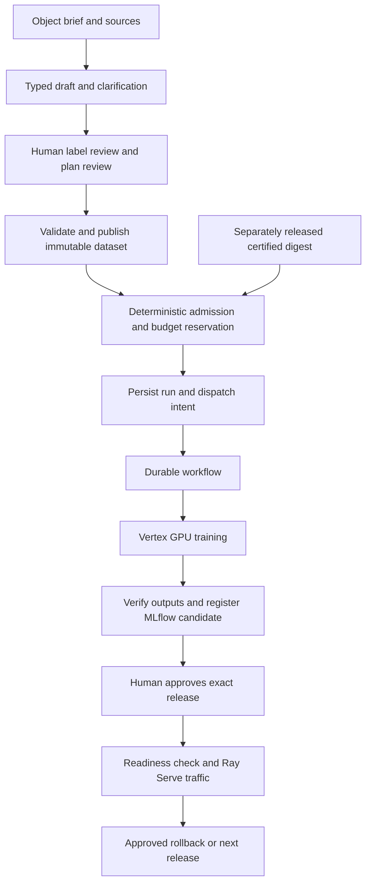

# Defect Training Platform — Full System Requirements

**Version:** 1.0

**Date:** September 28, 2026

**Status:** Requirements baseline for implementation and acceptance; full platform acceptance is incomplete.

**Implementation reviewed:** `dbc04a3c4ff260f966f7fc886efa8fc77d3a4b15`

**Audience:** Project owner, dataset reviewers, coding agents, platform operators, and acceptance reviewers.

## How to use this document

This document contains **150 individually identified requirements**. Each includes the requirement, **what** it means, **why** it exists, **how** it is enforced, required **positive evidence**, required **negative evidence**, and the evidence currently available.

Read the lifecycle and assurance sections first. Use the section index to find a feature, then its `TP-NNN` identifier to track implementation and evidence. A requirement is a target obligation, not a claim that the current code already satisfies it.

The canonical structured register is [requirements.json](requirements/requirements.json). The surrounding specification is authored in [context.md](requirements/context.md). This document is generated from both, with the evidence catalog. [baseline.json](requirements/baseline.json) records the local test observation used here. Run `python scripts/requirements_document.py --check` to validate document consistency; use `--write` to regenerate after an intentional specification change.

**“Positive evidence” describes successful required behavior. “Negative evidence” describes an attempted opposite or prohibited behavior being prevented.** Known defects and missing evidence are recorded separately. Procedures labeled `P-TP-NNN` and `N-TP-NNN` are acceptance obligations; they are not reports of tests already executed.

## 1. Purpose and authority

### 1.1 Intended system

A person supplies an object definition, class information, notes, images or image locations, and CSV or BigQuery labels. A LiteLLM-backed assistant asks a bounded number of clarifying questions and proposes configuration. The person reviews unresolved label decisions and the concrete training plan. Deterministic services validate the plan, publish a versioned WebDataset, admit a budgeted experiment, and execute it on a Vertex CustomJob.

Each object type has its own DINOv3 + MLP classifier. The system selects a checkpoint primarily by validation MCC and secondarily by macro F1, evaluates it, derives review thresholds, and registers an MLflow candidate. An authenticated human approves a concrete release before Ray Serve on GKE/KubeRay serves it. The system retains the prior approved release for rollback.

The agent helps establish intent and repair software within its role. **The runtime owns job submission, waiting, retries, cancellation, reconciliation, and result acceptance.** An active assistant session is not required while training runs.

### 1.2 Product boundary

| Included | Boundary |
| --- | --- |
| Supervised single-label classification | Input is an already identified defect crop |
| Separate object models | Dataset, model, and release identity bind to an object type |
| DINOv3 feature extraction and configurable MLP | Supplied pinned weights; controlled last-layer fine-tuning |
| CSV and BigQuery labels; local/GCS images | Approved, validated source locations |
| Versioned WebDatasets in GCS | Accepted evidence, splits, and shard integrity are immutable |
| One-machine GPU training | Configurable supported GPU count; no multi-machine requirement |
| MLflow run/registry control | Candidate creation is separate from production promotion |
| Ray Serve with GKE/KubeRay | Configured serving profile and explicit release approval |
| Structured logs and configurable Loki/OTLP integration | Delivered telemetry must be verified at its configured sink |
| CLI-first, template-driven operation | Non-programmers can navigate objects, runs, and artifacts |

Product disposition, autonomous release decisions, general object detection, segmentation, and unapproved model families are outside the accepted purpose. Heatmaps are diagnostics, not proof of defect localization or causal explanation. A later scope change must explicitly update this baseline and its acceptance criteria.

### 1.3 Requirement authority

This baseline derives from the user's platform request, accepted implementation plan, supplied eighteen architecture/agent prompts, and later insistence on actual GPU and live-infrastructure testing. Engineering obligations such as authenticated approval, crash reconciliation, artifact containment, and denial proof elaborate those requirements into testable controls.

Deployment-specific numeric targets remain decisions to configure and accept; this document does not invent approved latency, throughput, RPO/RTO, retention, quality, or production budget values. New cloud spending and resource destruction still require applicable authorization. The existing **USD 5 total test authorization** is not authorization for an unrestricted full deployment.

Changes to canonical requirement meaning require project-owner review. Generated views, test results, agent proposals, and code comments do not silently change scope. Historical evidence stays tied to its original source, image, environment, and procedure.

### 1.4 Current evidence boundary

A fresh local suite run for this document produced **55 passing tests, no skips, and two dependency deprecation warnings**. Actual DINOv3 architecture integration uses generated local weights. It verifies selected-layer gradients, patch pooling, fixture training, portable reload, evaluation, and heatmaps; it does not prove pretrained defect quality.

The prior live A100/GCS container probe passed for:

```text
source: cbf9dd19ba09df5a1c4236f620e83d20f73d7a94
image: us-central1-docker.pkg.dev/prefab-winter-256318/defect-gpu-smoke-20260927/trainer@sha256:54b8a0ffd2a8bb0cb444c6f61069f33c7fca4ce98ce88abd734eba0855c17c27
Vertex job: 5919343314829574144
```

That image predates the trainer compatibility fix in `749b3e5`. The live probe ran a generic CUDA MLP/checkpoint check, not pretrained DINOv3 training. Its successful result cannot certify changed source or close the deployed platform lifecycle. No complete live prevention campaign or full `CertifiedRuntime` acceptance is claimed.

See [testing status](TEST_STATUS.md), [chronological acceptance](ACCEPTANCE.md), and [retained GPU evidence](evidence/2026-09-27-gpu-container/README.md). Earlier dated entries describe observations at that time; later entries supersede readiness conclusions without rewriting history.

## 2. Actors, boundaries, and ownership

### 2.1 Operational actors

| Actor | Permitted responsibility | Authority boundary |
| --- | --- | --- |
| Project owner | Accept scope, environments, budgets, and operational profiles | Explicit human authority; cannot be impersonated by assistant text |
| Dataset reviewer | Resolve label exceptions against exact evidence | Does not issue runtime certification or production release |
| Setup assistant | Ask questions and propose typed configuration | No paid execution, certification, approval, or policy authority |
| Dataset publisher | Validate and publish accepted versions | Create-only accepted data; cannot change source decisions |
| Runtime release controller | Coordinate gated role-specific stages | Cannot collapse every stage into one unconstrained agent identity |
| Certification service | Validate existing exact digest and issue bound evidence | Cannot edit or rebuild the validated software |
| Admission/control service | Validate, reserve budget, persist intent, dispatch | Trusted facts resolved server-side |
| Workflow/job identities | Observe/execute within approved job and data scope | No arbitrary IAM changes or production promotion |
| MLflow candidate writer | Record runs and eligible candidate versions | No protected production-alias authority |
| Human approval/release service | Verify approval, deploy, reconcile, rollback | Artifact identity and approval are immutable and scoped |
| Serving identity | Read approved bundle and answer authorized inference | No dataset publication, trainer submission, or registry promotion |
| Acceptance reviewer | Evaluate requirement-level evidence | No claim of completion from a green subset |

### 2.2 Coding-agent roles

| Role | Owned work | Forbidden effects |
| --- | --- | --- |
| Trainer Engineer | Trainer algorithms, local trainer tests | Image build/push, cloud submission, certification |
| Runtime Engineer | Docker/dependencies/runtime packaging and GPU checks | Trainer algorithm edits, experiment submission, certification |
| Runtime Certifier | Existing-digest validation and evidence issuance | Source edits, image build/replacement, unrestricted training |
| Experiment Runner | Allowed experiment/job configuration, certified submission, inspection | Trainer/dependency edits, image build/push, certification |
| Primary integration owner | Shared contracts, deployment integration, reviewed handoffs | Does not bypass human budget/release authority |

A publisher capability, if required for candidate images, belongs to a narrowly scoped release-stage identity. This resolves the distinction between a runtime engineer proposing/building packaging and a protected service publishing it. Role policy must be consistent across instructions, harness checks, filesystem capabilities, and cloud permissions.

### 2.3 Threat and assurance model

Prevention claims cover mistakes and adversarial actions by untrusted source content, assistant outputs, API clients, ordinary role identities, and retries/crashes/concurrent requests at the declared boundaries. They assume trusted policy administrators, cloud identity providers, and configured cryptographic primitives behave as specified.

A cloud project Owner or host administrator who can replace policy is outside an ordinary-role denial claim. That exclusion must be stated in the evidence; it cannot be hidden to claim universal impossibility. Compromised administrator response, policy changes, and recovery remain operational concerns.

A prompt, written rule, or regex hook alone does not establish that a prohibited effect cannot occur. Authority must be constrained beneath that layer: authenticated services, scoped capabilities, protected storage, immutable records, and cloud IAM. If an alternative path such as an SDK or indirect subprocess can bypass the boundary, negative acceptance is still open.

## 3. Lifecycle and invariants



Runtime release is a separate path: **local trainer validation → pinned candidate build → GPU validation of that candidate → publication/digest resolution → exact-digest Vertex handshake → authenticated certification**. A candidate can be validated before publication by local content identity; after publication its resolved digest must match that same candidate. Where GPU validation is performed only after registry publication, publication is staging, not certification, and the subsequent gates must validate the resolved exact digest. The Certifier operates on an already built digest.

Ordinary experiments only resolve a usable certification; they never enter the build path. A hardware change can reuse an image but must remain inside proven compatibility scope.

### 3.1 State semantics

| Record | Required states/meaning | Important restriction |
| --- | --- | --- |
| Setup | Draft, needs clarification/review, accepted, superseded | Acceptance binds the displayed revision |
| Dataset | Preparing, committed/accepted, failed/quarantined | Only complete verified versions are consumable |
| Runtime | Candidate, validation pending/failed, certified, revoked | Certification binds exact identity and supported scope |
| Run | Pending/preparing, submitted, observed running, finalizing, succeeded/failed/canceled | Submission is not running; process success is not artifact acceptance |
| Reconciliation | Known, uncertain external outcome, stopping, resolved | May be orthogonal to run state; never hide unknown liveness |
| Release | Staged, approved, deploying, ready/promoted, failed/reconciling, rolled back | Completed release needs verified traffic and identity |

Existing `RunState` and `ModelRelease` enums are smaller than this target lifecycle. Implementations may represent finalization/reconciliation with separate typed records, but must preserve these semantics. State transitions use authenticated sources, stable event IDs, and revision checks. A terminal event cannot rewrite immutable job/artifact identity.

### 3.2 Safety invariants

1. **Paid job created ⇒** accepted plan ∧ source/dataset verification ∧ usable authoritative certification ∧ authorized identity ∧ trusted budget reservation.
2. **Accepted dataset ⇒** resolved accepted labels ∧ complete manifest/source evidence ∧ verified shards ∧ leakage-safe split assignment ∧ protected commit.
3. **Certified runtime ⇒** exact source/image binding ∧ all required successful gates ∧ authenticated certifier ∧ supported hardware scope.
4. **Ordinary experiment ⇒** zero software-build, image-publish, dependency-install, or certification effects.
5. **Successful run ⇒** observed terminal job success ∧ verified coherent outputs ∧ explicit finalization/registration status.
6. **Promoted release ⇒** authenticated human approval of exact identity ∧ eligibility evidence ∧ matching ready deployment ∧ consistent alias/traffic/ledger.
7. **Canceled/stopped claim ⇒** observed external terminal state; a local timeout alone is insufficient.
8. **Retry ⇒** same effective intent, bounded attempts/cost, no unauthorized duplicate effect.
9. **Complete system claim ⇒** all applicable requirements and accepted local/live positive and negative gates are satisfied.

These are acceptance invariants, not assertions about the present implementation.

## 4. Typed records and artifact organization

### 4.1 Required data contracts

Every record needs schema version, stable identity, object/environment scope where applicable, revision or content fingerprint, and validated references. The table distinguishes current named contracts from fields needed for complete authority/evidence binding.

| Record | Required content and purpose |
| --- | --- |
| `ObjectSpec` | Stable safe slug, readable name/description, unique ordered classes, crop/task policy |
| `LabelSource` | Kind, approved location, column mapping, image root, source revision/query selection, access evidence |
| `LabelReviewEvidence` | Authenticated reviewer, exact preview/source fingerprint, decisions, timestamp, mapping revision |
| `DatasetSpec` | Accepted sources/mapping, duplicate/group policy, splits/seed, output/shard policy, validation limits |
| `DatasetVersion` | Immutable identity, manifest/source/shard URIs and checksums, class/split counts, final commit reference |
| `ExperimentConfig` | Object/dataset/runtime references, pinned weights/model/head, optimization, preprocessing, seed, calibration policy |
| `VertexJobConfig` | Project/region/identity/network, machine/GPU/count/disk, duration/retry limits, trusted price-profile and budget reference |
| `CertifiedRuntime` | Exact source/image/software identities, hardware scope, gate reports/checksums, certifier identity/time, usability/revocation |
| `RunRecord` and dispatch/events | Durable ID, request fingerprint, state/revision, workflow/job/MLflow links, cost reservation, outputs, failures, reconciliation |
| `ModelRelease` and approval | Exact model/run/dataset/runtime/serving digest, eligibility, authenticated scoped approval, prior release, deploy/traffic outcome |
| `PlatformConfig`/deployment profile | Endpoints, secret/identity references, policy limits, environment resources, operational/acceptance targets |

Current definitions are in [contracts.py](../src/defect_platform/contracts.py). Fields already present do not make missing authenticity or immutable-storage guarantees implicit.

### 4.2 Template-controlled navigation

The following is the required navigation shape, not a claim that every generated file currently exists:

```text
projects/<object>/
  README.md                  object purpose and next actions
  object.yaml                object/classes
  dataset.yaml               source and accepted dataset policy
  experiment.yaml            training policy and artifact references
  vertex.yaml                job and cost profile references
  reviews/                   source-bound review indexes
  datasets/<version>/        readable index to immutable GCS artifacts
  runs/<run-id>/             summary and links generated from run state
  models/<version>/          evaluation, registry, and release index
  releases/<release-id>/     exact approval/deployment/rollback index

certifications/              readable pointers to authoritative records
templates/                   versioned object/run/review/release shapes
docs/                        requirements, operations, acceptance evidence
```

Large images, shards, weights, checkpoints, and bulk diagnostics belong in configured private GCS stores. These readable folders contain safe summaries and references. Private project summaries must not automatically become public Git files. Generated views can be rebuilt from authoritative records; hand edits cannot alter accepted truth.

## 5. Evidence and prevention proof

### 5.1 Evidence classes

| Class | What it establishes | What it does not establish |
| --- | --- | --- |
| Source inspection | A control or path appears in reviewed code/configuration | It executes correctly or cannot be bypassed |
| Local positive observation | Required behavior happened in the recorded local case | Live permissions, cloud integration, or realistic model quality |
| Local negative observation | A specified prohibited attempt was denied locally with checked effects | All bypass paths or cloud IAM |
| Simulated integration | Adapter/controller behavior under the simulated responses | Actual external authorization, capacity, durability, or billing |
| Live positive observation | A specified action happened on the recorded deployed infrastructure | Changed versions or untested prohibited behavior |
| Live negative observation | A real principal was denied and prohibited state remained unchanged | Different roles, alternate capabilities, administrators, or later policy changes |
| Invariant/control argument | Why all enumerated entry paths are mediated by enforcement | Universal mathematical proof unless formal verification is actually supplied |

Evidence scope and age are part of the result. A mocked denial is a simulated result, even when the test passes. An earlier GPU probe remains evidence for its original digest only.

### 5.2 Standard positive procedure

For each `P-TP-NNN`: identify the allowed actor and exact setup; exercise the real required path; verify expected output and durable state; capture lineage and artifacts; repeat at required local/live scope. Include the allowed counterpart in negative campaigns so a globally broken or inaccessible environment cannot appear to prove policy enforcement.

### 5.3 Standard negative procedure

For each `N-TP-NNN`:

1. State the opposite/prohibited effect and who is attempting it.
2. Enumerate the reachable entry points, credentials/capabilities, and enforcing boundary.
3. Capture before-state: relevant jobs, object generations/hashes, records/revisions, aliases, traffic, files, and audit context.
4. Attempt the forbidden effect directly and through relevant alternate paths; include stale data, races, interruption, replay, and dependency errors.
5. Observe an explicit denial, fail-closed result, or quarantined uncertain outcome.
6. Independently inspect after-state and audit evidence. Verify **zero forbidden effects** and no hidden stronger credentials.
7. Exercise the permitted counterpart and reconcile any uncertainty. If observation is incomplete, record **pending**, not passed.

An exception alone does not prove prevention: a paid job may have been created before the exception. An empty log query alone does not prove nothing happened. A test that only mocks the denial does not prove the real permission boundary.

“Cannot happen” means the prohibited effect is unreachable through the enumerated actor capabilities under the declared trust assumptions, backed by control inspection and adversarial observations. Finite tests cannot establish an unrestricted universal claim. A bypass invalidates the claim until fixed and reverified.

### 5.4 Required evidence report

Reports are separate from this requirements register. A planned procedure is not an observed report.

```yaml
evidence_id: N-TP-071-case-001
requirement_id: TP-071
direction: negative
procedure_version: "1"
status: pending                 # passed | failed | pending | inconclusive
scope: live                    # inspection | local | simulated | live
observed_at: null
source_commit: null
image_digest: null
configuration_fingerprint: null
environment: null
actor_principal: null
enforcement_boundary: "admission service plus restricted build capabilities"
prohibited_effect: "ordinary experiment builds or publishes a runtime"
entry_paths_tested: []
trust_assumptions: []
preconditions: []
steps: []
expected_result: "denied; no build, push, install, or certification effects"
observed_result: null
before_state_uri: null
after_state_uri: null
audit_or_trace_uri: null
artifact_checksums: {}
side_effects: null
limitations: []
reviewer: null
```

Evidence is valid only when identifiers, scope, preconditions, actual observations, integrity, and independent side-effect checks support the claim. A passed report may cover only part of a requirement. Store sensitive raw evidence privately; publish safe indexes.

### 5.5 Available evidence catalog

<!-- EVIDENCE_CATALOG -->

## 6. Requirements register

Each entry's **How** names the required enforcing mechanism and responsible component. **Current evidence** identifies present support and remaining proof. Every requirement's full acceptance remains open unless separately closed by a reviewed report; this baseline does not calculate a misleading completion percentage.

<!-- REQUIREMENTS_REGISTER -->

## 7. Current gaps and acceptance work

### 7.1 Material known gaps

| Gap observed in current implementation | Requirements most directly affected | Required closure |
| --- | --- | --- |
| Client-provided runtime override and certified flags can be treated as facts | TP-070, TP-079, TP-093 | Authoritative authenticated catalog lookup and forged-record denial |
| Caller-provided hourly rate can understate cost | TP-080–TP-082 | Trusted full-shape pricing, aggregate reservations, change rechecks |
| Workflow records running on dispatch; timeouts/errors do not cancel and reconcile | TP-086–TP-090, TP-123 | Observed state, explicit uncertainty, external cancellation and recovery |
| Crash/concurrent submission and event updates lack complete atomic/CAS proof | TP-083, TP-085–TP-086, TP-090 | Transactional intent/revisions, job reconciliation, race/fault campaigns |
| Certify wrapper combines building and certification | TP-069–TP-070, TP-075, TP-129 | Stage-specific capabilities; Certifier validates only existing digest |
| Regex role checks can be bypassed by alternate effect paths | TP-126–TP-135 | Active harness verification plus filesystem/service/cloud capability enforcement |
| Nonempty approver text is not authenticated consent | TP-005, TP-103–TP-104 | Identity-bound human approval of exact staged release |
| Serving startup uses mutable champion alias; readiness/traffic proof is incomplete | TP-106–TP-107, TP-112–TP-114 | Immutable model resolution, verified cutover and crash/concurrent reconciliation |
| Artifact loading/download containment lacks complete untrusted-input protection | TP-028, TP-062, TP-099 | Provenance/authentication before deserialization; safe path handling |
| Telemetry redaction, traces/metrics, delivery/retention guarantees incomplete | TP-117–TP-125 | Canary tests, schema/isolation checks, collector/Loki/retention live acceptance |
| Numeric production quality/SLO/recovery profiles are undefined | TP-036, TP-060, TP-115, TP-142, TP-144 | Accepted measurable profile and representative evaluation |
| Current fixed trainer source has not been built/tested on GPU | TP-067–TP-074, TP-147 | New exact image and real DINOv3 selected-layer GPU validation |
| Full deployed services and prevention campaign are unverified | TP-140–TP-150 | Complete authorized live positive/negative acceptance |

These are gaps against the target requirements, not “negative evidence” proving prevention. The requirements document does not fix them by describing the intended controls.

### 7.2 Ordered acceptance campaigns

| Campaign | Required coverage | Success evidence | Prevention evidence |
| --- | --- | --- | --- |
| A — Register/configuration | Schemas, templates, scope, navigation | Generated valid records/views, correct locations | Malformed/stale/unsafe configuration cannot be accepted |
| B — Source/dataset | CSV/BigQuery, review, duplicates, shards, GCS | Immutable accepted version with complete provenance | Ambiguous labels, leakage, corruption, overwrite and unauthorized deletion denied |
| C — Trainer | Actual DINOv3, frozen/fine-tuned, evaluation, reload, heatmap | Correct gradients, selection, portable inference | Unsupported layers/weights, test leakage, unsafe bundles denied |
| D — Runtime release | Pinned build, GPU, exact Vertex handshake, catalog | Current digest with authenticated complete certification | Failed/wrong/stale/forged gates cannot certify or submit |
| E — Durable execution | Cloud Run/state/Workflows/Vertex, budgets/retries | Detached successful execution and verified finalization | Overspend admission, duplicates, forged callbacks, orphaned cancellation prevented |
| F — Registry/releases/serving | Live MLflow, approved GKE/KubeRay/Ray deployment | Registered candidate, matching inference, promotion and rollback | Unapproved/wrong/stale/concurrent releases and unauthorized inference denied |
| G — Operations | Loki/telemetry, IAM/harness, recovery/cleanup/load | Delivered evidence, restored state, measured configured objectives | Secret leaks, role bypasses, history loss, unbounded scaling prevented |

Local gates precede paid cloud work. Actual DINOv3 training fixes must pass local architecture checks first; the release containing them then needs a new exact image and relevant GPU test. Repeating only the generic MLP probe cannot validate the changed DINOv3 path.

Complete live acceptance requires all relevant integrations to use intended identities and endpoints. Placeholder endpoints and absent weights are blockers to verification, not permission to substitute mocks or call the system complete.

### 7.3 Environment decisions to resolve before production acceptance

| Decision | Required accepted value/evidence | Present state |
| --- | --- | --- |
| GCP environment | Project(s), regions, network policy, APIs, quota, billing identity | Test project identified; readiness must be refreshed |
| DINOv3 artifact | Authorized pretrained weights, checksum, architecture/access | Not supplied for live training |
| Dataset quality policy | Class/group semantics, near-duplicate threshold, coverage minimums, label reviewer authority | Defaults/fixtures exist; representative policy acceptance pending |
| Service endpoints | Control/state/workflow, MLflow/artifacts, Loki/OTLP, GKE ingress | Templates remain unresolved |
| Identity policy | Actor-to-capability matrix and authenticated human approval mechanism | Written roles/templates; hard live denial proof pending |
| Budget/price profile | Per-run and campaign limits, authoritative rates, retry/reserved exposure, retained-resource costs | USD 5 test ceiling; actual historical billing unverified |
| Model acceptance | Minimum supported quality, per-class constraints, review-error/coverage/calibration evidence | Selection metric order agreed; production thresholds pending |
| Serving objectives | Target workload, latency, throughput, availability, overload/scaling limits | Numeric values not agreed |
| Recovery/retention | RPO/RTO, evidence/data retention, restore and deletion authority | Numeric/policy profile not agreed |
| Runtime compatibility | Supported Python/PyTorch/CUDA/GPU families/counts and certification validity/revocation | Old A100 probe only; current complete matrix pending |

No unresolved numeric value may be represented as passing. An accepted environment profile is itself versioned evidence.

### 7.4 Completion rule

A requirement is closed only when its implementation is present, required positive and negative reports are valid at the necessary scope, known contradictory evidence is resolved, and an authorized reviewer accepts the result.

The system is complete only when every applicable requirement is closed for the deployed revision and all live gates pass. Changes invalidate affected evidence, not unrelated historical observations. Scope exclusions need explicit owner approval and a revised baseline.

## 8. Source traceability and maintenance

### 8.1 User intent mapping

| Source intent | Requirement groups |
| --- | --- |
| Simple object/data brief and a few questions | TP-007–TP-015 |
| Config-driven structure and templates for non-programmers | TP-016–TP-024, TP-048, TP-102 |
| Versioned supervised WebDatasets in GCS | TP-025–TP-048 |
| DINOv3 + MLP, per object, one machine, MCC then macro F1 | TP-001–TP-002, TP-049–TP-064 |
| Runtime control without agent waiting | TP-003–TP-004, TP-078–TP-094 |
| MLflow experiments and models | TP-095–TP-102 |
| Human promotion, Ray Serve, rollback | TP-005, TP-103–TP-116 |
| Loki-compatible configurable telemetry | TP-117–TP-125 |
| Four coding roles and enforced boundaries | TP-126–TP-139 |
| Actual GPU and full live infrastructure acceptance | TP-006, TP-140–TP-150 |

### 8.2 Supplied prompt mapping

| Supplied architecture prompt | Requirements |
| --- | --- |
| 1 — Inspect Existing Architecture | TP-006, TP-149–TP-150; evidence catalog and known gaps |
| 2 — Separate Runtime/Experiment Configuration | TP-016–TP-018, TP-022–TP-023 |
| 3 — Local Trainer Validation | TP-049–TP-064, TP-145–TP-146 |
| 4 — Reproducible Docker Runtime | TP-065–TP-066, TP-139 |
| 5 — Local GPU Container Validation | TP-067, TP-074 |
| 6 — Vertex Runtime Handshake | TP-068, TP-091 |
| 7 — Certified Runtime Metadata | TP-070, TP-072–TP-074 |
| 8 — Separate Certification and Experiments | TP-071–TP-075 |
| 9 — Failure Ownership | TP-076, TP-088, TP-122–TP-123 |
| 10 — Trainer Engineer | TP-126–TP-127 |
| 11 — Runtime Engineer | TP-126, TP-128 |
| 12 — Runtime Certifier | TP-126, TP-129 |
| 13 — Experiment Runner | TP-126, TP-130 |
| 14 — Repository Agent Rules | TP-126–TP-131, TP-138 |
| 15 — Hard VS Code Enforcement | TP-132–TP-136, TP-148 |
| 16 — Single Release Command | TP-069, TP-075, TP-077 |
| 17 — Clean Experiment Submission | TP-071–TP-072, TP-078–TP-094 |
| 18 — End-to-End Verification | TP-145–TP-150 |

### 8.3 Change procedure

1. Update canonical records or context with the reason and affected IDs. Keep stable IDs; never reuse retired IDs for different meaning.
2. Update implementation/evidence mappings and required positive/negative procedures.
3. Regenerate and check the document. Check source links and cited test names.
4. Run affected acceptance checks at the correct scope. Retain prior evidence as historical, marking changed-source/digest coverage stale where needed.
5. Review unresolved decisions and known gaps; do not convert planned procedures into observed results.
6. Obtain owner review for changes to scope or authority and preserve the accepted revision.

Related documentation: [Architecture](ARCHITECTURE.md), [Operations](OPERATIONS.md), [Start here](START_HERE.md), [Testing status](TEST_STATUS.md), [Acceptance record](ACCEPTANCE.md).
